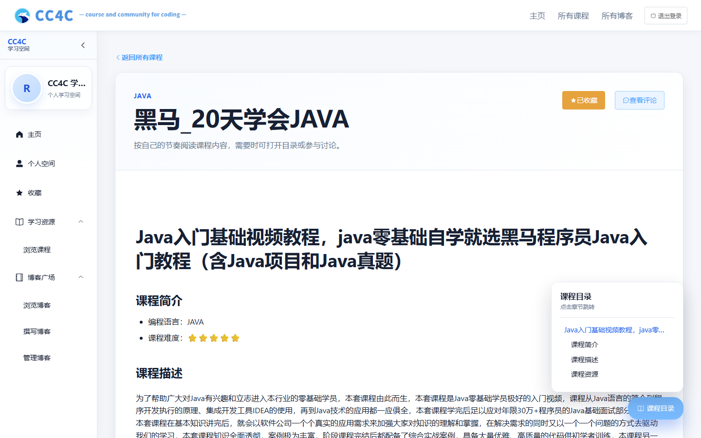
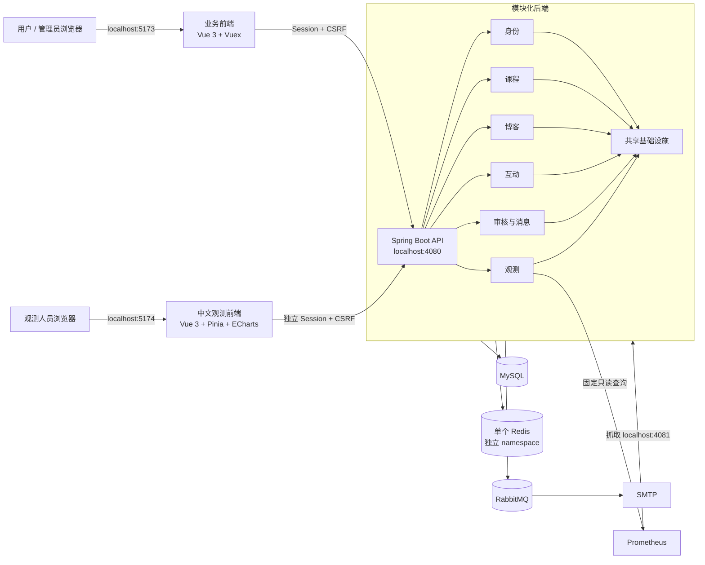

<div align="center">
  
  <h1>CC4C · Course and Community for Coding</h1>
  <p>连接编程课程、技术创作与社区互动的学习平台</p>

  <p>
    <a href="https://github.com/Jaily16/CC4C/actions/workflows/build.yml"></a>
    
    
    
    
  </p>
</div>

## 项目介绍

CC4C 是面向编程学习者的课程与技术社区。用户可以浏览 Java、C++、Python 和 C 课程，阅读 Markdown
内容，创作博客并参与收藏、评论与回复；管理员负责课程发布、博客审核和异步消息处置。平台同时提供独立
中文观测后台，以固定且有界的 Prometheus 查询呈现 API、JVM、数据库、缓存、安全和消息链路状态。

核心能力包括：

- 课程目录、关键词检索、模块化章节和 Markdown 阅读。
- 博客草稿、图片上传、提交审核、公开展示和个人内容管理。
- 课程与博客收藏、评论和回复，以及清晰的所有权与权限边界。
- 用户注册、邮件验证码、Redis Session、CSRF、登录限流和管理员身份隔离。
- MySQL Transactional Outbox、RabbitMQ、Inbox 幂等、有限重试和死信恢复。
- 独立观测账户、HttpOnly Session、中文 Dashboard、告警和依赖状态。

## 界面预览

<table>
  <tr>
    <td width="50%" valign="top">
      
      <br /><b>首页</b>：课程推荐、技术资源和社区内容入口。
    </td>
    <td width="50%" valign="top">
      
      <br /><b>课程详情</b>：章节导航、Markdown 阅读、收藏与讨论。
    </td>
  </tr>
  <tr>
    <td width="50%" valign="top">
      
      <br /><b>博客创作</b>：编辑、预览、图片上传和审核提交。
    </td>
    <td width="50%" valign="top">
      
      <br /><b>管理端</b>：课程、博客、审核和异步消息管理。
    </td>
  </tr>
</table>

## 技术架构



| 层级 | 技术 |
| --- | --- |
| 业务前端 | Vue 3、Vue Router、Vuex、Element Plus、Axios、Vite |
| 观测前端 | Vue 3、Vue Router、Pinia、Element Plus、ECharts、Axios、Vite |
| 后端 | Java 21、Spring Boot、Spring Security、Spring Modulith、MyBatis-Plus |
| 数据与缓存 | MySQL、Flyway、HikariCP、Redis Session、Redis Cache-Aside |
| 异步消息 | Transactional Outbox、RabbitMQ、Inbox 幂等、Publisher Confirm |
| 可观测性 | Actuator、Micrometer、Prometheus、ECS JSON 日志、请求关联 ID |
| 接口与安全 | DTO、Bean Validation、OpenAPI、BCrypt、HttpOnly Cookie、CSRF |

后端模块依赖方向见 [模块边界](docs/architecture/module-boundaries.md)，观测身份和数据流见
[独立观测架构](docs/architecture/observability.md)。

## 环境要求

| 组件 | 版本或要求 |
| --- | --- |
| PowerShell | 7.6.5 |
| Java | 21 |
| Maven | 3.9.16 |
| Node.js | 24.18.0 |
| npm | 11.16.0 |
| MySQL | 8.4.11，已创建专用数据库和最小权限账号 |
| Redis | 8.2.9，一个实例、三个互不相同的 namespace |
| RabbitMQ | 4.3.5，已创建专用 vhost、账号和权限 |
| SMTP | 用户控制且可接收验证码与审核邮件的服务 |
| Prometheus | 3.13.2，由用户独立运行和管理 |

完整版本基线见 [`versions.yml`](versions.yml)。所有 PowerShell 入口必须在 PowerShell 7 中运行。

## 本机复现

### 1. 克隆并安装依赖

```powershell
git clone https://github.com/Jaily16/CC4C.git
Set-Location -LiteralPath '.\CC4C'

Set-Location backend
mvn --no-transfer-progress clean package -DskipTests

Set-Location ..\frontend
npm ci --ignore-scripts --no-audit --no-fund

Set-Location ..\observability
npm ci --ignore-scripts --no-audit --no-fund

Set-Location ..
```

构建过程不需要连接业务数据库或其他外部服务。后端会生成主应用、管理员引导和密码哈希三个 JAR；两个
前端的生产构建命令分别为：

```powershell
Set-Location frontend
npm run lint
npm run format:check
npm run build

Set-Location ..\observability
npm run lint
npm run format:check
npm run build
```

### 2. 准备外部服务

在 MySQL 中创建一个空的 UTF-8 数据库和专用账号。应用账号需要业务读写权限，以及 Flyway 建表、变更和
索引所需权限；不要使用数据库管理员账号运行应用。首次后端启动会执行受控 Flyway 迁移并写入公开课程
目录基线。已有非空数据库必须先按 [数据库说明](infrastructure/database/README.md) 完成备份和迁移核对。

为 RabbitMQ 准备专用 vhost 和账号，不要复用默认账号。账号需要在目标 vhost 中配置、写入和读取权限；
应用不会创建、删除或清空 vhost。Redis、RabbitMQ、SMTP 和 Prometheus 也必须在启动 CC4C 前由用户准备好。

Prometheus 的公开参考配置和 20 条告警规则位于 `infrastructure/prometheus/`。实际配置、管理端明文密码和
运行数据应放在仓库外；项目脚本只检查公开模板、规则及外部实例状态，不启动、停止或重载 Prometheus。

### 3. 创建三端本机配置

```powershell
Copy-Item backend/.env.example backend/.env.local
Copy-Item frontend/.env.example frontend/.env.local
Copy-Item observability/.env.example observability/.env.local

git check-ignore -- backend/.env.local frontend/.env.local observability/.env.local
```

根据模板手工填写：

- 后端：数据库、Redis、RabbitMQ、SMTP、加密密钥、三个 namespace、上传目录、管理端和 Prometheus配置。
- 业务前端：公开 API 地址，默认 `http://localhost:4080`。
- 观测前端：公开 API 地址；不得放入 Prometheus 地址或任何凭据。

Session、业务缓存和观测 Session 可以使用同一个 Redis，但 namespace 必须互不相同。后端、业务前端和
观测前端各只使用自己目录中的 `.env.local`，不接受其他配置路径。

### 4. 生成两个独立密码哈希

分别准备两个仓库外的单行密码文件：一个用于 Prometheus 抓取管理端，另一个用于观测门户。密码必须不同，
每个为 12–64 个字符且 UTF-8 不超过 72 字节。后端完成打包后分别执行：

```powershell
.\backend\scripts\hash-observability-password.ps1 -PasswordFile <管理抓取密码文件绝对路径>
.\backend\scripts\hash-observability-password.ps1 -PasswordFile <观测门户密码文件绝对路径>
```

将两个 BCrypt 输出分别填入后端本机配置。管理抓取密码的明文仅写入仓库外 Prometheus 私有配置；观测门户
使用另一套账号和密码。不要把密码文件、明文或哈希提交到 Git。

### 5. 预检、启动和初始化管理员

```powershell
.\infrastructure\host\host-preflight.ps1 `
  -Component All `
  -ConfirmDatabase <精确数据库名>

.\infrastructure\host\start-host-stack.ps1 `
  -ConfirmDatabase <精确数据库名>
```

全新空库完成 Flyway 初始化后，如需创建首个管理员，准备仓库外密码文件并执行：

```powershell
.\backend\scripts\bootstrap-admin.ps1 `
  -AdminId <七位管理员ID> `
  -ConfirmDatabase <精确数据库名> `
  -PasswordFile <管理员密码文件绝对路径>
```

引导脚本不会创建数据库或生成密码。已有管理员的环境不要重复执行。

### 6. 健康检查和访问

```powershell
.\infrastructure\host\health-host-stack.ps1 -IncludePrometheus

.\infrastructure\prometheus\check-prometheus.ps1 `
  -PromtoolPath '<promtool.exe绝对路径>' `
  -RequireBackendScrape
```

| 入口 | 默认地址 |
| --- | --- |
| 业务前端 | `http://localhost:5173` |
| 业务 API | `http://localhost:4080` |
| 后端管理端口 | `http://127.0.0.1:4081` |
| 中文观测后台 | `http://localhost:5174` |
| 外部 Prometheus | `http://127.0.0.1:9090` |

观测后台使用独立 `OBSERVABILITY` 账号，不能使用业务用户或管理员账号登录。浏览器只取得有界、脱敏的
观测结果，不取得 Prometheus 凭据或任意查询能力。

### 7. 安全停止

```powershell
.\infrastructure\host\stop-host-stack.ps1
```

停止入口按观测前端、业务前端、后端的顺序，只停止状态记录中 PID、可执行文件、应用标记和创建时间均匹配
的进程。它不会停止 MySQL、Redis、RabbitMQ、SMTP 或 Prometheus，也不会清理业务数据、队列或上传文件。

## 安全边界

- `.env.local`、密码文件、数据库备份、上传数据、日志和运行状态只保留在本机，不得提交或上传。
- 业务、管理员和观测身份彼此隔离；服务端 Session 是身份权威，浏览器写请求必须通过对应 CSRF 校验。
- 生产 HTTPS 环境必须启用 Secure Cookie，并把 CORS 和观测 Origin 配置为精确来源。
- 管理端口只绑定回环地址；Prometheus抓取身份与观测门户身份使用不同密码。
- 消息载荷使用 AES-256-GCM；邮箱、验证码、正文、Cookie、Session ID 和密钥不得进入日志或管理摘要。
- 不清空 Redis，不清理 RabbitMQ vhost 或队列，不对身份不明的消息执行重试或忽略。
- 数据库迁移不提供破坏性降级；维护前先备份，恢复到新数据库并核对后再切换连接。
- `node_modules/`、`dist/`、`target/`、`temp/` 和日志是本地产物，不进入 Git。

## 常见问题

### 脚本提示需要 PowerShell 7

先运行 `pwsh -NoProfile` 进入 PowerShell 7，再从仓库根目录执行脚本。Windows PowerShell 5.1 不满足入口要求。

### 端口已被占用

预检不会结束占用者或自动更换端口。先确认 4080、4081、5173 和 5174 的进程归属，再由进程所有者安全停止。

### SMTP 预检失败

确认主机、端口、认证和 TLS 模式与邮件服务一致。隐式 SSL 和 STARTTLS 不能同时启用；TCP 通过不代表真实
邮件一定送达，仍需完成验证码和审核邮件验收。

### RabbitMQ 预检或启动失败

确认 URL 中的 vhost、账号和端口正确，并核对账号在该 vhost 的权限。项目不会自动创建或修复 RabbitMQ资源。

### 观测页面显示部分可用或不可用

先确认 Prometheus `/-/ready`、后端管理端口和 `up{job="cc4c-backend"}`。较长时间范围没有完整历史数据时
可能显示部分可用，这不等同于后端故障。

### 观测登录失败或会话失效

确认使用观测账户、访问地址与配置的精确 Origin 一致，并核对 Cookie Secure 与 HTTP/HTTPS 模式。连续失败
会触发独立登录限流；不要通过读取或清理 Redis 键绕过它。

## 进一步文档

- [本机运行手册](docs/operations/host-runbook.md)
- [数据库说明](infrastructure/database/README.md)
- [异步消息故障处理](docs/operations/messaging-failure-runbook.md)
- [独立观测架构](docs/architecture/observability.md)
- [模块边界](docs/architecture/module-boundaries.md)
- [代码质量约定](docs/development/code-quality.md)
- [OpenAPI 契约](docs/reference/openapi.json)
