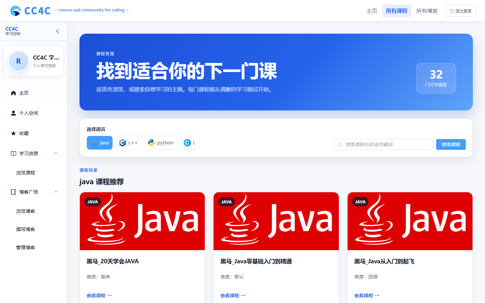
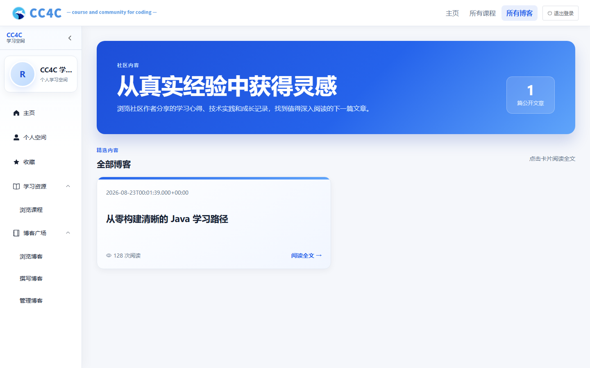
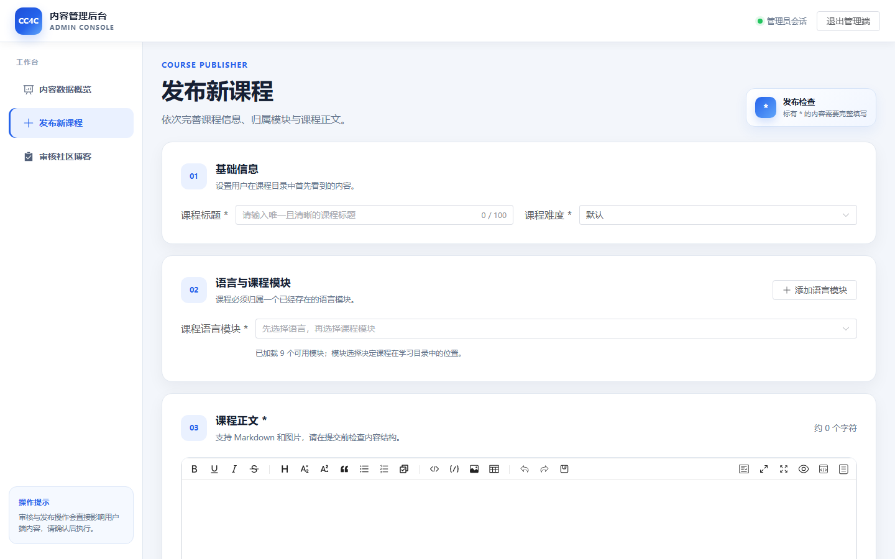
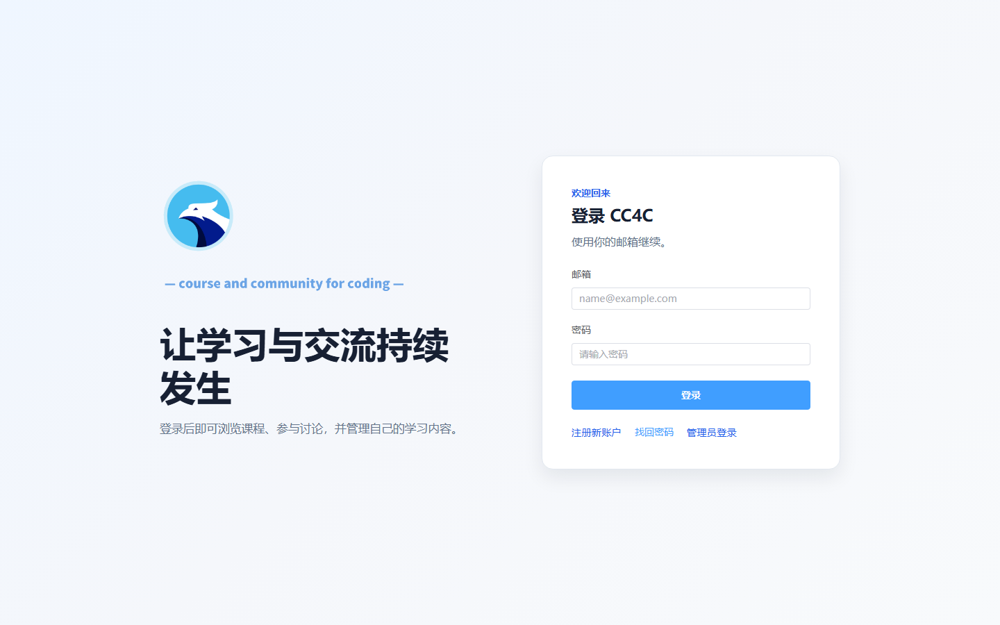
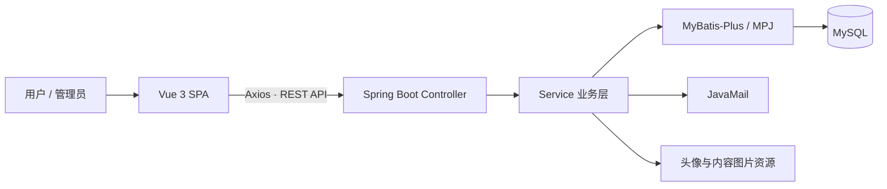

<div align="center">
  
  <h1>CC4C · Course and Community for Coding</h1>
  <p>面向编程学习者的课程发现、内容阅读与技术交流平台</p>

  <p>
    
    
    
    
    
    
  </p>
</div>

## 项目背景

CC4C（Course and Community for Coding）是一个围绕“学习课程 + 技术社区”构建的编程学习平台。项目将多语言课程、Markdown 内容阅读、博客创作、互动收藏与后台审核整合到同一套体验中，帮助学习者从发现内容、持续学习到沉淀与分享实践经验。

当前版本在保持既有前后端功能与 REST API 契约不变的前提下，进一步统一了视觉语言、页面反馈、响应式布局和键盘焦点体验。

## 平台亮点

- **课程发现**：按 Java、C++、Python、C 浏览课程，支持关键词搜索、推荐卡片与课程详情阅读。
- **沉浸式阅读**：课程和博客均支持 Markdown 渲染、浮动目录、收藏入口与评论抽屉。
- **社区创作**：提供 Markdown 博客编辑器、草稿恢复、文章提交和审核状态管理。
- **个人学习空间**：集中管理个人资料、课程收藏、博客收藏及个人文章。
- **内容管理后台**：管理员可查看平台数据、发布课程，并完成博客审核工作流。
- **友好交互**：统一加载、空状态与错误反馈，适配桌面和移动端，并保留清晰的键盘焦点。

## 关键界面

> 以下截图来自本地演示环境。身份信息已替换为演示内容，未包含真实邮箱、Cookie、Token、密码或本机配置。

<table>
  <tr>
    <td width="50%" valign="top">
      
      <br /><b>首页</b><br />品牌横幅、课程推荐、技术资源与社区内容入口。
    </td>
    <td width="50%" valign="top">
      
      <br /><b>课程发现</b><br />语言筛选、课程搜索及结构统一的响应式课程卡片。
    </td>
  </tr>
  <tr>
    <td width="50%" valign="top">
      
      <br /><b>课程详情</b><br />Markdown 正文、收藏与评论操作，以及随页面保持可达的浮动目录。
    </td>
    <td width="50%" valign="top">
      
      <br /><b>博客发现</b><br />公开文章统计、阅读量信息与清晰的文章卡片布局。
    </td>
  </tr>
  <tr>
    <td width="50%" valign="top">
      
      <br /><b>博客阅读</b><br />文章元信息、Markdown 阅读、浮动文章目录、收藏和讨论入口。
    </td>
    <td width="50%" valign="top">
      
      <br /><b>个人资料</b><br />账户概览、专业与订阅语言信息，以及个性化学习建议。
    </td>
  </tr>
  <tr>
    <td width="50%" valign="top">
      
      <br /><b>收藏中心</b><br />在课程与博客之间切换，集中管理后续学习和阅读内容。
    </td>
    <td width="50%" valign="top">
      
      <br /><b>博客创作</b><br />Markdown 编辑与预览、主题语言选择、字数反馈及草稿处理。
    </td>
  </tr>
  <tr>
    <td width="50%" valign="top">
      
      <br /><b>文章管理</b><br />统一查看已发布、待审核和未通过文章，快速进入详情或继续创作。
    </td>
    <td width="50%" valign="top">
      
      <br /><b>管理端概览</b><br />课程、博客与待审核内容统计，以及内容列表和快捷操作。
    </td>
  </tr>
  <tr>
    <td width="50%" valign="top">
      
      <br /><b>课程发布</b><br />分区式课程信息表单、语言模块归属与 Markdown 正文编辑。
    </td>
    <td width="50%" valign="top">
      
      <br /><b>博客审核</b><br />待审核文章列表、正文预览，以及通过或驳回操作。
    </td>
  </tr>
</table>

<p align="center">
  
  <br /><b>统一登录入口</b>：清晰的品牌信息、表单校验、找回密码与管理端入口。
</p>

## 技术栈

| 层级 | 技术 |
| --- | --- |
| 前端框架 | Vue 3、Vue Router、Vuex |
| UI 与交互 | Element Plus、Element Plus Icons、响应式 CSS |
| 内容编辑 | md-editor-v3、sanitize-html |
| 网络与构建 | Axios、Vite |
| 后端框架 | Spring Boot、Java |
| 数据访问 | MyBatis-Plus、MyBatis-Plus-Join、Druid |
| 数据与服务 | MySQL、JavaMail、文件资源读写 |

## 系统架构



## 仓库结构

```text
CC4C/
├─ front-end/CC4C/                  # Vue 3 前端应用
│  ├─ public/                       # 公共静态资源
│  ├─ src/
│  │  ├─ assets/                    # 品牌与课程图片
│  │  ├─ components/                # 通用组件
│  │  ├─ layout/                    # 顶部导航与侧边栏壳层
│  │  ├─ router/                    # 页面路由
│  │  ├─ store/                     # Vuex 状态
│  │  └─ views/                     # 用户端与管理端页面
│  └─ package.json
├─ back-end/CC4C/                   # Spring Boot 后端应用
│  ├─ src/main/java/com/cc4c/       # Controller、Service、DAO 与实体
│  ├─ src/main/resources/
│  │  └─ application-example.yml    # 可提交的脱敏配置模板
│  ├─ src/test/                     # 后端自动化测试
│  └─ pom.xml
├─ database/
│  └─ cc4c.sql                      # MySQL 表结构与基础数据
├─ docs/                            # 迭代文档与 README 图片
└─ README.md
```

## 本地运行

### 1. 环境要求

- JDK 17
- Maven 3.8+
- Node.js 18+ 与 npm
- MySQL 8.x

### 2. 克隆仓库

```bash
git clone https://github.com/Jaily16/CC4C.git
cd CC4C
```

### 3. 初始化数据库

在 MySQL 中创建一个空数据库，然后导入仓库内的初始化文件。数据库名需要与后续 `CC4C_DB_URL` 中的名称一致。

```bash
mysql -u <username> -p <database_name> < database/cc4c.sql
```

### 4. 创建本机后端配置

真实配置文件必须仅保留在本机。先复制脱敏模板：

```bash
cp back-end/CC4C/src/main/resources/application-example.yml \
   back-end/CC4C/src/main/resources/application.yml
```

Windows PowerShell：

```powershell
Copy-Item back-end/CC4C/src/main/resources/application-example.yml `
  back-end/CC4C/src/main/resources/application.yml
```

按本机环境设置模板中引用的环境变量：

| 环境变量 | 用途 |
| --- | --- |
| `CC4C_DB_URL` | MySQL JDBC 连接地址 |
| `CC4C_DB_USERNAME` | 数据库用户名 |
| `CC4C_DB_PASSWORD` | 数据库密码 |
| `CC4C_MAIL_USERNAME` | 邮件服务账号 |
| `CC4C_MAIL_PASSWORD` | 邮件服务授权信息 |
| `CC4C_REQUEST_AVATAR_PATH` | 前端可访问的头像资源地址 |
| `CC4C_REQUEST_IMG_PATH` | 前端可访问的内容图片地址 |
| `CC4C_SAVE_AVATAR_PATH` | 本机头像保存目录 |
| `CC4C_SAVE_IMG_PATH` | 本机内容图片保存目录 |

> 不要把真实值写回 `application-example.yml`，也不要提交生成的 `application.yml`。

### 5. 启动后端

```bash
cd back-end/CC4C
mvn spring-boot:run
```

后端默认地址：`http://localhost:4080`

课程接口检查：`http://localhost:4080/courses/home`

### 6. 启动前端

在另一个终端中执行：

```bash
cd front-end/CC4C
npm install
npm run dev
```

前端默认地址：`http://localhost:5173`

## 构建与测试

前端生产构建：

```bash
cd front-end/CC4C
npm run build
```

后端测试：

```bash
cd back-end/CC4C
mvn test
```

## 安全说明

- `back-end/CC4C/src/main/resources/application.yml` 是本机真实配置，已被 Git 忽略，禁止提交。
- 不要在源码、README、截图、Issue 或日志中放入 Token、Cookie、数据库密码、SMTP 授权码等敏感信息。
- GitHub 只应保留脱敏的 `application-example.yml`；如怀疑密钥泄露，请先轮换密钥，再清理历史记录。
- `node_modules/`、`dist/`、`target/`、`temp/` 和运行日志均属于本地产物，不应提交。
- 提交前建议执行 `git status` 和敏感信息扫描，确认暂存区只包含预期文件。

---

如果你正在学习一门编程语言，CC4C 希望把“找到课程、读懂内容、记录收获、参与讨论”连接成一条更顺畅的路径。