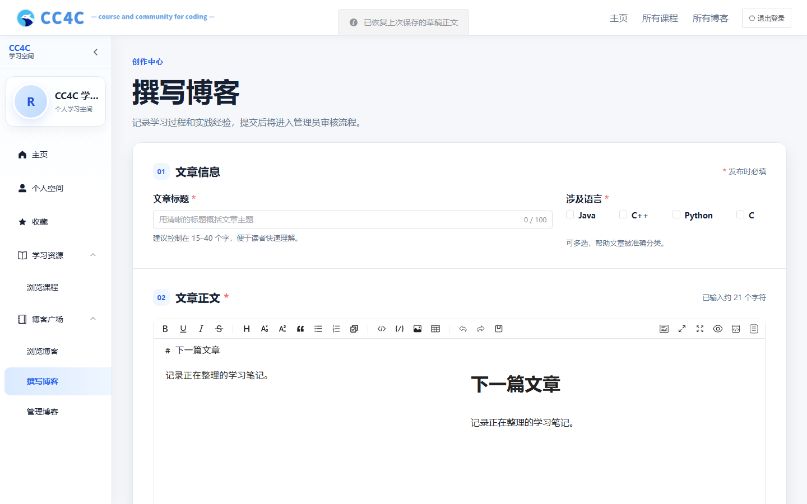
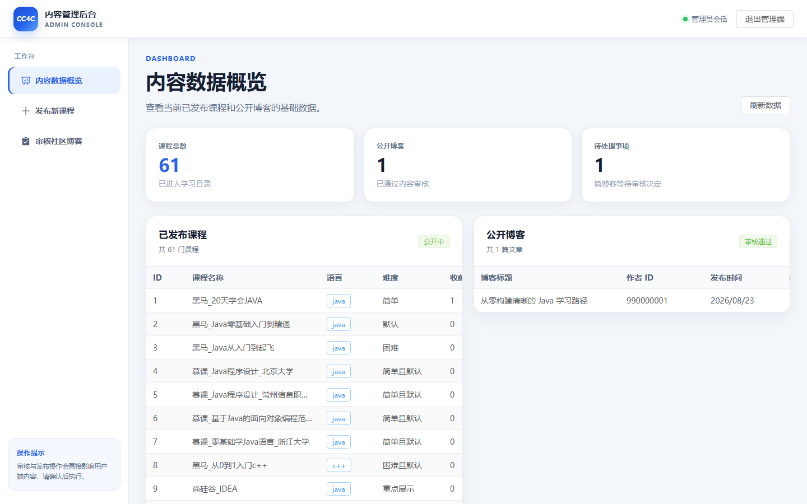
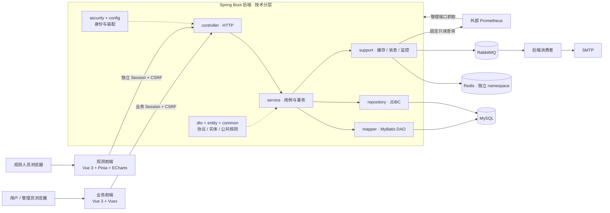

<div align="center">
  
  <h1>CC4C · Course and Community for Coding</h1>
  <p>连接编程课程、技术创作与社区互动的学习平台</p>

  <p>
    <a href="https://github.com/Jaily16/CC4C/actions/workflows/build.yml"></a>
    
    
    
    
  </p>
</div>

## 项目介绍

CC4C 是面向编程学习者的课程与技术社区。用户可以浏览 Java、C++、Python 和 C 课程，阅读 Markdown
内容，创作博客并参与收藏、评论与回复；管理员负责课程发布、博客审核和异步消息处置。平台同时提供独立
中文观测后台，以固定且有界的 Prometheus 查询呈现 API、JVM、数据库、缓存、安全和消息链路状态。

核心能力包括：

- 课程目录、关键词检索、模块化章节和 Markdown 阅读。
- 博客草稿、图片上传、提交审核、公开展示和个人内容管理。
- 课程与博客收藏、评论和回复，以及清晰的所有权与权限边界。
- 用户注册、邮件验证码、Redis Session、CSRF、登录限流和管理员身份隔离。
- MySQL Transactional Outbox、RabbitMQ、Inbox 幂等、有限重试和死信恢复。
- 独立观测账户、HttpOnly Session、中文 Dashboard、告警和依赖状态。

## 界面预览

<table>
  <tr>
    <td width="50%" valign="top">
      
      <br /><b>首页</b>：课程推荐、技术资源和社区内容入口。
    </td>
    <td width="50%" valign="top">
      
      <br /><b>课程详情</b>：章节导航、Markdown 阅读、收藏与讨论。
    </td>
  </tr>
  <tr>
    <td width="50%" valign="top">
      
      <br /><b>博客创作</b>：编辑、预览、图片上传和审核提交。
    </td>
    <td width="50%" valign="top">
      
      <br /><b>管理端</b>：课程、博客、审核和异步消息管理。
    </td>
  </tr>
</table>

## 技术架构



| 层级 | 技术 |
| --- | --- |
| 业务前端 | Vue 3、Vue Router、Vuex、Element Plus、Axios、Vite |
| 观测前端 | Vue 3、Vue Router、Pinia、Element Plus、ECharts、Axios、Vite |
| 后端 | Java 21、Spring Boot、Spring Security、MyBatis-Plus |
| 数据与缓存 | MySQL、Flyway、HikariCP、Redis Session、Cache-Aside |
| 异步消息 | Transactional Outbox、RabbitMQ、Inbox 幂等、Publisher Confirm |
| 可观测性 | Actuator、Micrometer、Prometheus、ECS JSON 日志、请求关联 ID |
| 协议与安全 | DTO、Bean Validation、OpenAPI、BCrypt、HttpOnly Cookie、CSRF |

后端有十个技术包，只有 support 保留三个子包；Mapper 承担 DAO 职责，已有 JDBC Repository 与其同层。
独立工具不进入主应用扫描。目录、调用关系和身份边界见[项目指南](docs/project-guide.md#项目与目录)。

## 环境要求

| 组件 | 版本或要求 |
| --- | --- |
| PowerShell | 7.6.5；Windows PowerShell 5.1 不满足脚本要求 |
| Java / Maven | Java 21、Maven 3.9.16 |
| Node.js / npm | 24.18.0 / 11.16.0 |
| MySQL | 8.4.11，预先创建专用数据库和最小权限账号 |
| Redis | 8.2.9，一个实例、三个不同 namespace |
| RabbitMQ | 4.3.5，预先准备专用 vhost、账号和权限 |
| SMTP | 用户控制、能够接收验证码与审核通知的服务 |
| Prometheus | 3.13.2，由用户独立管理 |

完整基线见 [versions.yml](versions.yml)。真实配置、密码文件、上传、日志、备份和运行数据只保留在本机。

## 快速启动

先按[项目指南](docs/project-guide.md#配置与本机运行)完成首次依赖准备、外部服务和三份被忽略的
`.env.local`。已有数据库先核对[数据库维护要求](docs/project-guide.md#数据库维护)，不覆盖本机配置。
启动会触发已有 Flyway、Session 和消息处理行为。

准备三个 PowerShell 7 终端，均先进入仓库根目录。Java 21 必须配置在 JAVA_HOME／PATH；
可用 `pwsh -NoProfile` 进入正确终端，再用 `$PSVersionTable.PSVersion` 核对版本。
以下命令复用已有依赖，Maven 离线依赖缺失时停止，不自动下载。

终端一，后端：

```powershell
Set-Location backend
$databaseName = Read-Host '输入本机配置中的精确数据库名'
& ..\infrastructure\host\with-app-environment.ps1 `
    -Application Backend -ConfirmDatabase $databaseName `
    -Command { mvn -o spring-boot:run }
```

确认后端健康正常后，终端二启动业务前端：

```powershell
Set-Location frontend
& ..\infrastructure\host\with-app-environment.ps1 `
    -Application Frontend `
    -Command { npm run dev -- --host localhost --port 5173 --strictPort }
```

终端三，观测前端：

```powershell
Set-Location observability
& ..\infrastructure\host\with-app-environment.ps1 `
    -Application Observability `
    -Command { npm run dev -- --host localhost --port 5174 --strictPort }
```

| 入口 | 默认地址 |
| --- | --- |
| 业务前端 | http://localhost:5173 |
| 业务 API | http://localhost:4080 |
| 管理健康 | http://127.0.0.1:4081/actuator/health |
| 独立观测前端 | http://localhost:5174 |
| 外部 Prometheus | http://127.0.0.1:9090 |

观测门户使用独立账户，管理抓取使用另一套密码；业务用户、管理员不能自动取得观测身份。
浏览器不取得 Prometheus 凭据或任意 PromQL 能力。业务前端上传 URL 由环境辅助提供映射，不从旧 public 目录回退。

停止时在各自前台终端依次按 **Ctrl+C：观测前端 → 业务前端 → 后端**，确认本次进程退出和四个应用端口释放。
包裹辅助退出时恢复临时环境。不要用旧 PID 状态停止这些前台进程，也不按名称或端口批量结束进程。
外部中间件保持运行。JAR 替代入口、健康检查、可选整栈入口和故障处理详见项目指南。

## 安全与维护

- 服务端 Session 是身份权威；写请求校验对应 CSRF 和权限。生产 HTTPS 配置 Secure Cookie 与精确来源。
- 管理端口仅绑定回环；两个前端配置只含公开 API 地址，秘密不进入 Vite 产物。
- 邮件载荷使用 AES-256-GCM；邮箱、验证码、正文、Cookie、Session ID 和密钥不进入日志或管理摘要。
- 不清空 Redis、purge 队列或重试未知消息。数据库维护先备份，恢复到新库核对后再切换。
- 本机依赖、target、dist、temp、配置与运行资料不进入 Git。

## 文档与资料

- [项目指南](docs/project-guide.md)：结构、配置、运行、数据库、消息、观测与质量门禁。
- [迭代总结](docs/iteration-summary.md)：历史变更、已记录验证、限制和后续交接。
- [性能历史](docs/performance-history.md)：原始实验方法、完整结果表和缺失证据说明。
- [OpenAPI 契约快照](backend/openapi.json) · [全部十三张截图](frontend/screenshots)。
