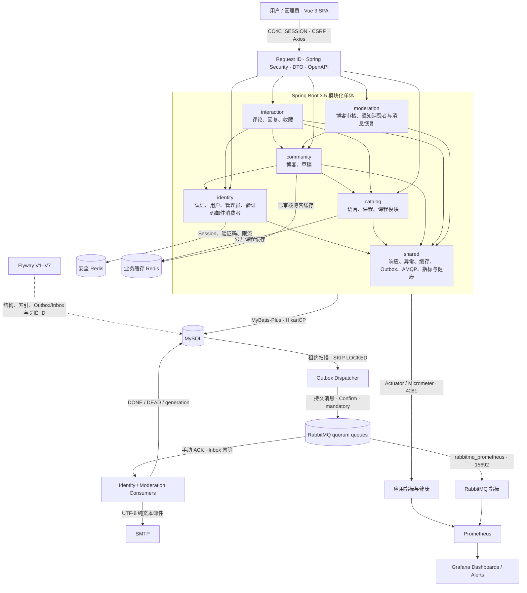

<div align="center">
  
  <h1>CC4C · Course and Community for Coding</h1>
  <p>面向编程学习者的课程发现、内容阅读与技术交流平台</p>

  <p>
    
    
    
    
    
    
    
    
  </p>
</div>

## 项目背景

CC4C（Course and Community for Coding）是一个围绕“学习课程 + 技术社区”构建的编程学习平台。项目将多语言课程、Markdown 内容阅读、博客创作、互动收藏与后台审核整合到同一套体验中，帮助学习者从发现内容、持续学习到沉淀与分享实践经验。

当前版本已完成 V3 七个方面，覆盖基础现代化、模块化与数据治理、安全认证、缓存与性能、异步可靠性、可观测性与性能证据，以及容器化与持续交付。后端运行于 Java 21、Spring Boot 3.5.16 和 MyBatis-Plus 3.5.17，并按六个领域模块组织；API 已引入 DTO、Bean Validation、统一分页、正确 HTTP 状态和 OpenAPI，数据库结构由 Flyway V1–V7 管理。认证使用 Spring Security、BCrypt、Spring Session Redis、不透明会话 Cookie 和 CSRF 防护；公开课程与已审核博客热点使用独立连接和命名空间的 Redis Cache-Aside。验证码、博客提交和审核通知通过 MySQL Transactional Outbox、RabbitMQ quorum queue、Inbox 幂等和管理员死信恢复异步处理。Actuator、Micrometer、Prometheus、Grafana、ECS JSON 日志和请求关联 ID 将 API、数据库、缓存、安全及消息链路转化为可复核指标，Gatling 提供固定数据和负载模型下的性能证据。Docker Compose 提供完整本地环境，Testcontainers 隔离后端集成测试，GitHub Actions 定义质量与 SemVer tag-only 发布门禁。前端使用 Vue 3.5、Vite 8 和 Axios 1.19.0，并统一处理会话、CSRF、分页、错误响应与 Markdown 输出净化。

本次升级前后的精确版本、七方面分别解决的工程问题、性能数据、开发效率收益和发布边界见 [V3 技术栈升级总结](docs/CC4CV3技术栈升级总结.md)。

## 平台亮点

- **课程发现**：按 Java、C++、Python、C 浏览课程，支持关键词搜索、推荐卡片与课程详情阅读。
- **沉浸式阅读**：课程和博客均支持 Markdown 渲染、浮动目录、收藏入口与评论抽屉。
- **社区创作**：提供 Markdown 博客编辑器、草稿恢复、文章提交和审核状态管理。
- **个人学习空间**：集中管理个人资料、课程收藏、博客收藏及个人文章。
- **内容管理后台**：管理员可查看平台数据、发布课程，并完成博客审核工作流。
- **友好交互**：统一加载、空状态与错误反馈，适配桌面和移动端，并保留清晰的键盘焦点。

## 关键界面

> 以下截图来自本地演示环境。身份信息已替换为演示内容，未包含真实邮箱、Cookie、Token、密码或本机配置。

<table>
  <tr>
    <td width="50%" valign="top">
      
      <br /><b>首页</b><br />品牌横幅、课程推荐、技术资源与社区内容入口。
    </td>
    <td width="50%" valign="top">
      
      <br /><b>课程发现</b><br />语言筛选、课程搜索及结构统一的响应式课程卡片。
    </td>
  </tr>
  <tr>
    <td width="50%" valign="top">
      
      <br /><b>课程详情</b><br />Markdown 正文、收藏与评论操作，以及随页面保持可达的浮动目录。
    </td>
    <td width="50%" valign="top">
      
      <br /><b>博客发现</b><br />公开文章统计、阅读量信息与清晰的文章卡片布局。
    </td>
  </tr>
  <tr>
    <td width="50%" valign="top">
      
      <br /><b>博客阅读</b><br />文章元信息、Markdown 阅读、浮动文章目录、收藏和讨论入口。
    </td>
    <td width="50%" valign="top">
      
      <br /><b>个人资料</b><br />账户概览、专业与订阅语言信息，以及个性化学习建议。
    </td>
  </tr>
  <tr>
    <td width="50%" valign="top">
      
      <br /><b>收藏中心</b><br />在课程与博客之间切换，集中管理后续学习和阅读内容。
    </td>
    <td width="50%" valign="top">
      
      <br /><b>博客创作</b><br />Markdown 编辑与预览、主题语言选择、字数反馈及草稿处理。
    </td>
  </tr>
  <tr>
    <td width="50%" valign="top">
      
      <br /><b>文章管理</b><br />统一查看已发布、待审核和未通过文章，快速进入详情或继续创作。
    </td>
    <td width="50%" valign="top">
      
      <br /><b>管理端概览</b><br />课程、博客与待审核内容统计，以及内容列表和快捷操作。
    </td>
  </tr>
  <tr>
    <td width="50%" valign="top">
      
      <br /><b>课程发布</b><br />分区式课程信息表单、语言模块归属与 Markdown 正文编辑。
    </td>
    <td width="50%" valign="top">
      
      <br /><b>博客审核</b><br />待审核文章列表、正文预览，以及通过或驳回操作。
    </td>
  </tr>
</table>

<p align="center">
  
  <br /><b>统一登录入口</b>：清晰的品牌信息、表单校验、找回密码与管理端入口。
</p>

## 技术栈

| 层级 | 技术 |
| --- | --- |
| 前端框架 | Vue 3.5.42、Vue Router、Vuex |
| UI 与交互 | Element Plus 2.14.5、Element Plus Icons、响应式 CSS |
| 内容编辑 | md-editor-v3、sanitize-html |
| 网络与构建 | Node 24.18.0、npm 11.16.0、Axios 1.19.0、Vite 8.2.2 |
| 后端框架 | Spring Boot 3.5.16、Java 21、Jakarta Servlet、Spring Modulith 1.4.12 |
| API 治理 | DTO、Bean Validation、统一分页、springdoc OpenAPI 2.8.17 |
| 身份与安全 | Spring Security、Spring Session Data Redis、BCrypt、CSRF、角色与所有权校验 |
| 数据访问与缓存 | MyBatis-Plus 3.5.17、HikariCP、MySQL 8.4.11、Flyway V1–V7、Redis 7.4.10 Cache-Aside |
| 异步可靠性 | RabbitMQ 4.3.5、Transactional Outbox/Inbox、Publisher Confirm、有限重试与死信恢复 |
| 可观测与压测 | Actuator、Micrometer、Prometheus 3.13.2、Grafana 13.1.0、ECS JSON、Gatling 3.15.1 |
| 测试与交付 | Testcontainers 1.21.4、Docker Compose、Mailpit 1.31.0、GitHub Actions、Trivy、GHCR 发布定义 |
| 序列化与服务 | Jackson、AES-256-GCM、JavaMail、文件资源读写 |

## V3 技术升级与工程收益

| 升级方向 | 基线状态 | 当前方案 | 解决或优化的问题 |
| --- | --- | --- | --- |
| 运行基础 | Java 17、Spring Boot 2.6.11、`javax` | Java 21、Spring Boot 3.5.16、Jakarta | 进入受支持的现代框架体系，为 Security、Actuator、Testcontainers 等后续能力消除兼容障碍 |
| 依赖与数据访问 | 重复 MyBatis Starter，另有 MPJ、Druid、Fastjson | MyBatis-Plus Boot 3 Starter、HikariCP、Jackson | 减少重复自动配置、版本冲突、依赖面与无效维护成本 |
| 架构与 API | 技术分层单体、实体直接收发、接口约定分散 | 六模块 Spring Modulith、DTO、校验、分页、OpenAPI | 模块越界自动失败，输入输出、错误状态与数据库分页可验证 |
| 数据治理 | 手工 SQL 与环境结构漂移 | Flyway V1–V7、约束、复合索引、迁移测试 | 空库与已有库使用同一结构来源，数据库升级可追踪、可重复 |
| 身份安全 | 业务 Cookie 与明文密码比较 | Spring Security、Redis Session、BCrypt、CSRF、限流 | 阻止伪造身份、水平越权和凭据明文泄露，支持会话撤销与安全失败 |
| 性能 | 热点反复查询、模块/评论 N+1 | Redis Cache-Aside、批量 SQL、稳定分页与复合索引 | 受控基准中目标 SELECT 10,995→0，热路径 p95 181.599→5.486 ms |
| 异步可靠性 | 请求线程同步 SMTP | Outbox、RabbitMQ、Inbox、Confirm、重试/DLQ | Broker/SMTP 故障不再破坏业务事务，重复消息幂等，失败可由管理员恢复 |
| 可观测性 | 零散日志、缺少运行证据 | Request ID、ECS JSON、Micrometer、Prometheus、Grafana、Gatling | API、JVM、数据库、缓存、安全和消息链路均可查询、告警和对照验证 |
| 测试与交付 | 测试依赖本机服务、手工启动和发布检查 | Testcontainers、Docker Compose、Mailpit、GitHub Actions、Trivy | 测试环境隔离，一键复现完整栈，依赖/镜像/契约门禁自动化 |
| 前端基础 | Vue 3.2、Vite 3、Axios 0.18、旧编辑器残留 | Vue 3.5.42、Vite 8.2.2、Axios 1.19.0、统一 Markdown 净化 | 清除 High/Critical 漏洞，统一 API、Session/CSRF 和 XSS 防护边界 |

上述性能数字来自固定硬件、固定数据与固定负载的本机三轮中位数，只用于证明优化方向和防止回退，不代表生产容量。详细测试条件、限制与证据分别见 [方面六报告](docs/reports/v3/aspect6/README.md) 和 [方面七报告](docs/reports/v3/aspect7/README.md)。

## 系统架构



Spring Modulith 测试会验证六个模块、允许的依赖方向和内部包边界；跨模块调用只通过公开的 `api` 包完成。

Compose 网络、secret、持久卷、Testcontainers 和 GitHub Actions 发布链路见 [容器交付架构](docs/CC4C容器交付架构.md)。

## 仓库结构

```text
CC4C/
├─ front-end/CC4C/                  # Vue 3 前端应用
│  ├─ public/                       # 公共静态资源
│  ├─ src/
│  │  ├─ assets/                    # 品牌与课程图片
│  │  ├─ components/                # 通用组件
│  │  ├─ layout/                    # 顶部导航与侧边栏壳层
│  │  ├─ router/                    # 页面路由
│  │  ├─ store/                     # Vuex 状态
│  │  └─ views/                     # 用户端与管理端页面
│  └─ package.json
├─ back-end/CC4C/                   # Spring Boot 后端应用
│  ├─ src/main/java/com/cc4c/
│  │  ├─ shared/                    # 公共响应、分页、异常与基础设施
│  │  ├─ identity/                  # 用户、管理员与验证码
│  │  ├─ catalog/                   # 语言、课程与课程模块
│  │  ├─ community/                 # 博客与草稿
│  │  ├─ interaction/               # 评论、回复与收藏
│  │  └─ moderation/                # 博客审核
│  ├─ src/main/resources/
│  │  ├─ application-example.yml    # 可提交的脱敏配置模板
│  │  └─ db/migration/              # Flyway V1–V7 迁移
│  ├─ src/test/                     # 后端自动化测试
│  ├─ src/gatling/                  # 方面六 Gatling Java DSL 场景
│  ├─ run-tests.ps1                 # 测试环境校验与 Maven 门禁
│  ├─ run-aspect4-benchmark.ps1      # 隔离性能库与缓存的方面四基准
│  ├─ run-local.ps1                 # 从忽略的本机 .env 文件安全启动
│  ├─ migrate-passwords.ps1          # 既有明文密码离线迁移入口
│  └─ pom.xml
├─ database/
│  ├─ legacy/cc4c.sql               # 仅供参考的历史 SQL
│  ├─ test-database-admin-setup.sql # 专用测试库授权模板
│  └─ README.md                     # Flyway 初始化、备份与恢复说明
├─ deploy/                          # 本机秘密生成、管理员引导、Rabbit 初始化与容器性能脚本
├─ observability/                   # Prometheus 规则、Grafana Provisioning 与受控脚本
├─ .github/                         # 质量、发布工作流与 Dependabot 配置
├─ compose.yml                      # 完整本地环境；默认 Mailpit、隔离网络和持久卷
├─ compose.smtp.yml                 # 可选外部 SMTP 覆盖
├─ docs/                            # 迭代文档、ADR、运行手册、OpenAPI 与脱敏报告
└─ README.md
```

## 本地运行

### 推荐：完整 Docker Compose 环境

安装 Docker Desktop 后，可由脚本生成只存在本机的 secret 文件，再启动完整环境：

```powershell
.\deploy\scripts\prepare-local.ps1
docker compose -p cc4c-v3 up --build -d --wait
```

默认邮件由 Mailpit 捕获，不需要真实 SMTP。前端、后端、Actuator、Grafana、Prometheus、RabbitMQ 管理页和 Mailpit 分别绑定 `127.0.0.1` 的 5173、4080、4081、3000、9090、15672 和 8025；MySQL、两个 Redis、AMQP 与 Rabbit 指标端口不向宿主机发布。普通停止使用 `docker compose -p cc4c-v3 down`，不得添加 `-v`。完整启动、管理员引导、外部 SMTP、备份、回滚和安全重置见 [容器运行手册](docs/CC4C容器运行手册.md)。

### 1. 环境要求

- JDK 21
- Maven 3.6.3+
- Node.js 24.18.0 与 npm 11.16.0（仅手工运行前端时需要）
- MySQL 8.x
- Redis 7.x
- RabbitMQ 4.3.x（本次验收版本 4.3.5）

### 2. 克隆仓库

```bash
git clone https://github.com/Jaily16/CC4C.git
cd CC4C
```

### 3. 初始化数据库

在 MySQL 中创建一个 UTF-8 空数据库，并为应用数据库账号授予业务读写及 Flyway 建表、变更和索引权限。数据库名需要与后续 `CC4C_DB_URL` 中的名称一致。

```sql
CREATE DATABASE <database_name>
  CHARACTER SET utf8mb4 COLLATE utf8mb4_0900_ai_ci;

GRANT SELECT, INSERT, UPDATE, DELETE, CREATE, ALTER, INDEX, REFERENCES
  ON <database_name>.* TO '<application_user>'@'127.0.0.1';
```

首次启动时 Flyway 会依次执行 V1–V7，创建 18 张表、写入公开课程目录基线、应用关系约束和查询索引、扩展用户及管理员密码列、建立异步 Outbox/Inbox，并为 Outbox 增加兼容旧消息的可空请求关联 ID。`baseline-on-migrate` 默认关闭；已有数据的非空库不得直接启动迁移，必须先按 [数据库说明](database/README.md) 完成检查、备份和显式基线。`database/legacy/cc4c.sql` 仅供历史参考，不再是初始化来源。

### 4. 配置后端运行环境

仓库只跟踪脱敏的 `application-example.yml` 和 `.env.runtime.example`。本地运行时复制模板并填写忽略文件；`run-local.ps1` 会校验变量、Java 版本和 JAR，再显式加载脱敏配置。不要复制或提交本机 `application.yml`。

```powershell
cd back-end/CC4C
Copy-Item .env.runtime.example .env.runtime.local
# 只在本机编辑 .env.runtime.local，不要把真实值写入模板或文档
```

可用环境变量：

| 环境变量 | 用途 |
| --- | --- |
| `CC4C_DB_URL` | MySQL JDBC 连接地址 |
| `CC4C_DB_USERNAME` | 数据库用户名 |
| `CC4C_DB_PASSWORD` | 数据库密码 |
| `CC4C_DB_CONNECTION_TIMEOUT_MS` | Hikari 获取连接等待上限；本机默认 3000 ms，数据库故障时有界失败 |
| `CC4C_DB_VALIDATION_TIMEOUT_MS` | Hikari 连接验证上限；必须小于连接等待上限，本机默认 1000 ms |
| `CC4C_REDIS_URL` | 安全 Redis 连接地址，用于会话、验证码和限流 |
| `CC4C_SESSION_NAMESPACE` | 当前应用独占的 Redis Session 命名空间 |
| `CC4C_BUSINESS_CACHE_ENABLED` | 是否启用公开课程与博客业务缓存；可设为 `false` 快速回退到数据库 |
| `CC4C_CACHE_REDIS_URL` | 业务缓存 Redis 地址；本地可与安全 Redis 相同，生产应使用独立实例 |
| `CC4C_CACHE_NAMESPACE` | 业务缓存独占命名空间，必须与 Session namespace 不同 |
| `CC4C_SECURITY_PEPPER` | 至少 32 字符的随机安全 Pepper |
| `CC4C_SESSION_COOKIE_SECURE` | HTTPS 部署必须为 `true`；本地 HTTP 可为 `false` |
| `CC4C_ALLOWED_ORIGINS` | 允许携带凭据的精确前端来源列表，禁止通配符 |
| `CC4C_MAIL_USERNAME` | 邮件服务账号 |
| `CC4C_MAIL_PASSWORD` | 邮件服务授权信息 |
| `CC4C_RABBITMQ_URL` | 运行 RabbitMQ AMQP/AMQPS 地址；必须包含显式 vhost |
| `CC4C_RABBITMQ_NAMESPACE` | durable exchange、quorum queue 与 DLQ 的独占命名空间 |
| `CC4C_MODERATION_NOTIFICATION_RECIPIENTS` | 逗号分隔、去重后的博客审核通知邮箱 |
| `CC4C_MESSAGING_ACTIVE_KEY_ID` | 当前 Outbox 载荷写入密钥 ID |
| `CC4C_MESSAGING_PAYLOAD_KEYS` | AES-256-GCM 密钥环；活动密钥和轮换期旧密钥均由本机秘密配置提供 |
| `CC4C_MESSAGING_CONFIRM_TIMEOUT` | Publisher Confirm 等待上限 |
| `CC4C_MESSAGING_CONSUMER_RETRY_DELAYS` | 三段消费者重试间隔，默认 `30s,5m,30m` |
| `CC4C_OUTBOX_DISPATCHER_ENABLED` | 是否启动 Outbox Dispatcher；故障隔离时可设为 `false` 暂停发布 |
| `CC4C_MESSAGE_CONSUMERS_ENABLED` | 是否启动消息消费者；可设为 `false` 保留 Broker 积压 |
| `CC4C_REQUEST_AVATAR_PATH` | 前端可访问的头像资源地址 |
| `CC4C_REQUEST_IMG_PATH` | 前端可访问的内容图片地址 |
| `CC4C_SAVE_AVATAR_PATH` | 本机头像保存目录 |
| `CC4C_SAVE_IMG_PATH` | 本机内容图片保存目录 |
| `CC4C_API_DOCS_ENABLED` | 是否公开 OpenAPI JSON 与 Swagger UI；默认 `false` |
| `CC4C_OBSERVABILITY_ENABLED` | 是否启用自定义指标、消息采样和请求完成日志 |
| `CC4C_MANAGEMENT_ADDRESS` / `CC4C_MANAGEMENT_PORT` | 独立管理端绑定地址与端口；本机固定 `127.0.0.1:4081` |
| `CC4C_MANAGEMENT_USERNAME` / `CC4C_MANAGEMENT_PASSWORD` | Prometheus、Info 与依赖详情的独立 Basic 身份；密码至少 24 字符 |
| `CC4C_OBSERVABILITY_ENVIRONMENT` | 指标环境标签，只允许受控低基数字符串 |
| `CC4C_LOG_FORMAT` | 方面六运行使用 `ecs` 输出结构化 JSON |
| `CC4C_MESSAGING_SAMPLE_INTERVAL` | Outbox/Inbox 内存快照采样间隔，默认 15 秒 |
| `CC4C_MAX_HTTP_URI_TAGS` | HTTP 路由模板指标基数上限，默认 100 |

> 不要把真实值写回 `application-example.yml`、`.env.runtime.example`、README、日志或源码。`.env.runtime.local` 必须保持忽略；密码、验证码、Cookie、CSRF Token、Pepper 和 SMTP 授权码不得记录或提交。

### 5. 启动后端

先构建并验证 JAR，再由受控脚本启动：

```powershell
cd back-end/CC4C
.\run-tests.ps1 clean verify
.\run-local.ps1
```

安全 Redis 不可连接、Pepper 不足 32 字符、CORS 含通配符、消息 namespace 或 AES 密钥环非法、审核邮箱缺失、Java 不是 21、JAR 缺失或数据库仍含明文/未知格式密码时，应用会快速失败，不会降级到内存会话或旧密码比较。RabbitMQ 暂时不可连接不会阻止 Web 应用受理验证码、博客提交或审核事务，事件会保留在 MySQL Outbox 并按有限退避恢复；业务缓存 Redis 不可用时，公开读取会在短暂熔断旁路后回源 MySQL。既有数据库升级必须先停止后端并备份，应用 V4 后使用 `migrate-passwords.ps1` 离线转换密码；脚本要求备份路径、SHA-256 和精确数据库名确认，且重复执行不会再次转换 `{bcrypt}` 值。

异步消息的 Broker 故障、消费者暂停、SMTP 死信、管理员重试/忽略、密钥轮换和代码回滚步骤见 [CC4C 异步消息故障手册](docs/CC4C异步消息故障手册.md)。

后端默认地址：`http://localhost:4080`

课程接口检查：`http://localhost:4080/courses/home`

如需在本机验收 API 文档，可在脱敏环境中显式设置 `CC4C_API_DOCS_ENABLED=true`。启用后访问 `/v3/api-docs` 和 `/swagger-ui/index.html`；生产环境应保持默认关闭。

### 6. 启动本地观测栈（可选）

后端启用观测并监听 `127.0.0.1:4081`、RabbitMQ 已启用 `rabbitmq_prometheus` 后，复制脱敏模板并填写本机路径与独立监控凭据。预检要求 Prometheus/Grafana 尚未启动，只验证版本、端口、认证、配置和 20 条告警规则；启停脚本只管理自己记录的精确 PID。

```powershell
Copy-Item observability/.env.observability.example observability/.env.observability.local
.\observability\scripts\preflight.ps1
.\observability\scripts\start-local.ps1
# 验收结束后：.\observability\scripts\stop-local.ps1
```

匿名只能访问脱敏的 `health`、`liveness` 和 `readiness`；`dependencies`、`info` 与 `prometheus` 要求独立 `OBSERVABILITY` Basic 身份，USER/ADMIN 会话不能替代。Grafana 默认位于 `http://127.0.0.1:3000`，提供 API/JVM、DB/缓存/安全和异步消息三个固定 UID Dashboard。Prometheus/Grafana 本地密码、TSDB 和生成配置均保持忽略。

### 7. 启动前端

先创建本机前端环境文件：

```powershell
cd front-end/CC4C
Copy-Item .env.example .env.local
```

按需修改其中公开的 `VITE_API_BASE_URL`；默认值仍为 `http://localhost:4080`，该文件不得存放秘密。然后执行：

```bash
npm ci
npm run dev
```

前端默认地址：`http://localhost:5173`

## 构建与测试

前端生产构建：

```bash
cd front-end/CC4C
npm ci
npm run build
```

后端标准测试使用 Testcontainers 1.21.4，在单个测试 JVM 中启动 MySQL 8.4.11、两个 Redis 7.4.10 和 RabbitMQ 4.3.5。测试不读取 `.env.test.local`，也不会连接或清理本机数据库、Redis 或 RabbitMQ；需要 Java 21 和可用的 Docker Engine：

```powershell
cd back-end/CC4C
.\run-tests.ps1 clean verify
```

MySQL 容器从空库执行 V1–V7；迁移测试另建容器内临时库验证空库、V1 已有库、重复 migrate 和 validate。Redis/Rabbit namespace 每轮独立，Testcontainers reuse 禁用，由 Ryuk 清理本轮资源。门禁覆盖密码迁移、安全体系、Cache-Aside、Outbox 原子性、Publisher Confirm、幂等消费、重试/DLQ、请求关联、管理端权限、指标/健康、日志脱敏、六模块和既有业务回归。当前验收基线为 154 项测试全部通过。

### 方面四独立性能基准

性能基准不属于标准 `clean verify`，只允许连接名称精确以 `_perf_test` 结尾的独立数据库。复制 `.env.performance.example` 为已忽略的 `.env.performance.local`，填写独立数据库、Redis 和精确数据库名确认后运行：

```powershell
cd back-end/CC4C
.\run-aspect4-benchmark.ps1
```

工具使用固定种子 `20260827` 生成 2,000 用户、1,000 课程、20,000 博客以及合计 200,000 条收藏、评论与回复关系，只清理工具保留的有限 ID 区间，不执行 Flyway `clean`/`repair` 或 `DROP DATABASE`。方面六收口时的当前构建重跑结果：HTTP 错误为 0，热缓存命中率 100%，目标 SELECT 从 10,995 降至 0，三轮中位数 p95 从 181.599 ms 降至 5.486 ms；冷路径 p95 从 95.875 ms 变为 97.848 ms，约退化 2.06%。结果只代表本机受控对照，不表示生产容量；原始 JSON、Markdown 与 EXPLAIN 保存在已忽略的 `temp/`。

### 方面六 Gatling 与观测开销证据

Gatling 场景只允许连接 loopback 和名称精确以 `_perf_test` 结尾的性能库。三轮 `PublicReadStandard` 中位数显示：观测关闭/开启均为 0 错误，p95 均为 5 ms，p99 从 7 ms 变为 8 ms，吞吐从 869.98 req/s 变为 868.91 req/s；p99 退化 14.29%、吞吐下降 0.12%，均通过门禁。`AuthenticatedMixed` 共 158,023 请求、0 错误、p95 11 ms；`StepCapacity` 共 885,823 请求、0 错误、p95 9 ms。故障修复后的当前构建 smoke 为 10,469 请求、0 错误、p95 7 ms、p99 19 ms。完整环境、负载、指标、告警和故障演练证据见 [方面六报告](docs/reports/v3/aspect6/README.md)。

### 方面七容器性能与交付证据

显式 performance profile 使用隔离的 `cc4c_perf_test`、固定种子 `20260827` 和关闭 Dispatcher/Consumer 的后端容器。`PublicReadSmoke` 为 10,656 请求、0 错误、p95 5 ms、p99 18 ms；`PublicReadStandard` 三轮中位数为 p50 1 ms、p95 2 ms、p99 4 ms、886.13 req/s、0 错误。后端 Testcontainers 154/154 通过，前端安全测试、两类 npm audit、生产构建、Trivy 源码/镜像扫描、Compose/OpenAPI/Prometheus/Grafana 门禁均通过。完整限制和供应链状态见 [方面七报告](docs/reports/v3/aspect7/README.md)；本地镜像尚未推送或发布到 GHCR。

## 安全说明

- `back-end/CC4C/src/main/resources/application.yml` 是本机真实配置，已被 Git 忽略，禁止提交。
- Maven 构建显式排除 `application.yml`；最终 JAR 只允许包含脱敏的 `application-example.yml`。
- `.env.runtime.local`、`.env.test.local` 与前端 `.env.local` 仅限本机使用，禁止提交；`.env.example` 文件不得包含秘密。
- Compose secret 只存在 `deploy/secrets/local/`，后端入口仅在进程启动时读取挂载文件；不得把 secret 值写进 Compose 环境、镜像层、日志或命令行。普通 `down` 不删除卷，只有带精确项目名和二次输入确认的 `reset-local.ps1` 可以执行本项目卷重置。
- 认证只信任服务端 Redis Session 和 `CC4C_SESSION`；旧 `user_email`、`admin` Cookie 会被清除，不能作为身份依据。
- 所有浏览器写请求必须携带 CSRF Token；生产 HTTPS 环境必须设置 `CC4C_SESSION_COOKIE_SECURE=true`，CORS 只能配置精确来源。
- 安全 Redis 与业务缓存使用不同 namespace；生产环境应使用独立实例。业务缓存只覆盖公开课程和已审核博客，认证、私有内容与权限结果不得缓存。
- Outbox 和 RabbitMQ 载荷使用 AES-256-GCM 加密；明文邮箱、验证码、邮件正文、Cookie、Session ID 和消息密钥不得写入数据库摘要、管理 API 或日志。
- 消息语义为至少一次投递，不宣称端到端 exactly-once；Publisher Confirm 与消费者 ACK 分开处理，外部 SMTP 不确定窗口可能产生内容相同的重复邮件。
- 管理端口只绑定回环地址，观测 Basic 身份与业务 USER/ADMIN 完全分离；禁止暴露 `env`、`configprops`、`heapdump`、`loggers`、`shutdown` 等高风险端点。
- 指标标签只使用路由模板和枚举值，禁止 request/event/actor ID、邮箱、IP、SQL、Cookie 或异常正文；ECS 日志同样不得记录请求正文或连接凭据。
- RabbitMQ 生产 namespace 禁止 purge、删除 vhost 或原地重建队列；失败恢复以数据库 Outbox 为事实来源，并通过受保护的管理员接口显式重试或忽略。
- 不要在源码、README、截图、Issue 或日志中放入 Token、Cookie、数据库密码、SMTP 授权码等敏感信息。
- GitHub 只应保留脱敏的 `application-example.yml`；如怀疑密钥泄露，请先轮换密钥，再清理历史记录。
- `node_modules/`、`dist/`、`target/`、`temp/` 和运行日志均属于本地产物，不应提交。
- 后端和前端镜像均以非 root、只读根文件系统、`no-new-privileges` 和最小 capability 运行；宿主访问端口只绑定回环地址，MySQL、Redis 与 AMQP 保持内部隔离。
- GitHub Actions 发布只响应严格 SemVer 标签，定义多架构 GHCR 镜像、SBOM、最大 provenance 和 attestation；创建提交、推送、打标签和发布镜像仍分别需要明确授权。
- 提交前建议执行 `git status` 和敏感信息扫描，确认暂存区只包含预期文件。

---

如果你正在学习一门编程语言，CC4C 希望把“找到课程、读懂内容、记录收获、参与讨论”连接成一条更顺畅的路径。
