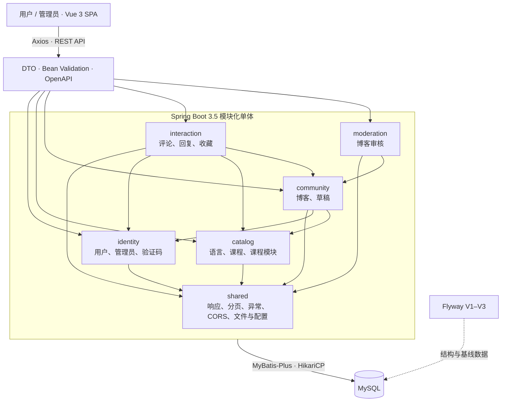

<div align="center">
  
  <h1>CC4C · Course and Community for Coding</h1>
  <p>面向编程学习者的课程发现、内容阅读与技术交流平台</p>

  <p>
    
    
    
    
    
    
  </p>
</div>

## 项目背景

CC4C（Course and Community for Coding）是一个围绕“学习课程 + 技术社区”构建的编程学习平台。项目将多语言课程、Markdown 内容阅读、博客创作、互动收藏与后台审核整合到同一套体验中，帮助学习者从发现内容、持续学习到沉淀与分享实践经验。

当前版本已完成 V3 方面一“基础版本与依赖现代化”和方面二“模块化单体、API 与数据治理”。后端运行于 Java 21、Spring Boot 3.5.16 和 MyBatis-Plus 3.5.17，并按六个领域模块组织；API 已引入 DTO、Bean Validation、统一分页、正确 HTTP 状态和 OpenAPI，数据库结构由 Flyway V1–V3 管理。前端继续使用 Vue 3，并通过 Axios 1.19.0 统一客户端适配分页和写操作方法。V3 方面三至方面七尚未实施。

## 平台亮点

- **课程发现**：按 Java、C++、Python、C 浏览课程，支持关键词搜索、推荐卡片与课程详情阅读。
- **沉浸式阅读**：课程和博客均支持 Markdown 渲染、浮动目录、收藏入口与评论抽屉。
- **社区创作**：提供 Markdown 博客编辑器、草稿恢复、文章提交和审核状态管理。
- **个人学习空间**：集中管理个人资料、课程收藏、博客收藏及个人文章。
- **内容管理后台**：管理员可查看平台数据、发布课程，并完成博客审核工作流。
- **友好交互**：统一加载、空状态与错误反馈，适配桌面和移动端，并保留清晰的键盘焦点。

## 关键界面

> 以下截图来自本地演示环境。身份信息已替换为演示内容，未包含真实邮箱、Cookie、Token、密码或本机配置。

<table>
  <tr>
    <td width="50%" valign="top">
      
      <br /><b>首页</b><br />品牌横幅、课程推荐、技术资源与社区内容入口。
    </td>
    <td width="50%" valign="top">
      
      <br /><b>课程发现</b><br />语言筛选、课程搜索及结构统一的响应式课程卡片。
    </td>
  </tr>
  <tr>
    <td width="50%" valign="top">
      
      <br /><b>课程详情</b><br />Markdown 正文、收藏与评论操作，以及随页面保持可达的浮动目录。
    </td>
    <td width="50%" valign="top">
      
      <br /><b>博客发现</b><br />公开文章统计、阅读量信息与清晰的文章卡片布局。
    </td>
  </tr>
  <tr>
    <td width="50%" valign="top">
      
      <br /><b>博客阅读</b><br />文章元信息、Markdown 阅读、浮动文章目录、收藏和讨论入口。
    </td>
    <td width="50%" valign="top">
      
      <br /><b>个人资料</b><br />账户概览、专业与订阅语言信息，以及个性化学习建议。
    </td>
  </tr>
  <tr>
    <td width="50%" valign="top">
      
      <br /><b>收藏中心</b><br />在课程与博客之间切换，集中管理后续学习和阅读内容。
    </td>
    <td width="50%" valign="top">
      
      <br /><b>博客创作</b><br />Markdown 编辑与预览、主题语言选择、字数反馈及草稿处理。
    </td>
  </tr>
  <tr>
    <td width="50%" valign="top">
      
      <br /><b>文章管理</b><br />统一查看已发布、待审核和未通过文章，快速进入详情或继续创作。
    </td>
    <td width="50%" valign="top">
      
      <br /><b>管理端概览</b><br />课程、博客与待审核内容统计，以及内容列表和快捷操作。
    </td>
  </tr>
  <tr>
    <td width="50%" valign="top">
      
      <br /><b>课程发布</b><br />分区式课程信息表单、语言模块归属与 Markdown 正文编辑。
    </td>
    <td width="50%" valign="top">
      
      <br /><b>博客审核</b><br />待审核文章列表、正文预览，以及通过或驳回操作。
    </td>
  </tr>
</table>

<p align="center">
  
  <br /><b>统一登录入口</b>：清晰的品牌信息、表单校验、找回密码与管理端入口。
</p>

## 技术栈

| 层级 | 技术 |
| --- | --- |
| 前端框架 | Vue 3、Vue Router、Vuex |
| UI 与交互 | Element Plus、Element Plus Icons、响应式 CSS |
| 内容编辑 | md-editor-v3、sanitize-html |
| 网络与构建 | Axios 1.19.0、Vite |
| 后端框架 | Spring Boot 3.5.16、Java 21、Jakarta Servlet、Spring Modulith 1.4.12 |
| API 治理 | DTO、Bean Validation、统一分页、springdoc OpenAPI 2.8.17 |
| 数据访问 | MyBatis-Plus 3.5.17、HikariCP、MySQL、Flyway |
| 序列化与服务 | Jackson、JavaMail、文件资源读写 |

## 系统架构



Spring Modulith 测试会验证六个模块、允许的依赖方向和内部包边界；跨模块调用只通过公开的 `api` 包完成。

## 仓库结构

```text
CC4C/
├─ front-end/CC4C/                  # Vue 3 前端应用
│  ├─ public/                       # 公共静态资源
│  ├─ src/
│  │  ├─ assets/                    # 品牌与课程图片
│  │  ├─ components/                # 通用组件
│  │  ├─ layout/                    # 顶部导航与侧边栏壳层
│  │  ├─ router/                    # 页面路由
│  │  ├─ store/                     # Vuex 状态
│  │  └─ views/                     # 用户端与管理端页面
│  └─ package.json
├─ back-end/CC4C/                   # Spring Boot 后端应用
│  ├─ src/main/java/com/cc4c/
│  │  ├─ shared/                    # 公共响应、分页、异常与基础设施
│  │  ├─ identity/                  # 用户、管理员与验证码
│  │  ├─ catalog/                   # 语言、课程与课程模块
│  │  ├─ community/                 # 博客与草稿
│  │  ├─ interaction/               # 评论、回复与收藏
│  │  └─ moderation/                # 博客审核
│  ├─ src/main/resources/
│  │  ├─ application-example.yml    # 可提交的脱敏配置模板
│  │  └─ db/migration/              # Flyway V1–V3 迁移
│  ├─ src/test/                     # 后端自动化测试
│  ├─ run-tests.ps1                 # 测试环境校验与 Maven 门禁
│  └─ pom.xml
├─ database/
│  ├─ legacy/cc4c.sql               # 仅供参考的历史 SQL
│  ├─ test-database-admin-setup.sql # 专用测试库授权模板
│  └─ README.md                     # Flyway 初始化、备份与恢复说明
├─ docs/                            # 迭代文档与 README 图片
└─ README.md
```

## 本地运行

### 1. 环境要求

- JDK 21
- Maven 3.6.3+
- Node.js 18+ 与 npm
- MySQL 8.x

### 2. 克隆仓库

```bash
git clone https://github.com/Jaily16/CC4C.git
cd CC4C
```

### 3. 初始化数据库

在 MySQL 中创建一个 UTF-8 空数据库，并为应用数据库账号授予业务读写及 Flyway 建表、变更和索引权限。数据库名需要与后续 `CC4C_DB_URL` 中的名称一致。

```sql
CREATE DATABASE <database_name>
  CHARACTER SET utf8mb4 COLLATE utf8mb4_0900_ai_ci;

GRANT SELECT, INSERT, UPDATE, DELETE, CREATE, ALTER, INDEX, REFERENCES
  ON <database_name>.* TO '<application_user>'@'127.0.0.1';
```

首次启动时 Flyway 会依次执行 V1–V3，创建 16 张表、写入公开课程目录基线并应用关系约束和查询索引。`baseline-on-migrate` 默认关闭；已有数据的非空库不得直接启动迁移，必须先按 [数据库说明](database/README.md) 完成检查、备份和显式基线。`database/legacy/cc4c.sql` 仅供历史参考，不再是初始化来源。

### 4. 配置后端运行环境

仓库只跟踪脱敏的 `application-example.yml`。使用环境变量提供本机参数，并在启动时显式选择该配置；不要读取、复制或提交本机 `application.yml`。

可用环境变量：

| 环境变量 | 用途 |
| --- | --- |
| `CC4C_DB_URL` | MySQL JDBC 连接地址 |
| `CC4C_DB_USERNAME` | 数据库用户名 |
| `CC4C_DB_PASSWORD` | 数据库密码 |
| `CC4C_MAIL_USERNAME` | 邮件服务账号 |
| `CC4C_MAIL_PASSWORD` | 邮件服务授权信息 |
| `CC4C_REQUEST_AVATAR_PATH` | 前端可访问的头像资源地址 |
| `CC4C_REQUEST_IMG_PATH` | 前端可访问的内容图片地址 |
| `CC4C_SAVE_AVATAR_PATH` | 本机头像保存目录 |
| `CC4C_SAVE_IMG_PATH` | 本机内容图片保存目录 |
| `CC4C_API_DOCS_ENABLED` | 是否公开 OpenAPI JSON 与 Swagger UI；默认 `false` |

> 不要把真实值写回 `application-example.yml`、README、日志或源码。数据库连接变量应显式设置；邮件变量仅在需要真实邮件投递时设置。

### 5. 启动后端

```powershell
cd back-end/CC4C
$env:SPRING_CONFIG_NAME = 'application-example'
$env:CC4C_DB_URL = 'jdbc:mysql://127.0.0.1:3306/<database_name>'
$env:CC4C_DB_USERNAME = '<username>'
$env:CC4C_DB_PASSWORD = '<password>'
mvn spring-boot:run
```

后端默认地址：`http://localhost:4080`

课程接口检查：`http://localhost:4080/courses/home`

如需在本机验收 API 文档，可在脱敏环境中显式设置 `CC4C_API_DOCS_ENABLED=true`。启用后访问 `/v3/api-docs` 和 `/swagger-ui/index.html`；生产环境应保持默认关闭。

### 6. 启动前端

先创建本机前端环境文件：

```powershell
cd front-end/CC4C
Copy-Item .env.example .env.local
```

按需修改其中公开的 `VITE_API_BASE_URL`；默认值仍为 `http://localhost:4080`，该文件不得存放秘密。然后执行：

```bash
npm ci
npm run dev
```

前端默认地址：`http://localhost:5173`

## 构建与测试

前端生产构建：

```bash
cd front-end/CC4C
npm ci
npm run build
```

后端测试必须连接相互独立的主测试库和空迁移库。先由数据库管理员按 [数据库说明](database/README.md) 创建并授权测试库，再使用受控脚本；`.env.test.local` 缺失、四个变量任一为空、库名不符合约束或两个 URL 相同时都会快速失败，不会回退到开发库：

```powershell
cd back-end/CC4C
Copy-Item .env.test.example .env.test.local
# 填写 CC4C_TEST_DB_URL、CC4C_TEST_EMPTY_DB_URL、CC4C_TEST_DB_USERNAME、CC4C_TEST_DB_PASSWORD
.\run-tests.ps1 clean verify
```

主测试库名必须以 `_test` 结尾但不能以 `_flyway_test` 结尾；空迁移库必须以 `_flyway_test` 结尾。测试门禁会先验证现有库基线和空库 V1–V3 重建，再执行完整测试。当前验收基线为 40 项测试全部通过。

## 安全说明

- `back-end/CC4C/src/main/resources/application.yml` 是本机真实配置，已被 Git 忽略，禁止提交。
- Maven 构建显式排除 `application.yml`；最终 JAR 只允许包含脱敏的 `application-example.yml`。
- `.env.test.local` 与前端 `.env.local` 仅限本机使用，禁止提交；`.env.example` 文件不得包含秘密。
- 不要在源码、README、截图、Issue 或日志中放入 Token、Cookie、数据库密码、SMTP 授权码等敏感信息。
- GitHub 只应保留脱敏的 `application-example.yml`；如怀疑密钥泄露，请先轮换密钥，再清理历史记录。
- `node_modules/`、`dist/`、`target/`、`temp/` 和运行日志均属于本地产物，不应提交。
- 提交前建议执行 `git status` 和敏感信息扫描，确认暂存区只包含预期文件。

---

如果你正在学习一门编程语言，CC4C 希望把“找到课程、读懂内容、记录收获、参与讨论”连接成一条更顺畅的路径。
