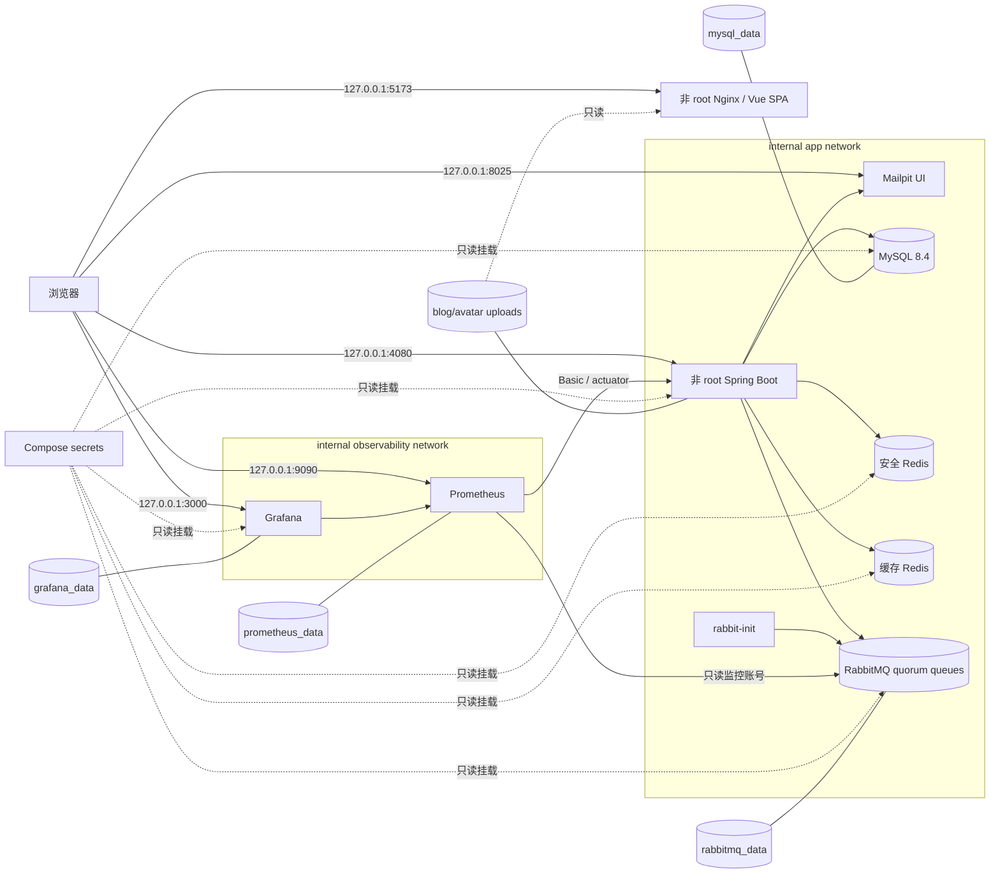
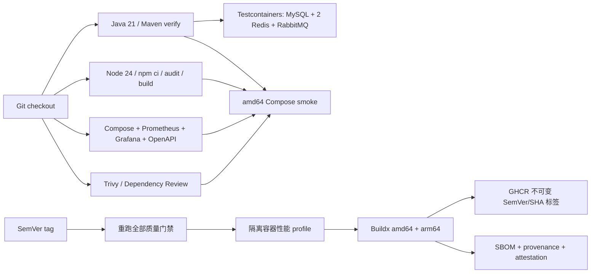

# CC4C 容器交付架构

## 运行拓扑

宿主访问服务各自连接一个关闭 masquerade 的独占桥接网络；MySQL、Redis、AMQP 和 Rabbit 指标端口没有宿主映射。可选外部 SMTP 覆盖只向后端附加 egress 网络。

## 测试与交付拓扑

标准测试不连接本机数据库或 Compose 卷。GitHub Actions 的发布定义不代表已经发布；只有经授权推送严格 SemVer 标签并获得成功的远程工作流和 registry digest，才构成发布事实。
