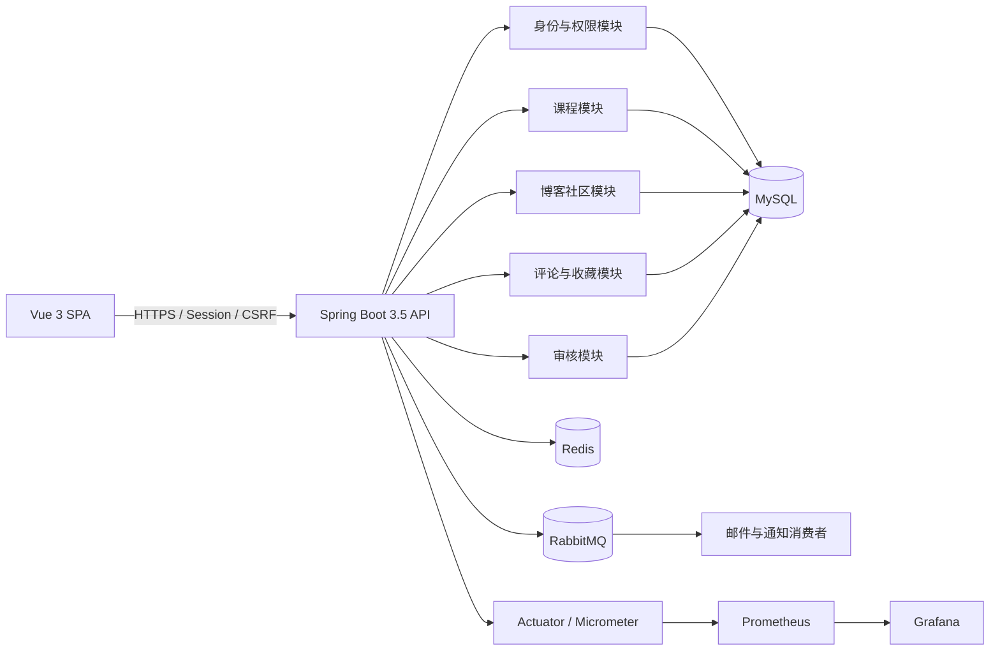

# CC4C 第三次迭代开发规划

> 状态：方面一“基础版本与依赖现代化”和方面二“模块化单体、API 与数据治理”已于 2026-08-27 完成实现、自动验证和用户浏览器验收；方面三至方面七尚未实施。

## 1. 规划背景与基线

CC4C 已完成两轮迭代：V1 建立并验证了认证、课程、博客、评论、收藏和管理员审核等核心功能，V2 完成了用户端与管理端的视觉、响应式、可访问性和交互反馈升级。

V3 以 Git 提交 `54262dad4053adeb4019be7dd95eb644995bc3da`（短提交号 `54262da`）为规划基线，重点从“功能可用、界面完整”提升到“架构清晰、安全可靠、可观测、可测试、可复现”。本轮预计按 6–8 周的作品级工程规模推进，但每个方面都需要在新的计划对话中独立完成源码检查、实施设计和验收确认。

本文件定义总体方向、顺序和验收证据。方面一、方面二的完成状态以本文件第 5 节和《CC4C 项目迭代修改记录》中的真实验证记录为准；其余方面仍只表示规划目标。

## 2. 当前状态与升级原则

### 2.1 已确认的当前状态

- 方面一已经把后端升级到 Java 21、Spring Boot 3.5.16，并完成 Jakarta Servlet 迁移。
- 数据访问已经收敛到 MyBatis-Plus 3.5.17 Boot 3 Starter、HikariCP 和 MySQL；重复 MyBatis Starter、MPJ、Druid、Fastjson及未使用分页配置已移除。
- 方面二已经建立 `shared`、`identity`、`catalog`、`community`、`interaction`、`moderation` 六模块单体，并由 Spring Modulith 1.4.12 自动验证边界。
- API 已使用请求/响应 DTO、Bean Validation、统一分页、正确 HTTP 状态和 OpenAPI；前端已同步分页与写操作方法。
- 数据库结构与公开目录基线已由 Flyway V1–V3 接管，历史 SQL 仅保留作参考；查询索引以实际 SQL 和 `EXPLAIN FORMAT=JSON` 为依据。
- 认证依赖业务 Cookie 和明文密码比较，尚未接入 Spring Security、密码哈希和统一授权模型。
- 尚未形成 Redis 缓存、消息可靠性、服务指标、可复现性能测试、容器编排和持续集成闭环。
- 前端已有较完整的 Vue 3 页面，活动调用统一复用 Axios 1.19.0 客户端，支持公开的 `VITE_API_BASE_URL` 和分页响应。

### 2.2 升级原则

1. **先建立安全网，再升级版本。** 每一项重构都必须有兼容测试或可复核的验收证据。
2. **采用模块化单体，不为技术数量拆微服务。** 当前业务规模优先保证模块边界、事务一致性和运维简单性。
3. **技术必须对应真实问题。** Redis、RabbitMQ、索引和异步化均需绑定明确场景与对照数据。
4. **不以跑分代替正确性。** 性能测试首先验证响应正确、错误率和数据一致性，再比较延迟与吞吐量。
5. **不编造结果。** README 和报告只能记录已经运行并保留原始证据的数据。
6. **保持用户功能连续。** V3 可以调整内部实现和认证机制，但现有用户端与管理端业务流程不得无故缺失。

## 3. 目标技术基线

| 领域 | V3 目标选择 | 采用原因 |
| --- | --- | --- |
| Java 与基础框架 | Java 21、Spring Boot 3.5.16 | 使用 LTS Java，进入 Jakarta 体系并获得较新的框架、可观测和配置能力 |
| 数据访问 | MyBatis-Plus 3.5.17 Boot 3 Starter、HikariCP、MySQL | 收敛重复依赖，保留现有 SQL 控制能力并使用 Spring Boot 默认连接池 |
| 模块治理 | Spring Modulith 1.4.12 | 与 Spring Boot 3.5 对应，用自动验证约束模块依赖而不拆微服务 |
| API 与数据变更 | DTO、Bean Validation、OpenAPI、Flyway | 明确输入输出、校验规则、接口文档和数据库版本 |
| 身份与安全 | Spring Security、Spring Session Redis、BCrypt、RBAC | 使用服务端会话和不可读 Cookie，建立认证、授权与密码安全闭环 |
| 性能与可靠性 | Redis、RabbitMQ、事务事件/Outbox | 优化读热点，并为邮件和审核通知提供可恢复的异步处理 |
| 可观测性 | Actuator、Micrometer、Prometheus、Grafana、结构化日志 | 将延迟、资源、缓存和消息状态转化为可验证证据 |
| 测试与交付 | JUnit 5、Testcontainers、Gatling Java DSL、Docker Compose、GitHub Actions | 形成隔离集成测试、可复现压测和自动化质量门禁 |

版本与兼容关系应以实施当日的官方稳定文档再次确认。本规划采用的主要依据包括：

- [Spring Boot 3.5 Reference](https://docs.spring.io/spring-boot/3.5/documentation.html)
- [MyBatis-Plus 安装说明](https://baomidou.com/en/getting-started/install/)
- [Spring Modulith 1.4 与 Spring Boot 兼容矩阵](https://docs.spring.io/spring-modulith/reference/1.4/appendix.html)
- [Spring Security 密码存储](https://docs.spring.io/spring-security/reference/features/authentication/password-storage.html)
- [Spring Boot Actuator Metrics](https://docs.spring.io/spring-boot/reference/actuator/metrics.html)
- [Testcontainers JUnit 5 Quickstart](https://java.testcontainers.org/quickstart/junit_5_quickstart/)
- [Gatling Maven Plugin](https://docs.gatling.io/integrations/build-tools/maven-plugin/)

## 4. 总体目标架构



## 5. 七个依次实施的方面

| 方面 | 状态 |
| --- | --- |
| 一：基础版本与依赖现代化 | 已完成；自动验证和用户浏览器验收通过 |
| 二：模块化单体、API 与数据治理 | 已完成；自动验证和用户浏览器验收通过 |
| 三：安全与身份体系 | 未实施 |
| 四：缓存、数据库与性能优化 | 未实施 |
| 五：异步事件与可靠性 | 未实施 |
| 六：可观测性与性能证据 | 未实施 |
| 七：容器化、自动化测试与持续交付 | 未实施 |

### 方面一：基础版本与依赖现代化（已完成）

目标是先获得可在 Java 21 和 Spring Boot 3.5 上稳定编译、测试和运行的功能等价版本。

- 固化 V2 核心接口、Cookie、数据序列化和主要业务流程的兼容测试。
- 升级 Java 21、Spring Boot 3.5.16，完成 `javax.*` 到 `jakarta.*` 迁移。
- 使用 MyBatis-Plus Boot 3 Starter，移除重复 MyBatis Starter 及未形成真实能力的 MPJ、Druid、Fastjson。
- 使用 HikariCP、Jackson 和类型安全的 Java 集合/对象代替临时 JSON 拼装。
- 集中前端 API Client，通过公开环境变量配置后端地址；不进行视觉重构。

进入下一方面前，应证明前后端可构建、现有自动化测试通过，并由用户完成核心业务浏览器验收。

完成证据（2026-08-27）：

- Java 21、Spring Boot 3.5.16、MyBatis-Plus 3.5.17 Boot 3 Starter、HikariCP、Jackson 和 Axios 1.19.0 已落地。
- 后端 `clean verify` 共 23 项测试全部通过；依赖树、有效 POM、JAR 配置清单和源码静态扫描符合方面一门禁。
- 前端 `npm ci` 和两次生产构建通过，默认 API 地址及 `VITE_API_BASE_URL` 覆盖均已验证。
- 使用脱敏配置和专用测试库完成在线契约回归，用户已确认浏览器验收通过。
- V2 URL、Cookie、JSON、Long ID、上传响应和前端路由契约保持不变。
- 完整命令、测试数量、已知非阻塞项和安全状态见 [CC4C 项目迭代修改记录](CC4C项目迭代修改记录.md#134-方面一实际变更)。

### 方面二：模块化单体、API 与数据治理（已完成）

目标是让代码结构反映业务领域，并让接口和数据库变更可追踪。

- 按身份、课程、社区、互动、审核和共享基础设施划分业务模块。
- 使用 Spring Modulith 验证循环依赖、非法模块访问和模块级集成行为。
- 引入 DTO、Bean Validation、统一成功响应、标准错误信息、正确 HTTP 状态和 OpenAPI。
- 使用 Flyway 建立可重复的数据库基线及后续迁移。
- 根据真实查询与 `EXPLAIN` 结果治理分页、索引和慢查询。

V3 优先保留现有 URL 和业务语义；若接口契约必须调整，应同步修改前端并以契约测试固定新行为。

完成证据（2026-08-27）：

- 后端按六个顶级模块重组，跨模块能力只从具名 `api` 接口暴露；Spring Modulith 结构验证确认恰好六个模块、无循环依赖、无内部包越界，并逐模块通过集成测试。
- 写接口使用独立 DTO 和 Bean Validation，统一错误响应及 400/401/404/409/422/500 状态；列表接口使用数据库分页，前端已同步分页器、错误消息与 POST/PUT/DELETE 语义。
- Springdoc OpenAPI 2.8.17 已覆盖请求/响应 DTO 和错误响应，默认关闭；脱敏环境启用后 `/v3/api-docs` 与 Swagger UI 验收通过，395 个 Schema 引用无悬空项。
- Flyway V1–V3 已分别覆盖 16 张表现有结构、公开课程目录基线、字符集/关系约束/查询索引；空库迁移、现有库显式基线、重复迁移和 `validate` 均通过。
- 课程首页、博客列表及两级评论读取改为聚合或批量分页查询；关键 SQL 保存迁移前后 `EXPLAIN FORMAT=JSON` 摘要，仅记录访问方式、索引和估算行数。
- 后端 `clean verify` 共 40 项测试全部通过，前端 `npm ci` 与生产构建通过；用户已确认课程、博客、收藏、评论、审核、草稿、分页与 Swagger 浏览器验收通过。
- 完整实施、验证、数据库恢复和已知非阻塞项见 [CC4C 项目迭代修改记录](CC4C项目迭代修改记录.md#139-方面二实际变更)。

### 方面三：安全与身份体系（未实施）

目标是替换当前业务 Cookie 和明文密码比较，形成完整认证授权闭环。

- 使用 Spring Security `SecurityFilterChain` 和基于角色的访问控制。
- 使用 Spring Session Redis 保存服务端会话，Cookie 设置 HttpOnly、SameSite、合理有效期，并在 HTTPS 环境启用 Secure。
- 为浏览器写操作启用 CSRF 防护，为前端建立统一 CSRF 处理。
- 使用 BCrypt/DelegatingPasswordEncoder；扩展密码字段并设计旧账号安全迁移或强制重置方案。
- 对登录、验证码、评论和发布操作增加限流、安全日志和失败审计。

安全验收应覆盖未登录、越权、CSRF、会话过期、退出、密码迁移和敏感字段不出现在响应/日志中。

### 方面四：缓存、数据库与性能优化（未实施）

目标是对可证明的读热点进行优化，而不是全局添加缓存注解。

- 对课程和博客列表、详情等热读场景使用 Redis Cache-Aside。
- 设计 TTL、随机抖动、空值保护、缓存键版本和更新失效策略。
- 结合慢查询、执行计划和连接池指标优化 SQL、分页和复合索引。
- 保留无缓存基线，进行同一数据集、同一硬件下的缓存前后与索引前后对比。

缓存命中率、数据库负载和 p95/p99 延迟必须来自真实测试，不预填改善比例。

### 方面五：异步事件与可靠性（未实施）

目标是将邮件和审核通知等非主链路工作异步化，并证明失败能够恢复。

- RabbitMQ 只承载邮件、审核通知等有明确解耦价值的任务。
- 使用事务事件或 Outbox 处理数据库事务和消息发送之间的一致性。
- 消费端实现幂等、有限重试、退避、死信队列和人工补偿入口。
- 验证重复消息、消费者宕机、Broker 短暂不可用和最终恢复场景。

普通查询和简单 CRUD 不为展示消息队列而强行异步化。

### 方面六：可观测性与性能证据（未实施）

目标是让系统状态和优化效果可以被持续观察和复核。

- 接入 Actuator、Micrometer、Prometheus 和 Grafana。
- 增加请求 Trace ID 与结构化日志，避免日志记录 Cookie、密码、Token 和完整个人数据。
- 观察 HTTP 延迟、错误率、JVM/GC、连接池、Redis 命中率、限流拒绝、RabbitMQ 重试和死信。
- 使用 Gatling Java DSL 为公开只读热路径和必要写路径建立独立负载模型。
- 在 `docs/reports/v3/` 保存测试环境、数据规模、脚本版本、原始结果和结论。

### 方面七：容器化、自动化测试与持续交付（未实施）

目标是让开发环境、测试和质量门禁可以由其他人稳定复现。

- Docker Compose 编排前端、后端、MySQL、Redis、RabbitMQ、Prometheus 和 Grafana。
- Testcontainers 覆盖 MySQL、Redis、RabbitMQ 集成测试，禁止测试回退到本机开发数据库。
- GitHub Actions 执行后端测试、模块验证、前端构建、依赖安全检查和镜像构建。
- 输出 ADR、运行手册、架构图、OpenAPI 和性能测试报告。
- 全部能力真实落地后，再使用事实和实测数据更新 README。

## 6. 性能验证框架

### 6.1 可重复环境

- Docker Desktop 是 V3 本地开发与正式验收前提。
- 测试数据通过脚本生成，记录随机种子、记录数量和数据分布。
- 基线与优化版本使用同一硬件、JVM 参数、容器资源、数据库数据和负载脚本。
- 每次报告记录 Git 提交、Java/容器版本和是否启用缓存、索引或异步能力。

### 6.2 负载分层

| 场景 | 默认负载 | 用途 |
| --- | --- | --- |
| 冒烟 | 20 并发，持续 1 分钟 | 验证脚本、响应断言和基础稳定性 |
| 标准 | 100 并发，预热 2 分钟、稳定运行 5 分钟，重复 3 次 | 形成可比较的日常性能基线 |
| 阶梯压力 | 50 → 100 → 200 → 500 并发 | 找到吞吐、延迟和错误率开始恶化的拐点 |

并发模型可在具体方面计划中根据本机资源调整，但任何对比必须使用相同模型。

### 6.3 必须记录的指标

- 业务断言成功率和 HTTP 错误率。
- 吞吐量以及 p50、p95、p99 响应时间。
- JVM CPU、堆内存、GC 次数和停顿。
- 数据库连接池活动连接、等待、查询耗时和慢查询。
- Redis 命中率、调用延迟和回源次数。
- RabbitMQ 发布失败、重试、积压和死信数量。

先完成 V2 基线测试，再冻结各方面的非回退门槛。规划目标不能在报告中写成已取得的结果，README 也不得展示没有原始报告支持的数字。

## 7. 兼容性和发布规则

- 每个方面开始前检查 Git 状态、上一个方面的提交与验收记录。
- 现有登录、课程、博客、评论、收藏、个人中心和管理员流程必须纳入回归测试。
- 数据库变更必须使用 Flyway，并在作用于非测试数据前备份和验证回滚方案。
- 真实 `back-end/CC4C/src/main/resources/application.yml` 必须保持忽略，不得读取、覆盖、暂存或上传。
- 仓库只提交脱敏示例配置；示例不得包含真实数据库密码、SMTP 授权码、Token、Cookie、私钥、邮箱或本机绝对路径。
- `node_modules/`、`dist/`、`target/`、`temp/`、日志和测试临时文件不得提交。
- 每个方面的实现、验证和发布均需得到当次对话的明确授权，不因本规划自动开始。

## 8. 本轮明确不引入的内容

以下技术暂不属于 V3 默认范围：

- Spring Cloud、Nacos、Seata 和微服务拆分。
- Kubernetes 和复杂多环境发布平台。
- Elasticsearch；当前先验证 MySQL 索引和查询能力是否足够。
- AI/RAG 或大模型功能；除非后续出现清晰、可验证的用户需求。
- 与现有功能无关的大规模前端视觉改版。

若未来引入，必须先说明现有方案无法解决的具体问题、增加的运维成本和可量化验收方式。

## 9. 新对话提示词

### 9.1 提示词一：只读接手 V3

```text
你正在接手 CC4C 项目的第三次迭代。请先只读并完整理解：

1. docs/CC4C项目迭代修改记录.md
2. docs/CC4C第三次迭代开发规划.md
3. README.md
4. 前后端的 pom.xml、package.json、路由、配置示例和现有测试结构

V3 以 Git 提交 54262da 为规划基线，目标是将项目升级为生产级、可验证的现代 Java 后端工程。总体路线依次为：基础版本现代化、模块化与数据治理、安全认证、缓存与性能、异步可靠性、可观测与压测、容器化与持续交付。

本条消息只允许只读检查。请回复你理解的项目现状、V3 各方面的执行顺序、第一方面的范围、兼容性风险、验证方式和安全规则。不要修改文件，不要执行测试或构建，不要启动或停止服务，不要执行 Git 暂存、提交或推送，也不要读取或修改本机 application.yml。等待我的下一条指令。
```

### 9.2 提示词二：规划第一个方面

```text
现在进入计划模式，为 docs/CC4C第三次迭代开发规划.md 中的第一个方面“基础版本与依赖现代化”制定可直接执行的详细实施计划。

请先只读检查当前工作区、后端 pom.xml、Java 源码中的 javax/jakarta 使用、MyBatis/MPJ/Druid/Fastjson 使用情况、前端 API 请求封装和现有测试。计划必须锁定 Java 21、Spring Boot 3.5.16、MyBatis-Plus 3.5.17，并说明升级顺序、依赖删除依据、Jakarta 迁移范围、V2 功能兼容测试、前端最小适配、构建验证、失败回滚和安全检查。

只规划第一个方面，不提前规划或实施模块化、安全、Redis 缓存、RabbitMQ、可观测性等后续方面。当前仍为计划模式，不要修改文件，不要运行会改变仓库状态的命令，不要启动或停止服务，不要暂存、提交或推送，更不能读取、修改或暂存本机 application.yml。计划完成后等待我确认。
```
