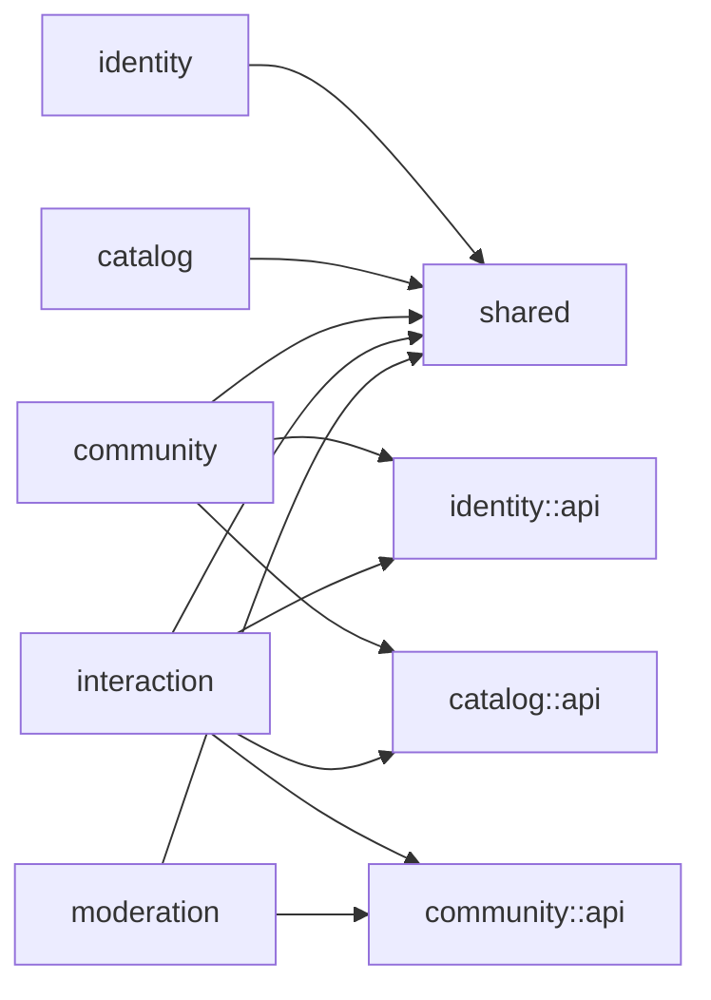

# CC4C 项目迭代修改记录

## 1. 文档信息

| 项目 | 内容 |
| --- | --- |
| 项目名称 | CC4C |
| 迭代主题 | 前后端功能稳定性与完整业务流程修复 |
| 迭代日期 | 2026-07-31 |
| 影响范围 | Spring Boot 后端、Vue 3 前端、功能测试、运行配置与项目文档 |
| 迭代性质 | 缺陷修复、健壮性增强、测试体系整理，不新增业务功能 |
| 文档状态 | 已完成 |

## 2. 迭代背景与目标

本轮迭代以“让项目能够流畅运行并通过核心功能性测试”为目标，先完成后端业务逻辑、接口行为和功能测试整理，再对已经启动的前端执行真实浏览器功能测试并修复问题。

本轮主要目标如下：

1. 建立覆盖用户、管理员、课程、博客、评论等核心领域的后端功能测试。
2. 根据测试结果修复后端事务、关联校验、空数据返回、登录态和异常处理问题。
3. 打通前端用户端与管理员端的完整业务闭环。
4. 修复 Vue 3 响应式状态、`script setup`、表单绑定、接口反馈和静态资源打包问题。
5. 保证后端测试、前端生产构建和关键浏览器流程全部通过。

本轮未引入新的业务模块，也未改变现有产品功能边界。

## 3. 总体变更摘要

| 领域 | 变更摘要 | 验证结论 |
| --- | --- | --- |
| 用户与管理员 | 修复注册、登录态、Cookie 生命周期、资料修改和密码安全输出 | 通过 |
| 课程 | 修复课程发布事务、模块关联、搜索空结果和收藏幂等性 | 通过 |
| 博客 | 修复发布事务、语言关联、收藏、草稿、空列表和浏览量校验 | 通过 |
| 评论 | 修复非法关联、孤儿数据、回复层级和用户信息补充 | 通过 |
| 前端用户端 | 修复登录、资料、课程、博客、收藏、评论和回复流程 | 通过 |
| 前端管理端 | 修复管理员登录、课程新增和博客审核流程 | 通过 |
| 构建与资源 | 修复 Vite 生产环境静态图片丢失和 Vue 控制台告警 | 通过 |
| 功能测试 | 后端 17 个功能测试全部通过；前端核心端到端流程全部通过 | 通过 |

---

## 4. 后端迭代修改记录

### 4.1 用户与管理员认证

#### BE-AUTH-01：完善用户 Cookie 生命周期

- 用户登录成功后，为 `user_email` Cookie 增加根路径和 `HttpOnly` 属性。
- 用户退出时将 Cookie 有效期设置为 `0`，确保浏览器真正删除登录 Cookie。
- 用户登录状态验证不再只判断 Cookie 是否存在，同时确认对应用户仍然存在。
- 获取当前用户信息时，对不存在的用户返回明确的功能失败结果，避免空对象或服务端异常。

主要涉及文件：

- `back-end/CC4C/src/main/java/com/cc4c/controller/UserController.java`
- `back-end/CC4C/src/main/java/com/cc4c/service/Impl/UserServiceImpl.java`

#### BE-AUTH-02：完善管理员 Cookie 生命周期

- 管理员登录 Cookie 增加根路径和 `HttpOnly` 属性。
- 管理员退出时显式删除 Cookie。
- 管理员校验接口同时验证管理员账号是否真实存在，避免伪造 Cookie 直接通过校验。
- 在管理员服务中增加账号存在性检查。

主要涉及文件：

- `back-end/CC4C/src/main/java/com/cc4c/controller/AdminController.java`
- `back-end/CC4C/src/main/java/com/cc4c/service/AdminService.java`
- `back-end/CC4C/src/main/java/com/cc4c/service/Impl/AdminServiceImpl.java`

#### BE-USER-01：修复用户注册唯一性判断

- 将用户名重复判断和邮箱重复判断拆分为独立查询条件。
- 修复原查询条件叠加后可能无法正确识别重复邮箱的问题。
- 保留数据库外键异常的功能性失败响应，同时避免输出无意义的异常堆栈。

#### BE-USER-02：增强资料与密码修改健壮性

- 修改密码前先判断目标用户是否存在。
- 修改个人资料前先判断用户是否存在。
- 保留用户名唯一性校验。
- 不存在的用户返回明确失败结果，不再触发空指针异常。

#### BE-USER-03：限制密码字段对外输出

- 将 `password` 和 `newPassword` 设置为仅允许 JSON 写入。
- 用户信息响应不再包含密码和新密码字段。

主要涉及文件：

- `back-end/CC4C/src/main/java/com/cc4c/entity/User.java`

### 4.2 课程业务

#### BE-COURSE-01：保证课程发布事务一致性

- 课程发布增加事务控制。
- 发布前验证目标语言模块是否存在。
- 课程写入成功但模块关联失败时回滚事务。
- 避免生成“课程存在但没有所属模块”的不完整数据。

主要涉及文件：

- `back-end/CC4C/src/main/java/com/cc4c/service/Impl/CourseServiceImpl.java`

#### BE-COURSE-02：统一空列表响应

- 查询不到课程模块时返回空数组，不再返回 `null`。
- 课程搜索或按语言查询没有结果时返回空数组。
- 前端可以统一按数组处理结果，避免额外空值分支。

#### BE-COURSE-03：完善课程收藏约束

- 收藏前验证用户和课程是否存在。
- 已收藏课程再次收藏时返回失败，不再产生重复收藏记录。
- 收藏列表、收藏状态和取消收藏流程通过功能测试验证。

### 4.3 博客业务

#### BE-BLOG-01：保证博客发布事务一致性

- 博客发布增加事务控制。
- 发布前验证作者是否存在。
- 验证文章涉及的语言 ID 是否全部有效。
- 对重复语言进行去重。
- 博客、语言关联和作者关联中的任一步骤失败时，不保留部分写入数据。

主要涉及文件：

- `back-end/CC4C/src/main/java/com/cc4c/service/Impl/BlogServiceImpl.java`

#### BE-BLOG-02：完善博客收藏行为

- 收藏前验证用户、博客及博客审核状态。
- 未审核博客不能被收藏。
- 修复博客收藏状态接口成功与失败状态码不一致的问题。
- 收藏列表过滤已逻辑删除的博客。

主要涉及文件：

- `back-end/CC4C/src/main/java/com/cc4c/controller/BlogController.java`
- `back-end/CC4C/src/main/java/com/cc4c/dao/BlogDao.java`

#### BE-BLOG-03：完善空数据与非法引用处理

- 用户没有博客时返回空数组。
- 某语言没有博客时返回空数组。
- 保存草稿前验证用户是否存在。
- 更新博客浏览量前验证博客是否存在。
- 非法作者、非法语言和非法博客引用返回功能性失败，不产生部分数据。

### 4.4 评论与回复

#### BE-COMMENT-01：增加评论引用校验

- 发布评论前验证用户是否存在。
- 课程评论验证课程是否存在。
- 博客评论验证博客是否存在。
- 回复验证父评论是否存在。
- 非法引用不会生成孤立评论数据。

#### BE-COMMENT-02：限制评论回复层级

- 通过间接评论关系读取父评论层级。
- 一级回复记录为第 `1` 层，二级回复记录为第 `2` 层。
- 超过两层的回复请求返回失败。

主要涉及文件：

- `back-end/CC4C/src/main/java/com/cc4c/dao/CommentDao.java`
- `back-end/CC4C/src/main/java/com/cc4c/service/Impl/CommentServiceImpl.java`

#### BE-COMMENT-03：保证评论事务一致性

- 评论主记录与课程、博客或父评论关联写入放入同一事务。
- 关联写入失败时抛出异常并回滚，避免孤儿评论。

#### BE-COMMENT-04：增强评论展示健壮性

- 补充评论用户、父评论和父评论用户的空值判断。
- 关联用户数据缺失时不再触发空指针异常。
- 为数据库保留字字段 `like` 增加显式字段映射。

主要涉及文件：

- `back-end/CC4C/src/main/java/com/cc4c/entity/Comment.java`
- `back-end/CC4C/src/main/java/com/cc4c/entity/Code.java`

### 4.5 通用异常与运行配置

#### BE-COMMON-01：启用统一异常处理

- 为全局异常处理方法增加 `@ExceptionHandler(Exception.class)`。
- 未处理异常统一返回项目失败码和布尔失败数据。
- 避免接口向前端泄露服务端异常堆栈。

主要涉及文件：

- `back-end/CC4C/src/main/java/com/cc4c/controller/ProjectExceptionAdvice.java`

#### BE-CONFIG-01：调整邮件和上传配置

- 邮件发送方改为读取 `spring.mail.username` 配置，不再在业务代码中硬编码。
- 调整 SMTP SSL/认证配置。
- 数据库密码和 SMTP 凭据改为环境变量，不再提交真实凭据。
- 博客图片、头像保存目录和访问地址支持环境变量覆盖，并保留当前开发路径作为非敏感默认值。
- 测试环境将文件写入 `target/functional-files`，避免污染前端公开资源目录。
- 本文档不记录任何 SMTP 密码或授权码。

主要涉及文件：

- `back-end/CC4C/src/main/java/com/cc4c/service/Impl/EmailServiceImpl.java`
- `back-end/CC4C/src/main/resources/application.yml`
- `back-end/CC4C/src/test/resources/application-test.yml`

运行环境可配置变量：

| 环境变量 | 用途 |
| --- | --- |
| `CC4C_DB_URL` | MySQL 连接地址 |
| `CC4C_DB_USERNAME` | MySQL 用户名 |
| `CC4C_DB_PASSWORD` | MySQL 密码，启动后端前必须配置 |
| `CC4C_MAIL_USERNAME` | SMTP 发件账号 |
| `CC4C_MAIL_PASSWORD` | SMTP 授权码 |
| `CC4C_SAVE_IMG_PATH` | 博客图片保存目录 |
| `CC4C_REQUEST_IMG_PATH` | 博客图片公网访问前缀 |
| `CC4C_SAVE_AVATAR_PATH` | 用户头像保存目录 |
| `CC4C_REQUEST_AVATAR_PATH` | 用户头像公网访问前缀 |

> 说明：上述内容记录的是本轮安全配置治理的设计目标。V1 发布基线已进一步调整为“本机真实 `application.yml` 被 Git 忽略、仓库跟踪脱敏 `application-example.yml`”的形式；当前实际约定以第 11.2 节为准。

### 4.6 后端功能测试体系

本轮删除了原先分散、依赖运行环境且覆盖有限的默认上下文、DAO 和 Service 测试，重新建立面向完整接口行为的功能测试。

新增测试结构：

- `FunctionalTestSupport.java`：统一提供 `MockMvc`、测试数据工厂、事务回滚和邮件发送模拟。
- `UserAdminFunctionalTest.java`：用户注册、登录、资料、密码、Cookie、邮件、头像和管理员认证。
- `CourseFunctionalTest.java`：课程模块、课程发布、查询推荐和收藏生命周期。
- `BlogFunctionalTest.java`：发布、审核、驳回、查询、收藏、草稿、图片上传和非法引用。
- `CommentFunctionalTest.java`：课程评论、博客评论、回复层级和非法引用。
- `application-test.yml`：测试邮件账号占位值和测试文件目录。

后端测试覆盖结果：

| 测试类 | 用例数 | 失败 | 错误 | 跳过 |
| --- | ---: | ---: | ---: | ---: |
| `UserAdminFunctionalTest` | 5 | 0 | 0 | 0 |
| `CourseFunctionalTest` | 3 | 0 | 0 | 0 |
| `BlogFunctionalTest` | 6 | 0 | 0 | 0 |
| `CommentFunctionalTest` | 3 | 0 | 0 | 0 |
| **合计** | **17** | **0** | **0** | **0** |

建议执行命令：

```powershell
cd back-end/CC4C
mvn test
```

---

## 5. 前端迭代修改记录

### 5.1 用户认证与注册

#### FE-AUTH-01：修复登录状态初始化竞态

- 用户登录成功后，先等待 `/users/info` 返回。
- 将用户 ID、用户名、邮箱、专业、订阅语言和头像完整写入 Vuex。
- 用户信息初始化完成后再进入首页。
- 避免首页、收藏和个人空间首次加载时使用空用户 ID。

主要涉及文件：

- `front-end/CC4C/src/views/login/Login.vue`

#### FE-AUTH-02：修复管理员失败登录误跳转

- 仅在后端返回成功数据时进入管理员页面。
- 兼容后端管理员登录成功数据为数值 `1`。
- 登录失败继续停留在管理员登录页并显示错误原因。

主要涉及文件：

- `front-end/CC4C/src/views/admin/AdminLoginView.vue`

#### FE-AUTH-03：完善退出登录

- 使用 Vue Router 返回登录页。
- 清空 Vuex 用户状态。
- 使用 Element Plus 消息替代阻塞式浏览器弹窗。
- 移除对 `http://localhost:5173` 的前端跳转硬编码。

主要涉及文件：

- `front-end/CC4C/src/layout/components/header.vue`

#### FE-AUTH-04：完善注册与找回密码校验

- 密码输入框改为密码类型并支持显示切换。
- 增加注册必填项、密码长度和邮箱格式校验。
- 验证码请求增加加载状态和失败反馈。
- 注册接口根据后端实际结果显示成功或失败。
- 找回密码保留邮箱、验证码和新密码校验。

主要涉及文件：

- `front-end/CC4C/src/views/login/Register.vue`
- `front-end/CC4C/src/views/login/Login.vue`

### 5.2 用户资料

#### FE-USER-01：修复资料表单回显

- 专业、订阅语言和头像改为读取正确的 Vuex 字段。
- 下拉框值统一转换为数值，保证 Element Plus 选项正确匹配。
- 修复专业和订阅语言进入编辑对话框后显示为空的问题。

#### FE-USER-02：修复资料、密码和头像反馈

- 资料更新后重新读取用户信息并同步 Vuex。
- 更新头像和页面显示，不再依赖整页刷新。
- 增加用户名、原密码和新密码的必填校验。
- 使用 `ElMessage` 替代 `script setup` 中不存在的 `this.$message`。
- 头像格式、大小和上传失败均提供明确提示。

主要涉及文件：

- `front-end/CC4C/src/components/UserInfo.vue`
- `front-end/CC4C/src/views/UserinfoView.vue`

### 5.3 课程功能

#### FE-COURSE-01：修复课程搜索事件

- 将错误的 `:change="search()"` 改为真实事件监听。
- 支持输入变更和回车搜索。
- 避免组件渲染阶段重复调用课程搜索接口。

#### FE-COURSE-02：修复课程收藏、评论和回复

- 移除 `script setup` 函数中错误使用的 `this`。
- 课程对象和评论列表改为正确的 `ref` 状态。
- 收藏状态仅在后端操作成功后更新。
- 评论和回复增加空内容校验。
- 评论或回复成功后重新加载列表，无需刷新页面。
- 评论输入框默认值改为空，提示文字使用 `placeholder`。

主要涉及文件：

- `front-end/CC4C/src/views/course/CourseView.vue`
- `front-end/CC4C/src/views/course/CourseDetailView.vue`
- `front-end/CC4C/src/views/course/AllCoursesView.vue`

#### FE-COURSE-03：修复新增课程表单

- 将级联选择值由不可重新赋值的 `reactive` 常量改为 `ref`。
- 修复课程难度错误绑定到模块表单的问题。
- 正确转换语言名称、语言 ID 和模块优先级。
- 增加课程标题、模块和正文必填校验。
- 课程发布严格根据后端结果反馈。
- 发布成功后清空表单。
- 重新加载模块时覆盖子项，避免重复追加。
- 模块新增严格根据后端结果反馈。

主要涉及文件：

- `front-end/CC4C/src/views/admin/AddCourseView.vue`

### 5.4 博客功能

#### FE-BLOG-01：修复博客详情交互

- 移除收藏、评论函数中错误使用的 `this`。
- 博客对象和评论列表改为正确的响应式状态。
- 收藏与取消收藏仅在后端成功后更新页面。
- 评论和回复增加空内容校验。
- 评论与回复成功后局部刷新列表。

主要涉及文件：

- `front-end/CC4C/src/views/blog/BlogDetailView.vue`

#### FE-BLOG-02：修复发布和草稿反馈

- 博客语言值改为数值类型，与后端语言 ID 一致。
- 发布和保存草稿严格根据后端返回结果反馈。
- 发布成功后清空标题、语言和正文。
- 重复草稿或发布失败时不再错误提示成功。

主要涉及文件：

- `front-end/CC4C/src/views/blog/BlogWriteView.vue`

#### FE-BLOG-03：修复博客审核

- 审核通过和驳回均校验后端结果。
- 审核成功后局部刷新待审核列表。
- 不再通过整页刷新完成状态更新。
- 博客加载和审核异常提供明确反馈。

主要涉及文件：

- `front-end/CC4C/src/views/admin/CheckBlogView.vue`

### 5.5 交互、资源和控制台

#### FE-UX-01：统一单击打开内容

- 课程、博客、收藏和个人博客列表由双击打开改为单击打开。
- 降低用户误操作和功能不可发现问题。

涉及页面：

- 首页
- 全部课程
- 全部博客
- 收藏中心
- 博客浏览
- 博客管理

#### FE-ASSET-01：修复生产环境静态资源

- 新增统一静态资源导出文件 `front-end/CC4C/src/assets/index.js`。
- 将 `src/assets/...` 字符串路径改为 Vite 模块导入。
- Logo、默认头像、语言图片、轮播图片、收藏和评论图标均进入生产构建产物。
- 解决开发服务器正常、生产部署图片丢失的问题。

#### FE-CONSOLE-01：清理 Vue 运行时告警

- 修复首页不存在的 `fit` 变量。
- 修复 Element Plus `gutter` 属性字符串类型告警。
- 修复课程菜单 `index` 数值类型告警。
- 最终关键页面浏览器回归无新增 `error` 或 `warn`。

### 5.6 前端功能验证

前端使用真实浏览器、运行中的后端和开发数据库完成端到端验证，覆盖：

- 用户正确/错误登录、退出、注册校验和找回密码校验。
- 首页课程、博客和图片资源。
- 课程浏览、搜索、详情、收藏、评论和回复。
- 用户资料编辑、密码校验和收藏中心。
- 博客发布、管理、审核、公开展示、收藏、评论和回复。
- 管理员正确/错误登录、课程新增、博客审核和数据总览。
- 生产构建和浏览器控制台回归。

完整前端功能测试报告：

- [CC4C 前端功能性测试报告](../front-end/CC4C/FUNCTIONAL_TEST_REPORT.md)

生产构建验证：

```powershell
cd front-end/CC4C
npm run build
```

验证结果：

- Vite 成功转换 `1475` 个模块。
- `dist/assets` 已包含项目图片资源。
- 构建无编译错误。
- 当前仅保留主 JavaScript 包大于 `500 KiB` 的性能提示。

---

## 6. 前后端接口契约调整

| 接口行为 | 迭代前 | 迭代后 |
| --- | --- | --- |
| 空课程/博客集合 | 部分接口返回 `null` | 统一返回空数组 |
| 收藏操作 | 可能重复收藏或引用不存在数据 | 验证用户、内容和重复关系 |
| 博客收藏状态 | 成功与失败都可能使用失败码 | 使用成功码并在 `data` 返回状态 |
| 用户/管理员校验 | 只判断 Cookie 内容 | 同时验证数据库账号存在 |
| 评论创建 | 可能先写主记录再关联失败 | 事务内完成写入和关联 |
| 课程/博客发布 | 可能产生部分关联数据 | 事务控制并验证所有引用 |
| 用户信息输出 | 可能序列化密码字段 | 密码字段仅允许写入 |
| 前端反馈 | 部分操作不检查 `data` | 统一依据后端结果更新页面 |

## 7. 本轮测试数据

前端端到端测试在当前开发数据库中保留以下带有明显标识的数据，便于人工复查：

- 测试用户：`codexui_0731190952@example.com`
- 测试课程：`前端功能回归课程-0731-1935`
- 测试博客：`前端功能回归博客-0731-1925`
- 课程评论：`前端回归测试评论-0731-1920`
- 课程回复：`前端回归测试回复-0731-1921`
- 博客评论：`博客前端回归评论-0731-1930`
- 博客回复：`博客前端回归回复-0731-1931`

后端自动化功能测试使用事务回滚，不应在成功结束后保留业务测试数据。邮件发送在测试中使用模拟对象，文件上传写入 `target/functional-files`。

## 8. 验收结果

| 验收项 | 结果 |
| --- | --- |
| 后端功能测试 | 17/17 通过 |
| 后端测试失败数 | 0 |
| 后端测试错误数 | 0 |
| 用户端核心业务闭环 | 通过 |
| 管理员端核心业务闭环 | 通过 |
| 前端生产构建 | 通过 |
| 关键页面控制台错误 | 0 |
| 关键页面控制台警告 | 0 |

本轮“前后端功能稳定性迭代”达到预定目标，可以进入下一阶段的性能优化、部署配置治理或新增功能迭代。

## 9. 已知边界与后续建议

以下事项不阻塞当前功能验收：

1. 前端主 JavaScript 包约 `869 KiB`，建议后续按路由和编辑器依赖进行拆包。
2. 前端 API 地址仍以本地 `http://localhost:4080` 为主，公网部署前应改为 `VITE_API_BASE_URL` 环境变量。
3. 后端上传保存目录和资源访问地址已支持环境变量覆盖；部署环境仍需显式配置对应目录和公网访问地址。
4. SMTP 真实投递依赖外部邮件服务，本轮后端自动化测试使用模拟发送器，前端未读取外部邮箱验证实际到达。
5. 浏览器自动化未读取用户本地文件，因此真实头像选择和本地图片选择仍建议人工补充一次验收。
6. 当前前端功能验证以浏览器端到端执行和测试报告为主，后续可引入 Vitest 与 Playwright 测试代码并纳入持续集成。

## 10. 相关文档

- [前端功能性测试报告](../front-end/CC4C/FUNCTIONAL_TEST_REPORT.md)

---

## 11. 第一轮迭代（V1）发布基线归档

### 11.1 基线定义

从 2026-08-18 起，将当前已经推送到 GitHub 的“前后端功能稳定性迭代”视为 **CC4C 第一次迭代（V1）** 的功能基线。

| 项目 | 基线内容 |
| --- | --- |
| Git 分支 | `codex/cc4c-functional-stability-iteration` |
| 基线提交 | `bf810a63985a92160210e004d4ebd6094791cbdf`（`chore: keep local backend config untracked`） |
| 前序核心提交 | `060c1bd5a1d17ed94f944a586f8be10a957e5cda`（功能稳定性修复） |
| GitHub PR | [#4 稳定 CC4C 前后端核心功能流程](https://github.com/Jaily16/CC4C/pull/4)；记录时为草稿状态 |
| 后端验证 | `mvn clean test`：17/17 通过 |
| 前端验证 | `npm run build` 通过；核心浏览器功能回归通过 |
| 运行验证 | 后端默认启动可访问 `http://localhost:4080`，课程首页接口返回成功 |

V2 只允许在该基线之上进行页面视觉与用户友好性迭代；不应回退、删除或改变 V1 已验收的认证、课程、博客、评论、收藏、审核等功能行为，除非后续任务明确记录了修复原因和回归用例。

### 11.2 V1 后的本地运行与安全配置约定

为同时满足本机直接运行与 GitHub 安全上传，V1 基线后的配置文件约定如下：

| 文件 | 用途 | Git 状态 |
| --- | --- | --- |
| `back-end/CC4C/src/main/resources/application.yml` | 本机真实开发配置；Spring Boot 直接启动时默认读取 | 已由 `.gitignore` 忽略，禁止暂存或上传 |
| `back-end/CC4C/src/main/resources/application-example.yml` | 与本机配置结构一致的脱敏示例；数据库、邮件等敏感项使用环境变量占位符 | 必须提交并维护 |
| `front-end/CC4C/node_modules/`、`front-end/CC4C/dist/`、`back-end/CC4C/target/`、`temp/` | 本机依赖、构建或临时产物 | 已忽略，禁止提交 |

本机后端可直接执行：

```powershell
cd back-end/CC4C
mvn spring-boot:run
```

后续任何人修改配置结构时，必须同步更新 `application-example.yml`，但不得通过 Git 覆盖、删除或上传本机 `application.yml`。发布前必须通过显式暂存和暂存区敏感信息检查，详见《CC4C 第二次迭代开发计划》。

### 11.3 V2 交接入口

- [CC4C 第二次迭代开发计划](CC4C第二次迭代开发计划.md)

---

## 12. 第二次迭代（V2）：页面视觉与用户友好性

### 12.1 迭代范围

V2 以 V1 提交 `bf810a63985a92160210e004d4ebd6094791cbdf` 为功能基线，聚焦页面视觉一致性、响应式布局、操作反馈和可访问性。认证、课程、博客、评论、收藏、审核等 V1 前后端行为和 API 契约保持不变；没有新增后端接口，也没有重置 Vuex 登录状态。

### 12.2 Task 1–8 实际完成内容

| 任务 | 主要页面/组件 | 实际完成内容 |
| --- | --- | --- |
| Task 1 | `App.vue`、全局样式、用户端壳层、页头、侧栏、`PageFeedback` | 建立设计令牌、全局焦点样式、响应式壳层和统一加载/空数据/失败反馈 |
| Task 2 | `/login`、`/register`、`/adminLogin` | 重排认证页视觉层级，补齐字段提示、提交状态、找回密码与移动端布局 |
| Task 3 | `/home`、`/allCourses`、`/allBlogs`、课程/博客发现列表 | 统一发现页横幅、筛选搜索和卡片系统；增加悬浮/焦点响应，修复导航激活态、语言图标排列、侧栏头像与折叠布局 |
| Task 4 | `/courseDetail`、课程内容与评论区、通用内容操作栏 | 优化阅读区、收藏/评论操作和评论层级；修复 Markdown 星级显示；将课程目录改为随页面固定的浮动按钮及上方弹出目录 |
| Task 5 | `/allBlogs`、`/blogDetail`、`/blogWrite`、`/blogmanage`、博客浏览页 | 统一博客发现、详情、写作和管理体验，补齐正文目录、表单反馈、文章状态和空/失败状态 |
| Task 6 | `/userinfo`、`/favorite`、`UserInfo.vue` | 重构个人资料概览、编辑资料、修改密码和头像反馈；统一收藏课程/博客卡片及空状态 |
| Task 7 | 管理端壳层、`/admin/CoursesAndBlogs`、`/admin/addCourse`、`/admin/checkBlog` | 统一管理员导航、数据总览、课程发布分区和博客审核工作台；补齐加载、确认、禁用与失败反馈 |
| Task 8 | Task 1–7 全部目标页、两份回归文档 | 完成源码级响应式/可访问性/反馈审计、前端生产构建和后端 17 项测试；未发现需继续修改的页面回归 |

### 12.3 Task 8 验证记录

| 验证项 | 结果 |
| --- | --- |
| 活动路由原生 `alert`、内联 `style`、`window.location`、错误 `this.$...` 扫描 | 未发现 |
| 全局可见焦点、原生按钮/链接语义、整卡 Enter 操作 | 源码审计通过 |
| 数据页加载、空数据、失败、重试与提交禁用态 | 源码审计通过 |
| `git diff --check` | 通过，仅有 LF/CRLF 工作区提示 |
| 前端生产构建 | 通过；Vite 3.2.4 转换 1480 个模块 |
| 后端测试 | 17/17 通过，0 失败、0 错误、0 跳过 |

前端构建命令为：

```powershell
cd front-end/CC4C
npm run build -- --outDir ..\..\temp\cc4c-task8-build-20260819
```

后端验证命令为：

```powershell
cd back-end/CC4C
mvn test
```

Task 1–7 的页面验收截图位于当前 Codex 任务的浏览器注释记录中，涉及 `/home`、`/allCourses`、`/allBlogs`、`/courseDetail`、`/userinfo`、`/favorite` 和 `/admin/addCourse`；未向仓库写入截图。完整 V2 回归明细见 [CC4C 前端功能性测试报告](../front-end/CC4C/FUNCTIONAL_TEST_REPORT.md)。

### 12.4 待人工确认与遗留项

按当前协作约定，项目由用户在本机启动后完成浏览器验收。Task 8 交付后仍需在 1440px、1024px、768px、375px 下覆盖用户端目标路由和三个管理员子页，检查页面级横向溢出、按钮/文字重叠、Tab/Shift+Tab/Enter、空数据/失败重试以及控制台 `error`/`warn`。该项在用户确认前不记录为自动通过。

以下为非阻塞遗留项：

1. Vite 仍提示入口 JavaScript 包约 874 KiB，建议后续拆分 Element Plus、Markdown 编辑器和公共依赖。
2. Maven 测试仍输出部分关联实体缺少 `@TableId` 的既有 MyBatis-Plus 警告；本轮没有修改后端模型或返回结构。
3. Task 8 未执行 Git 暂存、提交、推送或 PR；安全发布继续留给 Task 9 或用户后续明确指令。

### 12.5 本地配置与发布安全状态

- `back-end/CC4C/src/main/resources/application.yml` 未修改、未暂存，继续由 Git 忽略。
- 前端构建产物位于已忽略的 `temp/`；`node_modules/`、`dist/`、`target/` 和 `temp/` 均不得提交。
- 本轮没有启动或停止前后端服务，没有创建提交、推送分支或创建 PR。

---

## 13. 第三次迭代（V3）：生产级 Java 后端工程化规划

### 13.1 当前状态

截至 2026-08-28，V3 方面一至方面四均已完成实现、自动验证、脱敏环境运行和用户浏览器验收。方面四以方面三提交 `ca628e1` 为唯一基线，在不改变 URL、DTO、状态码、安全 Cookie、CSRF 和模块边界的前提下加入 Redis Cache-Aside、批量查询、Flyway V5 复合索引及可重复性能基准；方面五至方面七尚未实施。

| 项目 | 当前记录 |
| --- | --- |
| 规划基线 | `54262dad4053adeb4019be7dd95eb644995bc3da`（短提交号 `54262da`） |
| 规划文档 | [CC4C 第三次迭代开发规划](CC4C第三次迭代开发规划.md) |
| 预计规模 | 6–8 周，按七个方面依次推进 |
| 当前阶段 | 方面四已完成并通过自动、性能与用户浏览器验收 |
| 已落地基线 | Java 21、Spring Boot 3.5.16、MyBatis-Plus 3.5.17、Spring Modulith 1.4.12、Flyway V1–V6、Spring Security、Spring Session Data Redis、BCrypt、Redis Cache-Aside、RabbitMQ 4.3.5、Transactional Outbox/Inbox、springdoc OpenAPI 2.8.17、Axios 1.19.0 |
| 下一方面 | 异步事件与可靠性；尚未规划或实施 |

### 13.2 已确定的总体路线

1. 基础版本与依赖现代化。
2. 模块化单体、API 与数据治理。
3. Spring Security 与 Spring Session Redis 身份体系。
4. Redis 缓存、数据库和性能优化。
5. RabbitMQ、事务事件与异步可靠性。
6. Actuator、Micrometer、Prometheus、Grafana 与 Gatling 性能证据。
7. Docker Compose、Testcontainers 和 GitHub Actions 持续交付。

Java 21、Spring Boot 3.5.16 和 MyBatis-Plus 3.5.17 已在方面一落地；Spring Modulith 1.4.12、DTO/校验/分页/OpenAPI 和 Flyway V1–V3 已在方面二落地；Spring Security、Spring Session Redis、BCrypt、CSRF、安全限流和 Flyway V4 已在方面三落地；Redis 业务缓存、批量查询、Flyway V5 及隔离性能基准已在方面四落地。RabbitMQ、Actuator、容器和持续交付仍是后续目标，不能在代码、README 或对外说明中表述为已经完成。

### 13.3 安全与实施边界

- V3 每个方面均需在新的计划对话中独立检查、设计、实施和验收，不因规划文档建立而自动开始。
- `back-end/CC4C/src/main/resources/application.yml` 继续由 Git 忽略，禁止读取、覆盖、暂存或上传。
- 只允许提交脱敏示例配置；`node_modules/`、`dist/`、`target/`、`temp/`、日志和本机凭据不得提交。
- README 只有在相关能力真实落地并产生可复核证据后才允许更新，且不得展示虚构性能结果。

### 13.4 方面一实际变更

#### 后端基础版本与依赖

- 通过 Spring Boot 2.7.18 兼容桥，最终升级到 Java 21 和 Spring Boot 3.5.16。
- 切换到 `mybatis-plus-spring-boot3-starter:3.5.17`，MySQL 驱动版本交由 Spring Boot 管理，数据源使用默认 HikariCP。
- 删除重复 MyBatis Starter，以及无实际调用依据的 MPJ、Druid、Fastjson 和未使用分页配置；没有提前引入方面二的数据治理能力。
- 完成 Servlet API 的 Jakarta 迁移，测试模拟注解切换为 `@MockitoBean`；全仓不再保留 `javax.*` 兼容依赖。
- 用 Java 集合和 Jackson 保持原 JSON 字段；文件工具改用 `Path.resolve` 和 `Files.createDirectories`，移除硬编码 Windows 保存路径。
- 保留 `/test` 路由并将控制器类规范为 `TestController`，上传接口继续返回既有字段。

#### 配置与测试安全网

- Maven 测试固定加载 `application-test.yml`，测试数据库仅接受无默认值的 `CC4C_TEST_DB_URL`、`CC4C_TEST_DB_USERNAME`、`CC4C_TEST_DB_PASSWORD`。
- 新增脱敏 `.env.test.example` 和 `run-tests.ps1`；本机 `.env.test.local` 缺失或变量为空时快速失败，不回退到开发数据库。
- Maven Resources 排除本机 `application.yml`，最终 JAR 只保留脱敏 `application-example.yml`。
- 新增 V2 兼容测试和 `/test` 上传测试，固定 Cookie、CORS、收藏摘要、HTTP 200 业务失败、上传响应和 HikariCP 等行为。

#### 前端最小适配

- Axios 移入运行时依赖并锁定 1.19.0，删除无运行引用的 `vue-cli-plugin-axios` 和旧 `src/api/user.js`。
- 20 个活动页面/组件统一复用 `src/plugins/axiosInstance.js`，移除分散的绝对 API 地址和重复 `withCredentials` 设置。
- 新增公开的 `VITE_API_BASE_URL`，默认仍为 `http://localhost:4080`；前端路由、Vuex 数据模型、视觉和业务交互未调整。

### 13.5 自动验证证据

| 验证项 | 实际结果 |
| --- | --- |
| 工具链 | Maven 3.9.16；Eclipse Temurin Java 21.0.12.1 |
| 后端 `./run-tests.ps1 clean verify` | 23/23 通过，0 失败、0 错误、0 跳过；JAR 构建成功 |
| 有效 POM | Parent 3.5.16、Java 21、MyBatis-Plus 3.5.17 |
| 依赖树 | 存在 Boot 3 MyBatis-Plus Starter、HikariCP、MySQL 驱动；不存在旧 Starter、MPJ、Druid、Fastjson |
| JAR 配置清单 | 不含 `BOOT-INF/classes/application.yml`；包含脱敏 `application-example.yml` |
| 源码静态扫描 | 未发现 `javax.*`、Fastjson、MPJ、Druid、旧 Starter、`@MockBean` 或硬编码 Windows 保存路径 |
| 前端 `npm ci` | 通过 |
| 前端生产构建 | 两次通过，均转换 1495 个模块；第二次确认 `VITE_API_BASE_URL` 覆盖生效 |
| `git diff --check` | 通过 |

后端最终验证命令：

```powershell
cd back-end/CC4C
.\run-tests.ps1 clean verify
```

前端最终验证命令：

```powershell
cd front-end/CC4C
npm ci
npm run build -- --outDir ../../temp/cc4c-v3-aspect1-build
$env:VITE_API_BASE_URL = 'http://127.0.0.1:4080/'
npm run build -- --outDir ../../temp/cc4c-v3-aspect1-build-override
```

### 13.6 运行与浏览器验收

- 后端以 `SPRING_CONFIG_NAME=application-example` 和显式环境变量启动，运行时确认 Java 21、Spring Boot 3.5.16 和 Tomcat 10.1.55；未加载本机 `application.yml`。
- 在线契约回归覆盖用户正确/错误登录、Cookie、资料、头像、密码修改与恢复，课程首页/搜索/详情/收藏/评论/回复，博客草稿/上传/提交/审核/公开详情/收藏/评论/回复，以及管理员登录、课程发布和 CORS。
- 在线契约全部通过；后端与前端运行日志未发现新增错误，`/`、`/blogsdetail`、`/blogDetail`、`/admin`、`/test` 均可访问。
- 2026-08-27 用户确认方面一浏览器验收通过。
- 验收结束后仅停止本次启动的 V3 前后端进程，端口 4080 和 5173 已释放；MySQL 未停止。

### 13.7 兼容性结论

- `/users`、`/admin`、`/courses`、`/blogs`、`/comments`、`/test` 的路径和 HTTP 方法保持不变。
- `Result` 继续使用 `code/data/msg`，既有业务失败继续返回 HTTP 200。
- `user_email` 和 `admin` Cookie 的名称、值、路径、HttpOnly、有效期和退出删除行为保持不变。
- Long ID 继续序列化为字符串，密码字段不出现在响应；课程收藏摘要和博客上传响应字段保持不变。
- `/blogsdetail`、`/blogDetail` 等前端路由未修改，默认 API 地址及环境变量覆盖均已验证。

### 13.8 已知非阻塞项与发布安全

1. `npm audit --omit=dev` 仍报告 7 个既有生产依赖漏洞（3 个中等、4 个高危），涉及编辑器、Element Plus 及其传递依赖；Axios 1.19.0 不在报告中。修复需要升级方面一明确冻结的前端框架/编辑器依赖，未在本方面越界处理。
2. Vite 仍报告主包大于 500 KiB 的既有提示；本方面没有开展拆包或性能优化。
3. MyBatis-Plus 仍输出部分关联实体缺少 `@TableId` 的既有警告；数据模型治理留待方面二。
4. Windows 工作区中的 `testController.java` 属于仅大小写重命名。未来获得暂存授权后，应使用两步 `git mv` 确保 Git 正确记录为 `TestController.java`；本方面未执行暂存。
5. 本机 `application.yml` 未读取、未修改、未暂存；凭据和本机绝对路径未写入变更文件。
6. `node_modules/`、`dist/`、`target/`、`temp/` 和日志仍处于忽略范围。本方面未暂存、提交或推送。

### 13.9 方面二实际变更

#### 独立基线与模块化单体

- 先修正 `TestController.java` 的 Git 大小写记录，重新通过方面一门禁，并建立独立检查点提交 `b1b9c1b`（`chore: modernize CC4C foundation`）；未推送。
- 后端按 `shared`、`identity`、`catalog`、`community`、`interaction`、`moderation` 六个顶级模块重组。每个模块通过 `package-info.java` 声明允许依赖，内部 Mapper、实体和服务不对外暴露。
- 跨模块能力只通过 `identity::api`、`catalog::api` 和 `community::api` 的查询或审核接口访问。Spring Modulith 验证恰好识别六个模块，无循环依赖、内部包越界或未声明依赖。
- 控制器和服务统一使用构造器注入与 `private final` 依赖；删除仅为转发而存在的 Service/Impl 二层结构。
- 复合关系表改用明确的参数化 SQL，不再借用要求单一主键的 `BaseMapper`，方面一记录的关联实体 `@TableId` 警告已消除。

实际模块依赖如下：



#### API、DTO 与分页治理

- 普通响应继续使用泛型 `code/data/msg`，请求体和响应体改为独立 DTO；服务端生成的 ID、时间、点击量和删除状态不再允许由请求覆盖，密码字段不进入响应或 OpenAPI Schema。
- Bean Validation 覆盖用户名、邮箱、密码、课程/模块/博客标题、枚举值、正文、评论和正数 ID；统一异常处理返回受控业务码及 400/401/404/409/422/500，未捕获异常不泄露堆栈和请求正文。
- 列表统一返回 `items/page/size/total/totalPages/hasNext/hasPrevious`，页码从 1 开始，默认 20 条、最大 100 条；课程、博客、收藏、审核和顶层评论均在数据库分页，评论页仍批量装配完整的两级回复。
- 写操作调整为 `POST /users/logout`、`POST /admin/logout`、`POST /users/email/{email}`、`POST /courses/star/{userId}/{courseId}` 和 `POST /blogs/collect/{uid}/{bid}`，不再保留旧 GET 写方法。
- 草稿使用 `PUT /blogs/draft` 新增或覆盖、`GET /blogs/draft/{id}` 读取、`DELETE /blogs/draft/{id}` 删除；博客提交成功后在同一事务清除用户草稿。
- Springdoc OpenAPI 2.8.17 显式记录 DTO、分页和错误响应。`CC4C_API_DOCS_ENABLED` 默认 `false`，只在脱敏验收环境显式开启。
- 修复 Swagger 公共错误响应引用在最终 `components` 中缺少 `ApiErrorResponse` 的问题，并增加契约测试；运行文档共检查 395 个 Schema 引用，悬空引用为 0。

#### Flyway 与查询治理

- Flyway 成为数据库结构的唯一来源：V1 创建现有 16 张表，V2 幂等写入 4 种语言、61 门初始课程、9 个课程模块和 61 条模块关系，V3 统一文本字符集、强化评论归属和父回复完整性，并增加博客及回复查询索引。
- `baseline-on-migrate` 保持关闭。主测试库在迁移前使用 `mysqldump --single-transaction --skip-lock-tables` 备份并保存 SHA-256；测试脚本强制主库以 `_test` 结尾、空库以 `_flyway_test` 结尾且两者不同。
- 第一次作用于 `cc4c_test` 的 V3 迁移因外键两侧字符排序规则不一致而停止。未执行 `clean`、`repair` 或覆盖恢复；在用户完成恢复库授权后，将已验证备份恢复到固定的 `cc4c_recovery_test`，再由 V3 同时转换关联表两侧并重建外键，最终迁移成功。原失败库保持不变，便于审计。
- 空迁移库从 V1 重建、恢复库显式基线到版本 1 后应用 V2/V3、第二次迁移零新增、`validate` 和结构断言全部通过。
- 课程首页使用聚合收藏计数；博客首页、全部、语言、搜索、个人与收藏查询均使用稳定排序的数据库分页；评论读取批量加载用户和两级回复，避免逐评论 N+1。
- `EXPLAIN FORMAT=JSON` 证据保存在忽略的 `temp/`。迁移后博客时间排序选择 `idx_blog_state_time`，点击排序选择 `idx_blog_state_click`，回复查询选择 `idx_indirect_comment_father`；未据此编造耗时或性能提升比例。
- 原 `database/cc4c.sql` 移至 `database/legacy/cc4c.sql` 并移除默认管理员；新环境只允许从 Flyway 初始化。

#### 前端同步

- 首页、全部课程/博客、语言博客、收藏、个人博客、待审核、管理员列表和顶层评论按约定页大小读取 `PageResponse`；首页只取展示条数，不增加分页器。
- 搜索、语言和筛选切换会回到第一页；删除、审核或取消收藏后空页会回退；新评论回到第一页，回复刷新当前页。
- 前端同步 POST/PUT/DELETE 和草稿新语义，使用共享 `apiErrorMessage` 读取 4xx/5xx 的后端消息；没有增加把错误转为成功 Promise 的拦截器。
- 管理员概览使用服务端 `total`，博客标题上限调整为 75；前端路由、Vuex 用户模型和视觉主题未改变。

### 13.10 方面二验证与验收证据

| 验证项 | 实际结果 |
| --- | --- |
| Spring Modulith | 恰好六个模块，结构验证与六个模块集成测试通过 |
| Flyway | 空库 V1–V3、现有库版本 1 基线、重复迁移零新增、`validate` 和结构断言通过 |
| 后端 `./run-tests.ps1 clean verify` | 40/40 通过，0 失败、0 错误、0 跳过；JAR 构建成功 |
| V2 回归 | 原 23 项功能测试适配后全部通过 |
| 新增门禁 | HTTP 状态、DTO 校验、分页、草稿、OpenAPI、查询形态和迁移测试通过 |
| OpenAPI | `/v3/api-docs`、Swagger UI 返回 200；395 个 Schema 引用，0 个悬空引用 |
| 前端 | `npm ci` 和生产构建通过；路由及 Vuex 文件无改动 |
| 运行日志 | 脱敏后端标准错误为空，无新增 `ERROR`；Swagger Resolver 错误修复后复验通过 |
| Git 与配置 | `git diff --check` 通过，暂存区为空，本机 `application.yml` 状态为空 |

运行与浏览器验收覆盖用户/管理员正确和错误登录、Cookie、刷新与 POST 退出，DTO 错误消息，课程/博客/收藏/审核/评论分页及边界页，搜索和筛选重置，草稿保存与发布清除，课程发布、博客提交审核以及 OpenAPI/Swagger。2026-08-27 用户确认方面二浏览器验收通过，并进一步确认 Swagger Resolver 错误已修复。

### 13.11 当前契约、已知项与发布安全

- 核心 `/users`、`/admin`、`/courses`、`/blogs`、`/comments` 和 `/test` 路径及前端路由保留；上文列出的写操作 HTTP 方法和草稿语义属于方面二明确升级的新契约。
- `code/data/msg`、Long ID 字符串序列化、密码字段隐藏、Cookie 名称/值/路径/HttpOnly/有效期/删除行为，以及博客编辑器上传字符串字段保持兼容。
- 成功创建返回 201，非法输入、未授权、不存在、冲突和不可处理场景分别返回 400/401/404/409/422；前端已同步读取错误消息。
- `npm ci` 仍报告 10 个既有依赖漏洞（4 个中等、6 个高危），涉及当前冻结的前端框架或编辑器依赖；本方面未越界升级。Vite 仍有主包大于 500 KiB 的提示。
- Flyway 11.7.2 在当前 MySQL 8.4 环境给出“官方测试至 MySQL 8.1”的兼容提示，但 V1–V3、重复迁移和 `validate` 的实际门禁全部通过。
- 方面二验收时仍使用业务 Cookie 和明文密码比较；该历史状态已由方面三替换。RabbitMQ、Actuator、容器和 CI 仍未实施。
- 本机 `application.yml` 未读取、未修改、未暂存；JAR 不包含该文件。备份、EXPLAIN、构建产物和日志均保存在忽略目录。
- 方面二已在用户独立授权后创建本地 Git 提交 `57d769b`，未推送。方面三随后在用户批准的独立计划下实施，并与方面二保持独立提交边界。

### 13.12 方面三实际变更

#### 密码结构、迁移与启动门禁

- 新增 Flyway `V4__expand_password_columns.sql`，把 `user.password` 和 `administrator.admin_password` 扩展为 `VARCHAR(255)`；迁移文件不读取、记录或转换任何明文。
- 新增非 Web 离线密码迁移入口。执行前必须提供备份路径、SHA-256 和精确数据库名称；非 `{bcrypt}` 值分批转换，已迁移值直接跳过，未知 `{id}`、超过 BCrypt 72 字节或备份校验失败时拒绝继续。
- 迁移前只停止精确监听 CC4C 端口且命令行指向当前 JAR 的后端进程，没有停止无关 Java 进程。专用恢复测试库备份使用 `mysqldump --single-transaction --skip-lock-tables`，SHA-256 为 `dc31e918e52544017ac3ce9d43a3bb378ecfcd0981b0d62e90beb7cd23afd791`。
- 实际离线迁移转换 2 个用户密码和 5 个管理员密码，验证明文及未知格式剩余数为 0；第二次执行转换数为 0，证明幂等。普通 Web 启动新增密码就绪检查，发现明文或未知格式会快速失败。
- 生产 BCrypt 强度固定为 12，测试强度为 4。注册、改密和重置密码要求 8–64 字符且 UTF-8 不超过 72 字节；登录仍兼容旧账号 4–64 字符输入。

#### Spring Security、Redis Session 与授权

- 增加 Spring Security、Spring Data Redis、Spring Session Data Redis 和测试依赖，不引入 JWT、OAuth2 或内存会话降级。Redis 启动检查显式执行 `PING`，缺少配置或连接失败时拒绝启动。
- 认证只使用单一不透明 Cookie `CC4C_SESSION`，设置 `Path=/`、HttpOnly 和 SameSite=Lax；Secure 由必填变量控制。旧 `user_email` 与 `admin` Cookie 只被主动过期，任何值都不参与身份判断。
- 用户和管理员使用独立认证 Token 与 Provider，Principal 只保存 actor ID、角色和显示名，并使用受限类型白名单序列化到 indexed Redis Session。用户最多 3 个会话、管理员最多 1 个；超限撤销最旧会话，同一浏览器切换身份会失效当前会话。
- 用户会话空闲 2 小时，管理员会话空闲 1 小时。登录使用 session fixation protection；退出会同时失效 Redis Session、安全上下文、会话 Cookie 和 CSRF Cookie。用户或管理员改密、找回密码后会通过 principal 索引撤销该账号全部会话。
- `SecurityFilterChain` 使用默认拒绝策略，公开、用户和管理员接口按矩阵授权；服务层再次验证博客、草稿、收藏、评论等资源所有权。`/test/**` 控制器只在 test profile 且显式开关启用时创建，普通运行和 OpenAPI 中不存在。
- 新增 `GET /csrf` 和 `GET /auth/session`。Cookie CSRF 使用 `XSRF-TOKEN` 与 `X-XSRF-TOKEN`，所有 POST/PUT/DELETE（包括登录、注册、发码和退出）都校验；Security Filter 层的 401/403/503 继续返回 `code/data/msg` JSON，不出现默认登录页、重定向或 HTML 错误。
- CORS 只接受 `CC4C_ALLOWED_ORIGINS` 的精确来源，禁止通配来源与凭据组合；允许必要方法和 Header，并暴露 `Retry-After`。客户端 IP 只取连接的 `remoteAddr`，未提前信任 `X-Forwarded-For`。

#### 验证码、限流与安全审计

- 验证码接口调整为 `POST /users/email`，请求体包含邮箱和 `REGISTER`/`PASSWORD_RESET` 用途；成功统一返回 202，不返回验证码，也不泄露邮箱是否存在。
- 六位验证码来自 `SecureRandom`，有效期 10 分钟。Redis 只保存由 Pepper 派生的 HMAC-SHA256 标识与验证码摘要，不保存原始邮箱或验证码；用途相互隔离、最多错误 5 次，验证成功后由 Lua 原子消费。
- Redis Lua 原子实现登录账号/IP、邮件冷却及小时窗口、评论/回复、博客发布限流；超过阈值返回 429 和 `Retry-After`。成功登录清除账号失败计数但保留 IP 窗口。
- 安全审计只记录动作、结果、角色、actor ID 或 HMAC 标识及远端 IP，不记录密码、验证码、邮箱原文、Cookie、Token、请求体或密码哈希。

#### 接口与前端同步

- `/users/me` 系列只操作当前用户；课程收藏、博客收藏、个人博客、草稿、博客提交、评论和回复不再接受当前操作者 ID。当前身份由 `identity::api` 的 `CurrentActor` 提供，模块边界仍通过 Spring Modulith 验证。
- 博客详情对匿名只公开已审核内容，作者可查看自己的非公开内容，管理员可查看审核对象；删除博客、草稿、收藏和评论均同时校验角色及所有权。
- Axios 统一客户端启用 `withXSRFToken`，所有非 GET 请求先去重初始化 `/csrf`，401 时清除本地展示状态并跳转对应登录页，所有 4xx/5xx 仍保持 rejected Promise。
- Vuex 和 sessionStorage 不再作为认证依据；应用启动调用 `/auth/session`，只缓存展示资料和角色。路由增加用户/管理员元数据和异步守卫，后端继续作为最终授权边界。
- 注册与找回页面只接受用户输入的六位验证码，浏览器不再保存或比较验证码；增加 60 秒倒计时和泛化提示。用户、管理员改密成功后均清空前端状态并回到相应登录页。
- 新增 `.env.runtime.example` 和 `run-local.ps1`，运行文件要求 Redis、namespace、Pepper、Cookie Secure、精确 CORS 来源等安全变量；本机 `.env.runtime.local` 始终忽略。测试每次生成独立 Redis namespace，只删除本次 namespace 下的键，禁止 `FLUSHDB` 和 `FLUSHALL`。

### 13.13 方面三验证与验收证据

| 验证项 | 实际结果 |
| --- | --- |
| 工具链 | Maven 3.9.16；Eclipse Temurin Java 21.0.12.1；Spring Boot 3.5.16 |
| 后端 `./run-tests.ps1 clean verify` | 63/63 通过，0 失败、0 错误、0 跳过；JAR 构建成功 |
| 密码与 Flyway | 空库/现有库 V4、首次转换、重复执行、未知格式拒绝、Web 启动明文拒绝均通过 |
| 认证与会话 | 用户/管理员登录、身份替换、session fixation、USER 3 会话、ADMIN 1 会话、空闲过期和全会话撤销通过 |
| 授权与 CSRF | 匿名/USER/ADMIN 矩阵、所有权、缺失/错误/正确 CSRF、精确 CORS 来源和 JSON Security 错误通过 |
| 验证码与限流 | 用途隔离、过期、5 次错误、单次消费、泛化响应、Redis Lua 边界、429 与 `Retry-After` 通过 |
| Redis | 两个独立 Session repository 读取同一会话通过；启动与运行时不可用场景安全失败；测试只清理独立 namespace |
| OpenAPI | Swagger UI 返回 200，0 个悬空 Schema 引用；声明 `CC4C_SESSION`/`X-XSRF-TOKEN`，密码字段均为 write-only |
| 前端 | `npm ci` 和生产构建通过；认证 URL 不携带 actor ID，验证码不在客户端比较 |
| JAR 与静态扫描 | JAR 不含 `application.yml`，包含脱敏配置和 V4；未发现 JWT/OAuth、可信代理头、旧 Cookie 创建或未保护写接口 |
| Git 与配置 | `git diff --check` 通过；本机 `.env.*.local`、构建产物、备份和日志未进入跟踪范围 |

脱敏运行使用专用测试库、Redis 独立 namespace、Java 21 和 `SPRING_CONFIG_NAME=application-example`。无副作用运行检查确认匿名 `/auth/session` 为 200/未认证，`/csrf` 创建 XSRF Cookie，未登录私有接口为 401，缺 CSRF 为 403，正确 CSRF 但未认证为 401，合法 CORS 来源为 200、未知来源为 403；以上响应均为统一 JSON。Swagger UI 和前端入口返回 200，旧 Cookie 被过期，运行标准错误为空。

2026-08-27，用户逐项确认浏览器验收通过，覆盖：用户登录与刷新、普通用户访问管理路由被阻止、课程/博客收藏、评论与回复、草稿保存和提交清除、管理员身份切换与审核、用户/管理员改密、管理员退出、找回密码验证码单次消费、新用户注册验证码、跨浏览器全会话撤销、管理员单会话、429 提示、Swagger 安全契约，以及控制台和网络请求中的 Session/CSRF/无 actor ID 契约。

### 13.14 当前契约、已知项与发布安全

- 认证 Cookie 已从 `user_email`/`admin` 明确升级为单一 `CC4C_SESSION`，升级后旧会话必须重新登录。Cookie、CSRF、角色和所有权变化属于方面三公开安全契约，不再保持方面一的旧 Cookie 兼容性。
- 在方面三验收时，Redis 只承载 Session、验证码摘要和安全限流，尚无课程、博客业务缓存或性能提升数字；该历史状态已由下文方面四实现与实测证据替换。
- `npm ci` 仍报告 10 个既有依赖漏洞（4 个中等、6 个高危），且 Vite 保留主包大于 500 KiB 的提示；方面三未越界升级 Vue、Vite、Vuex、Element Plus 或编辑器，也未执行 `npm audit fix`。
- 本次本地验收使用临时 Redis 容器，但没有形成 Docker Compose 或容器化交付；容器编排属于方面七。
- 本机 `application.yml` 未读取、未修改、未暂存，最终 JAR 不包含该文件。`.env.runtime.local`、`.env.test.local`、数据库备份、日志、Redis 数据、`target`、`node_modules`、`dist` 和 `temp` 均保持忽略。
- 方面三代码、测试和文档作为一个独立本地提交收口；不执行推送，任何推送仍需进一步明确授权。

### 13.15 方面四实际变更

#### 缓存基础设施与边界

- 方面四以本地提交 `ca628e1` 为唯一基线，没有修改公开 URL、请求/响应 DTO、HTTP 状态、安全 Cookie、CSRF、前端路由或六模块依赖方向。
- 新增独立业务缓存配置 `CC4C_BUSINESS_CACHE_ENABLED`、`CC4C_CACHE_REDIS_URL` 和 `CC4C_CACHE_NAMESPACE`。本地允许与安全 Redis 使用同一实例，但 namespace 必须不同；生产环境要求独立实例。
- `shared` 模块实现显式 Cache-Aside 门面：缓存 key 包含 namespace、版本、region generation 和参数摘要；值使用无多态类型信息的 UTF-8 JSON 信封，单项超过 1 MiB 跳过，不使用 JDK 原生序列化。
- TTL 支持 ±15% 抖动和 30 秒负缓存。同 JVM 使用 per-key 单飞，多实例使用 `SET NX PX` 短锁与带 token 的 Lua 解锁；锁失败或超时直接回源，不阻塞业务。
- Redis 连续异常 3 次后进入 30 秒本地旁路，恢复探测成功后退出。损坏 JSON 只删除当前 key 并回源；公开查询缓存故障不阻止启动或读取，Session、验证码和限流仍保持安全失败。
- 写操作只在事务提交后增加 region generation，以 O(1) 方式失效；回滚事务不失效缓存。测试清理仅允许 `SCAN` 精确测试 namespace 后逐键删除，禁止 `KEYS`、`FLUSHDB`、`FLUSHALL` 和无前缀删除。

#### Catalog、Community 与 SQL 治理

- Catalog 缓存课程首页、语言列表、公开详情、模块树和推荐结果；课程/模块创建以及课程收藏变化在事务提交后失效相关 generation。
- 模块树和推荐课程从逐模块查询改为“模块一次、课程关系一次”的两次批量查询，查询次数不随模块数量增长。
- Community 只缓存已审核博客首页、全部、语言列表和公开详情；搜索、个人博客、草稿、收藏、待审核、评论与回复均不缓存。作者或管理员读取非公开内容始终查库并重新执行所有权判断。
- 审核、驳回和作者删除博客在事务提交后失效公开列表及详情；点击仍同步写入 MySQL 且不逐次清缓存，公开读数由约 15 秒 TTL 收敛。
- 新增 `V5__add_interaction_query_indexes.sql`，为 `user_favors_course(user_id, time DESC, course_id)` 与 `user_collects_blog(user_id, time DESC, blog_id DESC)` 增加复合索引。大数据性能库的只读 `EXPLAIN FORMAT=JSON` 确认两个 V5 索引均存在并被相应查询选择。

#### 独立性能基准

- 新增显式 Maven `aspect4-benchmark` profile 和 `run-aspect4-benchmark.ps1`；标准 `clean verify` 不执行大数据基准。
- 工具只接受名称精确以 `_perf_test` 结尾且确认变量完全匹配的数据库。固定随机种子 `20260827`，生成 2,000 用户、1,000 课程、20,000 博客以及合计 200,000 条收藏、评论与回复关系；只清理工具保留的有限 ID 区间，不执行 `DROP DATABASE`、Flyway `clean` 或 `repair`。
- 同一提交、数据库、Redis 和硬件上以并发 16、固定公开课程/博客请求组合执行无缓存基线及三轮热缓存。三轮中位数：HTTP 错误 0，命中率 100%，MyBatis SELECT 从 10,995 降至 0，p50 从 14.727 ms 降至 3.224 ms，p95 从 182.514 ms 降至 5.177 ms，p99 从 207.472 ms 降至 6.720 ms。
- 冷路径 p95 从 96.047 ms 变为 96.279 ms，约退化 0.24%，满足不超过 15% 的门禁。吞吐从 464.458 req/s 变为 4,633.079 req/s；该结果只表示本机受控对照，不声明生产容量。
- 原始 Markdown、JSON 和 EXPLAIN 保存在已忽略的 `temp/cc4c-v3-aspect4-*`，未进入跟踪范围。

### 13.16 方面四验证与验收证据

| 验证项 | 实际结果 |
| --- | --- |
| 后端 `./run-tests.ps1 clean verify` | 80/80 通过，0 失败、0 错误、0 跳过；JAR 构建成功 |
| 缓存与并发 | 命中、TTL 抖动、负缓存、单飞、Redis 故障旁路、损坏 JSON、事务提交/回滚和 namespace 清理通过 |
| 模块与查询 | 六个 Spring Modulith 模块验证通过；Catalog 批量查询固定为两次，跨模块收藏失效和 Community 审核/驳回/删除失效通过 |
| Flyway 与索引 | 空库 V1–V5、已有库升级、重复迁移零新增、`validate` 和 V5 结构断言通过；性能库实际选择两个新索引 |
| 性能门禁 | 0 HTTP 错误、100% 热命中、100% 目标 SELECT 减少、p95 改善 97.16%、冷路径 p95 退化约 0.24%，全部通过 |
| 故障演练 | 业务缓存 Redis 不可连接时公开课程回源 MySQL，`/auth/session` 仍由安全 Redis 正常返回 |
| 前端 | `npm ci` 和 Vite 生产构建通过；方面四未修改前端源码 |
| 配置与 JAR | JAR 不含 `application.yml`；运行、测试和性能本机 env 文件及 `temp/` 保持忽略 |

2026-08-28，用户逐项确认课程缓存失效、博客审核缓存失效、非公开内容隔离、管理员审核页身份切换，以及控制台、网络请求和页面显示均正常。运行检查同时确认公开响应冷/热一致、点击量在 15 秒内收敛、业务缓存故障回源且安全会话不受影响。

### 13.17 当前契约、已知项与发布安全

- 方面四没有新增前端博客删除入口；现有作者删除后端契约和缓存失效由自动测试覆盖。页面对预期 401/403/404 仍使用既有“加载失败/重新加载”通用反馈，同浏览器登录另一身份会按方面三契约替换当前会话，这两项均不是缓存泄露。
- `CC4C_BUSINESS_CACHE_ENABLED=false` 是最快运行回滚方式，关闭后公开查询直接使用 MySQL；安全 Redis 不受该开关影响。
- Flyway 11.7.2 在 MySQL 8.4 上仍提示官方测试至 8.1，但 V1–V5、重复迁移、`validate` 和结构断言实际通过。V5 只增加索引，不伪造 down migration。
- `npm ci` 仍报告 10 个既有依赖漏洞（4 个中等、6 个高危），Vite 仍提示主包超过 500 KiB；方面四未越界升级或拆分前端依赖。
- 本机 `application.yml` 未读取、未修改、未暂存，最终 JAR 不包含该文件；env 本机文件、性能数据、备份、日志、`target`、`node_modules`、`dist` 和 `temp` 均保持忽略。
- 方面四尚未暂存、提交或推送；任何 Git 收口需用户另行明确授权。RabbitMQ、Actuator、容器、Testcontainers 和 CI 仍属于方面五至七。

### 13.18 方面五实际变更

#### Outbox、加密与事务边界

- 方面五以本地提交 `bc7dcf8` 为唯一基线，只增加 `spring-boot-starter-amqp`，Spring AMQP 与 Rabbit Java Client 版本继续由 Spring Boot 3.5.16 管理；真实浏览器验收使用 RabbitMQ 4.3.5。
- Flyway 新增 `V6__add_async_outbox_and_inbox.sql`，数据库从 16 张业务表扩展为 18 张表。`async_outbox` 保存事件版本、路由、generation、状态、租约、尝试次数、受控错误码、AES-GCM nonce 与密文；`async_inbox` 以消费者、eventId 和 generation 组成复合主键。
- `TransactionalOutbox` 使用强制事务传播，验证码请求、博客提交、审核通过/驳回与事件行同提交、同回滚；没有使用 `REQUIRES_NEW` 或单独的 AFTER_COMMIT 发送窗口绕过业务事务。
- 消息载荷使用 AES-256-GCM，eventId、事件类型、schemaVersion、generation、时间和 key ID 作为 AAD。事件类型按白名单反序列化，解密后 JSON 上限为 64 KiB；Outbox、RabbitMQ、管理 API 和日志均不包含明文邮箱、验证码或邮件正文。

#### RabbitMQ 发布、消费与恢复

- 运行拓扑由 durable topic exchange、三个 durable quorum 主队列、每类三段 retry quorum queue 和最终 DLQ 组成；消息持久化，Publisher 开启 mandatory、correlated Confirm 与 Return。
- Dispatcher 每 500 ms 以 `FOR UPDATE SKIP LOCKED` 和 30 秒租约领取最多 50 条，区分 ACK、NACK、Return、超时和连接异常。Broker 发布失败按有限退避重试，超过边界进入 `PUBLISH_FAILED`，不会阻止 Web 应用启动或业务事务写入 Outbox。
- 消费模板在业务处理前校验 Envelope、版本、大小、时效和密钥，使用 Inbox 租约与唯一键去重；成功写入 `DONE/DELIVERED` 后 ACK，临时失败在重试消息获得 Confirm 后 ACK 原消息，永久失败或重试耗尽进入 DEAD/DLQ。
- 管理员明确重试时 generation 加一，使人工恢复与同 generation 自动重投语义分离。`DELIVERED/EXPIRED/IGNORED` Outbox 和 `DONE` Inbox 保留 31 天后分批清理；未处理的 `PUBLISH_FAILED/DEAD` 不自动删除。

#### 业务异步化与管理页面

- `POST /users/email` 保持 HTTP 202，但语义调整为“可靠受理”。符合条件的验证码请求先写 Outbox，消费者发信前以 Redis Lua 原子激活验证码；旧事件不能覆盖新验证码，过期事件不发信且不能人工重试。
- 博客提交为每个去重后的审核邮箱创建独立 `community.blog.submitted.v1`；审核通过或驳回在原审核事务中创建 `community.blog.reviewed.v1`，只快照作者通知邮箱、标题、博客 ID、时间和结果，不包含正文或虚构驳回原因。
- 新增 `IdentityNotificationLookup` 命名接口，community 不扩展通用用户快照；通用 Outbox、Rabbit 与邮件网关留在 shared，业务模板归 identity/moderation，Spring Modulith 仍恰好识别六个模块且无内部包越界。
- 新增 ADMIN 专用 `GET/POST /admin/messaging/messages` 查询、重试和忽略接口，以及前端 `/admin/messaging` 页面。页面只显示安全摘要、状态、次数、时间、错误码和 recoverable，不提供载荷、邮箱或任意 Rabbit 管理能力。
- 找回密码成功后后端会删除 CSRF Cookie；浏览器验收发现前端仍缓存旧 `/csrf` Promise，已在成功重置后调用 `resetCsrfToken()`，下一次写请求会先获取新令牌，不自动重放写请求。

### 13.19 方面五验证与验收证据

| 验证项 | 实际结果 |
| --- | --- |
| 后端 `./run-tests.ps1 clean verify` | 125/125 通过，0 失败、0 错误、0 跳过；Java 21、Spring Boot 3.5.16，JAR 构建成功 |
| Flyway | 空库 V1–V6、已有库升级、重复 migrate 零新增、`validate` 和 18 张表结构断言通过 |
| 事务与加密 | 业务提交/回滚与 Outbox 同步，缺少事务被拒绝；AES-GCM 正常、错误 key、修改 AAD、未知 key ID 和超限载荷测试通过 |
| Publisher 与 Broker | ACK、NACK、Return、超时、连接中断、租约接管和八次失败终止测试通过；真实 `_test` vhost 的 durable quorum、mandatory、Confirm、retry TTL 回主队列、最终 DLQ 与连接恢复断言通过 |
| 消费与恢复 | Inbox 并发幂等、租约接管、保留清理、重试 Confirm、DEAD/DLQ、generation 管理员重试、忽略、过期验证码不可恢复和受控错误码测试通过；未知版本和非法 Envelope 均不会静默丢失 |
| 模块与安全 | 六模块验证通过；匿名 401、USER 403、ADMIN 可访问恢复 API，CSRF 与 OpenAPI 安全摘要通过 |
| 前端 | `npm ci` 和 Vite 生产构建通过；异步消息页面、验证码受理提示和密码重置后 CSRF 刷新编译通过 |
| 配置与 JAR | JAR 不含 `BOOT-INF/classes/application.yml`，包含脱敏示例与 V6；本机 env、日志、target、node_modules 和 temp 保持忽略 |

首次完整门禁因浏览器验收已在同一专用库留下 4 条合法 Outbox 历史，而两个测试错误假设整表为空，出现 2 个断言失败。测试随后改为比较每次操作前后的事件数量增量，不删除历史消息。最终可靠性审计又补充了非法/未知消息 DEAD 持久化、过期重复消息状态保护、真实 retry/DLQ、Rabbit 连接恢复、Inbox 租约接管与终态保留清理，最终完整 125 项均通过。

2026-08-28，用户逐项确认验证码异步受理、单次消费、CSRF 重置、博客提交通知、审核通过/驳回通知、管理员消息页与权限隔离、Swagger 和控制台安全摘要正常。故障演练还确认：

- RabbitMQ Broker 暂停期间验证码仍返回 202，Outbox 按 `1s/5s/30s/2m` 发布退避保留；Broker 恢复后同一 eventId 自动 `confirmed → delivered`，验证码仍在有效期内可用。
- 三个消费者暂停时博客提交成功，审核通知在主 quorum queue 以 `consumers=0/messages_ready=1` 积压；恢复消费者后变为 `consumers=1/messages_ready=0` 并自动送达。
- 使用仅对本次进程生效的无效发件地址制造 `MAIL_PERMANENT`，审核事务仍成功，通知进入 DEAD；恢复正常邮件配置后，管理员重试使同一 eventId 从 generation 0 提升到 1 并成功送达。

### 13.20 当前契约、已知项与发布安全

- 验证码、博客提交和审核接口不等待 SMTP。HTTP 202 或业务成功表示事件已可靠写入 MySQL，不承诺邮件在响应前到达；RabbitMQ 不可用不返回 503，Outbox 无法持久化才属于受理失败。
- 系统语义是“至少一次投递 + Inbox 幂等”，不宣称 SMTP 端到端 exactly-once。若 SMTP 已接收邮件而进程在写 DONE 前崩溃，可能收到内容相同、Message-ID 相同的重复邮件。
- `CC4C_OUTBOX_DISPATCHER_ENABLED=false` 和 `CC4C_MESSAGE_CONSUMERS_ENABLED=false` 只用于暂停发布或消费，不能删除消息。生产 vhost 和 namespace 禁止 purge、删除或原地重建拓扑；数据库 Outbox 是人工恢复事实来源。
- 密钥轮换必须先把新密钥加入可读 key ring，再切换活动写 key ID；旧 Outbox、Inbox 与 DLQ 超过保留期前不得删除旧密钥。密钥不得复用安全 Pepper。
- 回滚到 `bc7dcf8` 时旧代码可忽略 V6 两张附加表，但必须先停止 Dispatcher/Consumer并保留所有未完成 Outbox，待恢复方面五代码后继续处理；不得执行 Flyway `repair` 或伪造 down migration。
- Flyway 11.7.2 在 MySQL 8.4 上仍提示官方测试至 8.1；V1–V6、重复迁移、`validate` 和结构断言实际通过。`npm ci` 仍报告 10 个既有依赖漏洞（4 个中等、6 个高危），Vite 仍提示主包超过 500 KiB。
- 本机 `application.yml` 未读取、未修改、未暂存，最终 JAR 不包含该文件；`.env.*.local`、Rabbit definitions、数据库备份、邮件内容、日志、target、node_modules、dist 和 temp 均不得进入 Git。
- 方面五已按用户授权收口为本地提交 `5daf68c`，未推送。该提交是方面六唯一基线。

### 13.21 方面六实际变更

#### 管理面、请求关联与日志

- 方面六以本地提交 `5daf68c` 为唯一基线，增加由 Spring Boot 3.5.16 管理的 Actuator 和 Prometheus Registry；Gatling Java DSL 锁定 3.15.1、Maven Plugin 锁定 4.21.10，仅在显式 profile 中运行。
- Actuator 独立绑定 `127.0.0.1:4081`。匿名只可访问脱敏 `health/liveness/readiness`；`dependencies/info/prometheus` 使用独立无状态 `OBSERVABILITY` Basic 身份，业务 USER/ADMIN Session 不能替代。管理链只允许 GET/HEAD，不创建 Session，并明确排除高风险端点。
- 新增最高优先级请求关联过滤器：只接受 `[A-Za-z0-9_-]{16,64}`，缺失或非法值生成 UUID；成功、4xx、5xx 和 Security Filter 响应均返回 `X-Request-ID`，CORS 与 OpenAPI 同步声明。
- Flyway V7 为 `async_outbox` 增加可空 ASCII `correlation_id`。新事件把 HTTP request ID 传入 Outbox、AMQP Header、重试和消费者 MDC；V6 历史消息缺失关联值时回退 eventId，不修改密文、nonce、AAD 或事件版本。
- 请求、Security、Cache、Publisher 和 Consumer 日志统一使用 SLF4J key-value 与 Spring Boot ECS JSON。HTTP 完成日志只记录 method、路由模板、status、outcome 和 duration；未预期异常只记录受控异常类型、顶部安全栈帧和 fingerprint，不记录异常 message、正文、个人信息或连接凭据。

#### 指标、健康、Prometheus 与 Grafana

- Micrometer 覆盖 HTTP/JVM/GC/Tomcat/Hikari，并新增缓存、MyBatis、安全认证/拒绝/限流、消息发布/消费/重试/DEAD/重复/过期、Outbox/Inbox 状态和采样新鲜度指标。标签只来自固定路由、模块、命令和枚举，禁止动态 ID、邮箱、IP、SQL 或异常正文；HTTP URI 标签上限为 100。
- MyBatis Interceptor 只计时最外层 Executor，按六模块固定包前缀归类，不记录 statement ID、SQL、参数或数据。缓存保留方面四 `snapshot/reset` API，同时按有限 region 写入 Micrometer。
- Outbox/Inbox 每 15 秒执行固定聚合查询并写入原子内存快照，Prometheus scrape 不访问数据库。liveness 只检查应用自身；readiness 检查数据库和安全 Redis；业务缓存、RabbitMQ 和异步积压只影响受保护 dependencies。
- 仓库新增 Prometheus 配置模板、20 条告警规则及规则测试，Grafana Provisioning 提供 API/JVM、DB/缓存/安全、Messaging 三个固定 UID Dashboard。Rabbit 指标由 RabbitMQ 4.3.5 的 `rabbitmq_prometheus` 插件采集，不由应用轮询队列。
- 本机受控脚本只管理自身记录的 Prometheus/Grafana PID，默认绑定回环地址；秘密环境生成的实际配置、TSDB 和日志只保存在已忽略位置。

#### Gatling 与性能证据

- 新增 PublicReadSmoke、PublicReadStandard、AuthenticatedMixed 和 StepCapacity Java DSL 场景。性能脚本只接受 loopback Base URL、名称精确以 `_perf_test` 结尾且确认变量匹配的数据库，以及彼此不同的 Session/Cache/Rabbit namespace。
- `PublicReadStandard` 在同一数据、JVM 和硬件上分别运行观测关闭和观测开启，均为闭环 100 并发、2 分钟预热、5 分钟测量、三轮中位数。AuthenticatedMixed 只使用专用测试账号与保留资源，不调用验证码、博客审核或真实邮件。
- 性能服务启动脚本关闭 Dispatcher/Consumer，避免准备数据或压测时污染运行消息队列；启停只使用精确 Java PID 记录。原始 Gatling 报告、Prometheus 查询和日志全部位于已忽略 `temp/`。

### 13.22 方面六验证与验收证据

| 验证项 | 实际结果 |
| --- | --- |
| 工具链 | Windows 11；Java 21.0.12.1；Maven 3.9.16；Gatling 3.15.1；Prometheus 3.13.2；Grafana 13.1.0；RabbitMQ 4.3.5 |
| 后端 `./run-tests.ps1 clean verify` | 150/150 通过，0 失败、0 错误、0 跳过；JAR 构建成功 |
| Flyway 与兼容 | V1–V7 空库/已有库/重复 migrate/validate 通过；V6 历史 Outbox 缺失 correlation ID 时回退 eventId |
| 请求、日志与安全 | 合法/非法 request ID、MDC 清理、Security/500 响应 Header、异步传播和日志脱敏测试通过；管理端匿名/Basic/USER/ADMIN 隔离通过 |
| 指标与健康 | 缓存、MyBatis、Security、消息、采样器指标及标签/基数测试通过；DB/安全 Redis/业务缓存/Rabbit/积压状态映射通过 |
| Prometheus/Grafana | 配置、20 条规则和规则单测通过；三个 Dashboard 静态校验和用户浏览器验收通过 |
| 标准性能对照 | 观测关闭/开启均 0 错误；p95 5→5 ms，p99 7→8 ms，吞吐 869.98→868.91 req/s；全部通过门禁 |
| 其他负载 | AuthenticatedMixed 158,023 请求、0 错误、p95 11 ms；StepCapacity 885,823 请求、0 错误、p95 9 ms |
| 当前构建 smoke | 10,469 请求、0 错误、p95 7 ms、p99 19 ms、168.85 req/s |
| 缓存回归 | 100% 热命中、SELECT 10,995→0、p95 181.599→5.486 ms；冷路径 p95 退化约 2.06%，通过 |
| 前端 | `npm ci` 与生产构建通过；业务 URL、Cookie、CSRF、DTO 与路由未改变 |
| 配置与产物 | JAR 不含 `application.yml`；本机 env、凭据、TSDB、报告原件、日志、target、node_modules 和 temp 均保持忽略 |

用户已确认 API/JVM、DB/缓存/安全、异步消息三个 Grafana 面板正常；业务页面与请求关联、Swagger 契约和管理指标认证正常。性能数字、硬件、负载、随机种子和限制见 `docs/reports/v3/aspect6/`，不表示生产容量。

### 13.23 故障修复、已知边界与发布安全

- 本机安全 Redis 与业务缓存 Redis 共用同一实例，因此按计划跳过单独停止业务缓存实例；共享中断时公开课程回源 MySQL 返回 200、readiness 503，登录安全失败返回统一 503/50300，恢复后 readiness 200 且正常 401 语义恢复。
- 首轮共享 Redis 演练发现 Lettuce 异常被外层运行时异常包装后落入 500。新增有深度与循环保护的 cause-chain 分类器，由外层 Servlet Filter 和全局异常处理器共同复用；非 Redis 超时仍保留通用 500。
- 为避免停止本机共享 MySQL 服务，只把 CC4C 临时连接到回环 13307 透明代理并切断代理。Hikari 原默认 30 秒等待已改为脱敏配置默认 `connectionTimeout=3000 ms`、`validationTimeout=1000 ms`；复测 readiness 503，未缓存查询 3,149 ms 内返回脱敏 500/50000 与原 request ID，恢复后 readiness 200。
- RabbitMQ 中断时业务事务继续写 Outbox；Broker 恢复后自动发布。消费者暂停时主 quorum queue 积压并由指标/告警反映，恢复 Listener 后自动消费。SMTP 永久失败进入 DEAD，恢复配置后管理员以新 generation 重试并送达。
- 所有故障操作均在精确 PID、容器或 CC4C-only 代理上使用 `try/finally`；结束时普通前端/后端、Prometheus/Grafana 恢复，13307 和临时 SMTP 2526 未监听。最终 DLQ 的合法保留消息未被 purge。
- `CC4C_OBSERVABILITY_ENABLED=false` 可关闭自定义指标、采样和请求完成日志，管理端口可通过 `-1` 关闭。V7 只增加可空字段；回滚到 `5daf68c` 时旧代码会忽略该列，但不得执行 Flyway `repair` 或破坏性 down migration。
- `npm ci` 仍报告 10 个既有漏洞（4 中等、6 高危），Vite 仍提示主 chunk 超过 500 KiB；方面六没有越界升级前端依赖。Flyway 11.7.2 对 MySQL 8.4 仍有“官方测试至 8.1”提示，但 V1–V7 实测通过。
- 本机 `application.yml` 未读取、未修改、未暂存，最终 JAR 不包含该文件。方面六尚未暂存、提交或推送，任何 Git 收口需用户另行明确授权；Docker、容器编排、Testcontainers 和 CI/CD 仍属于方面七。
