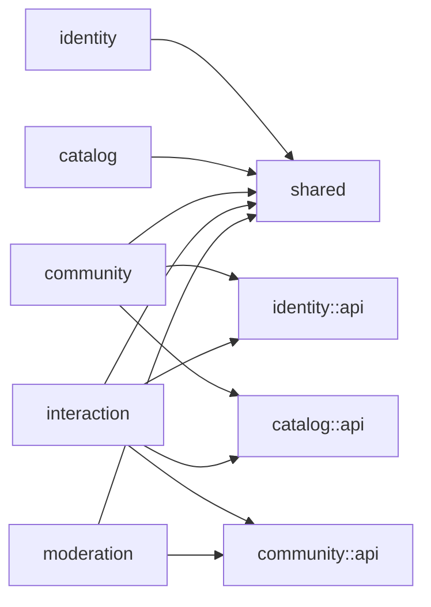

# CC4C 项目迭代修改记录

## 1. 文档信息

| 项目 | 内容 |
| --- | --- |
| 项目名称 | CC4C |
| 迭代主题 | 前后端功能稳定性与完整业务流程修复 |
| 迭代日期 | 2026-07-31 |
| 影响范围 | Spring Boot 后端、Vue 3 前端、功能测试、运行配置与项目文档 |
| 迭代性质 | 缺陷修复、健壮性增强、测试体系整理，不新增业务功能 |
| 文档状态 | 已完成 |

## 2. 迭代背景与目标

本轮迭代以“让项目能够流畅运行并通过核心功能性测试”为目标，先完成后端业务逻辑、接口行为和功能测试整理，再对已经启动的前端执行真实浏览器功能测试并修复问题。

本轮主要目标如下：

1. 建立覆盖用户、管理员、课程、博客、评论等核心领域的后端功能测试。
2. 根据测试结果修复后端事务、关联校验、空数据返回、登录态和异常处理问题。
3. 打通前端用户端与管理员端的完整业务闭环。
4. 修复 Vue 3 响应式状态、`script setup`、表单绑定、接口反馈和静态资源打包问题。
5. 保证后端测试、前端生产构建和关键浏览器流程全部通过。

本轮未引入新的业务模块，也未改变现有产品功能边界。

## 3. 总体变更摘要

| 领域 | 变更摘要 | 验证结论 |
| --- | --- | --- |
| 用户与管理员 | 修复注册、登录态、Cookie 生命周期、资料修改和密码安全输出 | 通过 |
| 课程 | 修复课程发布事务、模块关联、搜索空结果和收藏幂等性 | 通过 |
| 博客 | 修复发布事务、语言关联、收藏、草稿、空列表和浏览量校验 | 通过 |
| 评论 | 修复非法关联、孤儿数据、回复层级和用户信息补充 | 通过 |
| 前端用户端 | 修复登录、资料、课程、博客、收藏、评论和回复流程 | 通过 |
| 前端管理端 | 修复管理员登录、课程新增和博客审核流程 | 通过 |
| 构建与资源 | 修复 Vite 生产环境静态图片丢失和 Vue 控制台告警 | 通过 |
| 功能测试 | 后端 17 个功能测试全部通过；前端核心端到端流程全部通过 | 通过 |

---

## 4. 后端迭代修改记录

### 4.1 用户与管理员认证

#### BE-AUTH-01：完善用户 Cookie 生命周期

- 用户登录成功后，为 `user_email` Cookie 增加根路径和 `HttpOnly` 属性。
- 用户退出时将 Cookie 有效期设置为 `0`，确保浏览器真正删除登录 Cookie。
- 用户登录状态验证不再只判断 Cookie 是否存在，同时确认对应用户仍然存在。
- 获取当前用户信息时，对不存在的用户返回明确的功能失败结果，避免空对象或服务端异常。

主要涉及文件：

- `back-end/CC4C/src/main/java/com/cc4c/controller/UserController.java`
- `back-end/CC4C/src/main/java/com/cc4c/service/Impl/UserServiceImpl.java`

#### BE-AUTH-02：完善管理员 Cookie 生命周期

- 管理员登录 Cookie 增加根路径和 `HttpOnly` 属性。
- 管理员退出时显式删除 Cookie。
- 管理员校验接口同时验证管理员账号是否真实存在，避免伪造 Cookie 直接通过校验。
- 在管理员服务中增加账号存在性检查。

主要涉及文件：

- `back-end/CC4C/src/main/java/com/cc4c/controller/AdminController.java`
- `back-end/CC4C/src/main/java/com/cc4c/service/AdminService.java`
- `back-end/CC4C/src/main/java/com/cc4c/service/Impl/AdminServiceImpl.java`

#### BE-USER-01：修复用户注册唯一性判断

- 将用户名重复判断和邮箱重复判断拆分为独立查询条件。
- 修复原查询条件叠加后可能无法正确识别重复邮箱的问题。
- 保留数据库外键异常的功能性失败响应，同时避免输出无意义的异常堆栈。

#### BE-USER-02：增强资料与密码修改健壮性

- 修改密码前先判断目标用户是否存在。
- 修改个人资料前先判断用户是否存在。
- 保留用户名唯一性校验。
- 不存在的用户返回明确失败结果，不再触发空指针异常。

#### BE-USER-03：限制密码字段对外输出

- 将 `password` 和 `newPassword` 设置为仅允许 JSON 写入。
- 用户信息响应不再包含密码和新密码字段。

主要涉及文件：

- `back-end/CC4C/src/main/java/com/cc4c/entity/User.java`

### 4.2 课程业务

#### BE-COURSE-01：保证课程发布事务一致性

- 课程发布增加事务控制。
- 发布前验证目标语言模块是否存在。
- 课程写入成功但模块关联失败时回滚事务。
- 避免生成“课程存在但没有所属模块”的不完整数据。

主要涉及文件：

- `back-end/CC4C/src/main/java/com/cc4c/service/Impl/CourseServiceImpl.java`

#### BE-COURSE-02：统一空列表响应

- 查询不到课程模块时返回空数组，不再返回 `null`。
- 课程搜索或按语言查询没有结果时返回空数组。
- 前端可以统一按数组处理结果，避免额外空值分支。

#### BE-COURSE-03：完善课程收藏约束

- 收藏前验证用户和课程是否存在。
- 已收藏课程再次收藏时返回失败，不再产生重复收藏记录。
- 收藏列表、收藏状态和取消收藏流程通过功能测试验证。

### 4.3 博客业务

#### BE-BLOG-01：保证博客发布事务一致性

- 博客发布增加事务控制。
- 发布前验证作者是否存在。
- 验证文章涉及的语言 ID 是否全部有效。
- 对重复语言进行去重。
- 博客、语言关联和作者关联中的任一步骤失败时，不保留部分写入数据。

主要涉及文件：

- `back-end/CC4C/src/main/java/com/cc4c/service/Impl/BlogServiceImpl.java`

#### BE-BLOG-02：完善博客收藏行为

- 收藏前验证用户、博客及博客审核状态。
- 未审核博客不能被收藏。
- 修复博客收藏状态接口成功与失败状态码不一致的问题。
- 收藏列表过滤已逻辑删除的博客。

主要涉及文件：

- `back-end/CC4C/src/main/java/com/cc4c/controller/BlogController.java`
- `back-end/CC4C/src/main/java/com/cc4c/dao/BlogDao.java`

#### BE-BLOG-03：完善空数据与非法引用处理

- 用户没有博客时返回空数组。
- 某语言没有博客时返回空数组。
- 保存草稿前验证用户是否存在。
- 更新博客浏览量前验证博客是否存在。
- 非法作者、非法语言和非法博客引用返回功能性失败，不产生部分数据。

### 4.4 评论与回复

#### BE-COMMENT-01：增加评论引用校验

- 发布评论前验证用户是否存在。
- 课程评论验证课程是否存在。
- 博客评论验证博客是否存在。
- 回复验证父评论是否存在。
- 非法引用不会生成孤立评论数据。

#### BE-COMMENT-02：限制评论回复层级

- 通过间接评论关系读取父评论层级。
- 一级回复记录为第 `1` 层，二级回复记录为第 `2` 层。
- 超过两层的回复请求返回失败。

主要涉及文件：

- `back-end/CC4C/src/main/java/com/cc4c/dao/CommentDao.java`
- `back-end/CC4C/src/main/java/com/cc4c/service/Impl/CommentServiceImpl.java`

#### BE-COMMENT-03：保证评论事务一致性

- 评论主记录与课程、博客或父评论关联写入放入同一事务。
- 关联写入失败时抛出异常并回滚，避免孤儿评论。

#### BE-COMMENT-04：增强评论展示健壮性

- 补充评论用户、父评论和父评论用户的空值判断。
- 关联用户数据缺失时不再触发空指针异常。
- 为数据库保留字字段 `like` 增加显式字段映射。

主要涉及文件：

- `back-end/CC4C/src/main/java/com/cc4c/entity/Comment.java`
- `back-end/CC4C/src/main/java/com/cc4c/entity/Code.java`

### 4.5 通用异常与运行配置

#### BE-COMMON-01：启用统一异常处理

- 为全局异常处理方法增加 `@ExceptionHandler(Exception.class)`。
- 未处理异常统一返回项目失败码和布尔失败数据。
- 避免接口向前端泄露服务端异常堆栈。

主要涉及文件：

- `back-end/CC4C/src/main/java/com/cc4c/controller/ProjectExceptionAdvice.java`

#### BE-CONFIG-01：调整邮件和上传配置

- 邮件发送方改为读取 `spring.mail.username` 配置，不再在业务代码中硬编码。
- 调整 SMTP SSL/认证配置。
- 数据库密码和 SMTP 凭据改为环境变量，不再提交真实凭据。
- 博客图片、头像保存目录和访问地址支持环境变量覆盖，并保留当前开发路径作为非敏感默认值。
- 测试环境将文件写入 `target/functional-files`，避免污染前端公开资源目录。
- 本文档不记录任何 SMTP 密码或授权码。

主要涉及文件：

- `back-end/CC4C/src/main/java/com/cc4c/service/Impl/EmailServiceImpl.java`
- `back-end/CC4C/src/main/resources/application.yml`
- `back-end/CC4C/src/test/resources/application-test.yml`

运行环境可配置变量：

| 环境变量 | 用途 |
| --- | --- |
| `CC4C_DB_URL` | MySQL 连接地址 |
| `CC4C_DB_USERNAME` | MySQL 用户名 |
| `CC4C_DB_PASSWORD` | MySQL 密码，启动后端前必须配置 |
| `CC4C_MAIL_USERNAME` | SMTP 发件账号 |
| `CC4C_MAIL_PASSWORD` | SMTP 授权码 |
| `CC4C_SAVE_IMG_PATH` | 博客图片保存目录 |
| `CC4C_REQUEST_IMG_PATH` | 博客图片公网访问前缀 |
| `CC4C_SAVE_AVATAR_PATH` | 用户头像保存目录 |
| `CC4C_REQUEST_AVATAR_PATH` | 用户头像公网访问前缀 |

> 说明：上述内容记录的是本轮安全配置治理的设计目标。V1 发布基线已进一步调整为“本机真实 `application.yml` 被 Git 忽略、仓库跟踪脱敏 `application-example.yml`”的形式；当前实际约定以第 11.2 节为准。

### 4.6 后端功能测试体系

本轮删除了原先分散、依赖运行环境且覆盖有限的默认上下文、DAO 和 Service 测试，重新建立面向完整接口行为的功能测试。

新增测试结构：

- `FunctionalTestSupport.java`：统一提供 `MockMvc`、测试数据工厂、事务回滚和邮件发送模拟。
- `UserAdminFunctionalTest.java`：用户注册、登录、资料、密码、Cookie、邮件、头像和管理员认证。
- `CourseFunctionalTest.java`：课程模块、课程发布、查询推荐和收藏生命周期。
- `BlogFunctionalTest.java`：发布、审核、驳回、查询、收藏、草稿、图片上传和非法引用。
- `CommentFunctionalTest.java`：课程评论、博客评论、回复层级和非法引用。
- `application-test.yml`：测试邮件账号占位值和测试文件目录。

后端测试覆盖结果：

| 测试类 | 用例数 | 失败 | 错误 | 跳过 |
| --- | ---: | ---: | ---: | ---: |
| `UserAdminFunctionalTest` | 5 | 0 | 0 | 0 |
| `CourseFunctionalTest` | 3 | 0 | 0 | 0 |
| `BlogFunctionalTest` | 6 | 0 | 0 | 0 |
| `CommentFunctionalTest` | 3 | 0 | 0 | 0 |
| **合计** | **17** | **0** | **0** | **0** |

建议执行命令：

```powershell
cd back-end/CC4C
mvn test
```

---

## 5. 前端迭代修改记录

### 5.1 用户认证与注册

#### FE-AUTH-01：修复登录状态初始化竞态

- 用户登录成功后，先等待 `/users/info` 返回。
- 将用户 ID、用户名、邮箱、专业、订阅语言和头像完整写入 Vuex。
- 用户信息初始化完成后再进入首页。
- 避免首页、收藏和个人空间首次加载时使用空用户 ID。

主要涉及文件：

- `front-end/CC4C/src/views/login/Login.vue`

#### FE-AUTH-02：修复管理员失败登录误跳转

- 仅在后端返回成功数据时进入管理员页面。
- 兼容后端管理员登录成功数据为数值 `1`。
- 登录失败继续停留在管理员登录页并显示错误原因。

主要涉及文件：

- `front-end/CC4C/src/views/admin/AdminLoginView.vue`

#### FE-AUTH-03：完善退出登录

- 使用 Vue Router 返回登录页。
- 清空 Vuex 用户状态。
- 使用 Element Plus 消息替代阻塞式浏览器弹窗。
- 移除对 `http://localhost:5173` 的前端跳转硬编码。

主要涉及文件：

- `front-end/CC4C/src/layout/components/header.vue`

#### FE-AUTH-04：完善注册与找回密码校验

- 密码输入框改为密码类型并支持显示切换。
- 增加注册必填项、密码长度和邮箱格式校验。
- 验证码请求增加加载状态和失败反馈。
- 注册接口根据后端实际结果显示成功或失败。
- 找回密码保留邮箱、验证码和新密码校验。

主要涉及文件：

- `front-end/CC4C/src/views/login/Register.vue`
- `front-end/CC4C/src/views/login/Login.vue`

### 5.2 用户资料

#### FE-USER-01：修复资料表单回显

- 专业、订阅语言和头像改为读取正确的 Vuex 字段。
- 下拉框值统一转换为数值，保证 Element Plus 选项正确匹配。
- 修复专业和订阅语言进入编辑对话框后显示为空的问题。

#### FE-USER-02：修复资料、密码和头像反馈

- 资料更新后重新读取用户信息并同步 Vuex。
- 更新头像和页面显示，不再依赖整页刷新。
- 增加用户名、原密码和新密码的必填校验。
- 使用 `ElMessage` 替代 `script setup` 中不存在的 `this.$message`。
- 头像格式、大小和上传失败均提供明确提示。

主要涉及文件：

- `front-end/CC4C/src/components/UserInfo.vue`
- `front-end/CC4C/src/views/UserinfoView.vue`

### 5.3 课程功能

#### FE-COURSE-01：修复课程搜索事件

- 将错误的 `:change="search()"` 改为真实事件监听。
- 支持输入变更和回车搜索。
- 避免组件渲染阶段重复调用课程搜索接口。

#### FE-COURSE-02：修复课程收藏、评论和回复

- 移除 `script setup` 函数中错误使用的 `this`。
- 课程对象和评论列表改为正确的 `ref` 状态。
- 收藏状态仅在后端操作成功后更新。
- 评论和回复增加空内容校验。
- 评论或回复成功后重新加载列表，无需刷新页面。
- 评论输入框默认值改为空，提示文字使用 `placeholder`。

主要涉及文件：

- `front-end/CC4C/src/views/course/CourseView.vue`
- `front-end/CC4C/src/views/course/CourseDetailView.vue`
- `front-end/CC4C/src/views/course/AllCoursesView.vue`

#### FE-COURSE-03：修复新增课程表单

- 将级联选择值由不可重新赋值的 `reactive` 常量改为 `ref`。
- 修复课程难度错误绑定到模块表单的问题。
- 正确转换语言名称、语言 ID 和模块优先级。
- 增加课程标题、模块和正文必填校验。
- 课程发布严格根据后端结果反馈。
- 发布成功后清空表单。
- 重新加载模块时覆盖子项，避免重复追加。
- 模块新增严格根据后端结果反馈。

主要涉及文件：

- `front-end/CC4C/src/views/admin/AddCourseView.vue`

### 5.4 博客功能

#### FE-BLOG-01：修复博客详情交互

- 移除收藏、评论函数中错误使用的 `this`。
- 博客对象和评论列表改为正确的响应式状态。
- 收藏与取消收藏仅在后端成功后更新页面。
- 评论和回复增加空内容校验。
- 评论与回复成功后局部刷新列表。

主要涉及文件：

- `front-end/CC4C/src/views/blog/BlogDetailView.vue`

#### FE-BLOG-02：修复发布和草稿反馈

- 博客语言值改为数值类型，与后端语言 ID 一致。
- 发布和保存草稿严格根据后端返回结果反馈。
- 发布成功后清空标题、语言和正文。
- 重复草稿或发布失败时不再错误提示成功。

主要涉及文件：

- `front-end/CC4C/src/views/blog/BlogWriteView.vue`

#### FE-BLOG-03：修复博客审核

- 审核通过和驳回均校验后端结果。
- 审核成功后局部刷新待审核列表。
- 不再通过整页刷新完成状态更新。
- 博客加载和审核异常提供明确反馈。

主要涉及文件：

- `front-end/CC4C/src/views/admin/CheckBlogView.vue`

### 5.5 交互、资源和控制台

#### FE-UX-01：统一单击打开内容

- 课程、博客、收藏和个人博客列表由双击打开改为单击打开。
- 降低用户误操作和功能不可发现问题。

涉及页面：

- 首页
- 全部课程
- 全部博客
- 收藏中心
- 博客浏览
- 博客管理

#### FE-ASSET-01：修复生产环境静态资源

- 新增统一静态资源导出文件 `front-end/CC4C/src/assets/index.js`。
- 将 `src/assets/...` 字符串路径改为 Vite 模块导入。
- Logo、默认头像、语言图片、轮播图片、收藏和评论图标均进入生产构建产物。
- 解决开发服务器正常、生产部署图片丢失的问题。

#### FE-CONSOLE-01：清理 Vue 运行时告警

- 修复首页不存在的 `fit` 变量。
- 修复 Element Plus `gutter` 属性字符串类型告警。
- 修复课程菜单 `index` 数值类型告警。
- 最终关键页面浏览器回归无新增 `error` 或 `warn`。

### 5.6 前端功能验证

前端使用真实浏览器、运行中的后端和开发数据库完成端到端验证，覆盖：

- 用户正确/错误登录、退出、注册校验和找回密码校验。
- 首页课程、博客和图片资源。
- 课程浏览、搜索、详情、收藏、评论和回复。
- 用户资料编辑、密码校验和收藏中心。
- 博客发布、管理、审核、公开展示、收藏、评论和回复。
- 管理员正确/错误登录、课程新增、博客审核和数据总览。
- 生产构建和浏览器控制台回归。

完整前端功能测试报告：

- [CC4C 前端功能性测试报告](../front-end/CC4C/FUNCTIONAL_TEST_REPORT.md)

生产构建验证：

```powershell
cd front-end/CC4C
npm run build
```

验证结果：

- Vite 成功转换 `1475` 个模块。
- `dist/assets` 已包含项目图片资源。
- 构建无编译错误。
- 当前仅保留主 JavaScript 包大于 `500 KiB` 的性能提示。

---

## 6. 前后端接口契约调整

| 接口行为 | 迭代前 | 迭代后 |
| --- | --- | --- |
| 空课程/博客集合 | 部分接口返回 `null` | 统一返回空数组 |
| 收藏操作 | 可能重复收藏或引用不存在数据 | 验证用户、内容和重复关系 |
| 博客收藏状态 | 成功与失败都可能使用失败码 | 使用成功码并在 `data` 返回状态 |
| 用户/管理员校验 | 只判断 Cookie 内容 | 同时验证数据库账号存在 |
| 评论创建 | 可能先写主记录再关联失败 | 事务内完成写入和关联 |
| 课程/博客发布 | 可能产生部分关联数据 | 事务控制并验证所有引用 |
| 用户信息输出 | 可能序列化密码字段 | 密码字段仅允许写入 |
| 前端反馈 | 部分操作不检查 `data` | 统一依据后端结果更新页面 |

## 7. 本轮测试数据

前端端到端测试在当前开发数据库中保留以下带有明显标识的数据，便于人工复查：

- 测试用户：`codexui_0731190952@example.com`
- 测试课程：`前端功能回归课程-0731-1935`
- 测试博客：`前端功能回归博客-0731-1925`
- 课程评论：`前端回归测试评论-0731-1920`
- 课程回复：`前端回归测试回复-0731-1921`
- 博客评论：`博客前端回归评论-0731-1930`
- 博客回复：`博客前端回归回复-0731-1931`

后端自动化功能测试使用事务回滚，不应在成功结束后保留业务测试数据。邮件发送在测试中使用模拟对象，文件上传写入 `target/functional-files`。

## 8. 验收结果

| 验收项 | 结果 |
| --- | --- |
| 后端功能测试 | 17/17 通过 |
| 后端测试失败数 | 0 |
| 后端测试错误数 | 0 |
| 用户端核心业务闭环 | 通过 |
| 管理员端核心业务闭环 | 通过 |
| 前端生产构建 | 通过 |
| 关键页面控制台错误 | 0 |
| 关键页面控制台警告 | 0 |

本轮“前后端功能稳定性迭代”达到预定目标，可以进入下一阶段的性能优化、部署配置治理或新增功能迭代。

## 9. 已知边界与后续建议

以下事项不阻塞当前功能验收：

1. 前端主 JavaScript 包约 `869 KiB`，建议后续按路由和编辑器依赖进行拆包。
2. 前端 API 地址仍以本地 `http://localhost:4080` 为主，公网部署前应改为 `VITE_API_BASE_URL` 环境变量。
3. 后端上传保存目录和资源访问地址已支持环境变量覆盖；部署环境仍需显式配置对应目录和公网访问地址。
4. SMTP 真实投递依赖外部邮件服务，本轮后端自动化测试使用模拟发送器，前端未读取外部邮箱验证实际到达。
5. 浏览器自动化未读取用户本地文件，因此真实头像选择和本地图片选择仍建议人工补充一次验收。
6. 当前前端功能验证以浏览器端到端执行和测试报告为主，后续可引入 Vitest 与 Playwright 测试代码并纳入持续集成。

## 10. 相关文档

- [前端功能性测试报告](../front-end/CC4C/FUNCTIONAL_TEST_REPORT.md)

---

## 11. 第一轮迭代（V1）发布基线归档

### 11.1 基线定义

从 2026-08-18 起，将当前已经推送到 GitHub 的“前后端功能稳定性迭代”视为 **CC4C 第一次迭代（V1）** 的功能基线。

| 项目 | 基线内容 |
| --- | --- |
| Git 分支 | `codex/cc4c-functional-stability-iteration` |
| 基线提交 | `bf810a63985a92160210e004d4ebd6094791cbdf`（`chore: keep local backend config untracked`） |
| 前序核心提交 | `060c1bd5a1d17ed94f944a586f8be10a957e5cda`（功能稳定性修复） |
| GitHub PR | [#4 稳定 CC4C 前后端核心功能流程](https://github.com/Jaily16/CC4C/pull/4)；记录时为草稿状态 |
| 后端验证 | `mvn clean test`：17/17 通过 |
| 前端验证 | `npm run build` 通过；核心浏览器功能回归通过 |
| 运行验证 | 后端默认启动可访问 `http://localhost:4080`，课程首页接口返回成功 |

V2 只允许在该基线之上进行页面视觉与用户友好性迭代；不应回退、删除或改变 V1 已验收的认证、课程、博客、评论、收藏、审核等功能行为，除非后续任务明确记录了修复原因和回归用例。

### 11.2 V1 后的本地运行与安全配置约定

为同时满足本机直接运行与 GitHub 安全上传，V1 基线后的配置文件约定如下：

| 文件 | 用途 | Git 状态 |
| --- | --- | --- |
| `back-end/CC4C/src/main/resources/application.yml` | 本机真实开发配置；Spring Boot 直接启动时默认读取 | 已由 `.gitignore` 忽略，禁止暂存或上传 |
| `back-end/CC4C/src/main/resources/application-example.yml` | 与本机配置结构一致的脱敏示例；数据库、邮件等敏感项使用环境变量占位符 | 必须提交并维护 |
| `front-end/CC4C/node_modules/`、`front-end/CC4C/dist/`、`back-end/CC4C/target/`、`temp/` | 本机依赖、构建或临时产物 | 已忽略，禁止提交 |

本机后端可直接执行：

```powershell
cd back-end/CC4C
mvn spring-boot:run
```

后续任何人修改配置结构时，必须同步更新 `application-example.yml`，但不得通过 Git 覆盖、删除或上传本机 `application.yml`。发布前必须通过显式暂存和暂存区敏感信息检查，详见《CC4C 第二次迭代开发计划》。

### 11.3 V2 交接入口

- [CC4C 第二次迭代开发计划](CC4C第二次迭代开发计划.md)

---

## 12. 第二次迭代（V2）：页面视觉与用户友好性

### 12.1 迭代范围

V2 以 V1 提交 `bf810a63985a92160210e004d4ebd6094791cbdf` 为功能基线，聚焦页面视觉一致性、响应式布局、操作反馈和可访问性。认证、课程、博客、评论、收藏、审核等 V1 前后端行为和 API 契约保持不变；没有新增后端接口，也没有重置 Vuex 登录状态。

### 12.2 Task 1–8 实际完成内容

| 任务 | 主要页面/组件 | 实际完成内容 |
| --- | --- | --- |
| Task 1 | `App.vue`、全局样式、用户端壳层、页头、侧栏、`PageFeedback` | 建立设计令牌、全局焦点样式、响应式壳层和统一加载/空数据/失败反馈 |
| Task 2 | `/login`、`/register`、`/adminLogin` | 重排认证页视觉层级，补齐字段提示、提交状态、找回密码与移动端布局 |
| Task 3 | `/home`、`/allCourses`、`/allBlogs`、课程/博客发现列表 | 统一发现页横幅、筛选搜索和卡片系统；增加悬浮/焦点响应，修复导航激活态、语言图标排列、侧栏头像与折叠布局 |
| Task 4 | `/courseDetail`、课程内容与评论区、通用内容操作栏 | 优化阅读区、收藏/评论操作和评论层级；修复 Markdown 星级显示；将课程目录改为随页面固定的浮动按钮及上方弹出目录 |
| Task 5 | `/allBlogs`、`/blogDetail`、`/blogWrite`、`/blogmanage`、博客浏览页 | 统一博客发现、详情、写作和管理体验，补齐正文目录、表单反馈、文章状态和空/失败状态 |
| Task 6 | `/userinfo`、`/favorite`、`UserInfo.vue` | 重构个人资料概览、编辑资料、修改密码和头像反馈；统一收藏课程/博客卡片及空状态 |
| Task 7 | 管理端壳层、`/admin/CoursesAndBlogs`、`/admin/addCourse`、`/admin/checkBlog` | 统一管理员导航、数据总览、课程发布分区和博客审核工作台；补齐加载、确认、禁用与失败反馈 |
| Task 8 | Task 1–7 全部目标页、两份回归文档 | 完成源码级响应式/可访问性/反馈审计、前端生产构建和后端 17 项测试；未发现需继续修改的页面回归 |

### 12.3 Task 8 验证记录

| 验证项 | 结果 |
| --- | --- |
| 活动路由原生 `alert`、内联 `style`、`window.location`、错误 `this.$...` 扫描 | 未发现 |
| 全局可见焦点、原生按钮/链接语义、整卡 Enter 操作 | 源码审计通过 |
| 数据页加载、空数据、失败、重试与提交禁用态 | 源码审计通过 |
| `git diff --check` | 通过，仅有 LF/CRLF 工作区提示 |
| 前端生产构建 | 通过；Vite 3.2.4 转换 1480 个模块 |
| 后端测试 | 17/17 通过，0 失败、0 错误、0 跳过 |

前端构建命令为：

```powershell
cd front-end/CC4C
npm run build -- --outDir ..\..\temp\cc4c-task8-build-20260819
```

后端验证命令为：

```powershell
cd back-end/CC4C
mvn test
```

Task 1–7 的页面验收截图位于当前 Codex 任务的浏览器注释记录中，涉及 `/home`、`/allCourses`、`/allBlogs`、`/courseDetail`、`/userinfo`、`/favorite` 和 `/admin/addCourse`；未向仓库写入截图。完整 V2 回归明细见 [CC4C 前端功能性测试报告](../front-end/CC4C/FUNCTIONAL_TEST_REPORT.md)。

### 12.4 待人工确认与遗留项

按当前协作约定，项目由用户在本机启动后完成浏览器验收。Task 8 交付后仍需在 1440px、1024px、768px、375px 下覆盖用户端目标路由和三个管理员子页，检查页面级横向溢出、按钮/文字重叠、Tab/Shift+Tab/Enter、空数据/失败重试以及控制台 `error`/`warn`。该项在用户确认前不记录为自动通过。

以下为非阻塞遗留项：

1. Vite 仍提示入口 JavaScript 包约 874 KiB，建议后续拆分 Element Plus、Markdown 编辑器和公共依赖。
2. Maven 测试仍输出部分关联实体缺少 `@TableId` 的既有 MyBatis-Plus 警告；本轮没有修改后端模型或返回结构。
3. Task 8 未执行 Git 暂存、提交、推送或 PR；安全发布继续留给 Task 9 或用户后续明确指令。

### 12.5 本地配置与发布安全状态

- `back-end/CC4C/src/main/resources/application.yml` 未修改、未暂存，继续由 Git 忽略。
- 前端构建产物位于已忽略的 `temp/`；`node_modules/`、`dist/`、`target/` 和 `temp/` 均不得提交。
- 本轮没有启动或停止前后端服务，没有创建提交、推送分支或创建 PR。

---

## 13. 第三次迭代（V3）：生产级 Java 后端工程化规划

### 13.1 当前状态

截至 2026-08-27，V3 方面一“基础版本与依赖现代化”和方面二“模块化单体、API 与数据治理”均已完成实现、自动验证、脱敏环境运行和用户浏览器验收。方面二在保留核心业务流程和前端路由的同时，明确调整了写操作 HTTP 方法、分页响应、错误状态和草稿语义；方面三至方面七尚未实施。

| 项目 | 当前记录 |
| --- | --- |
| 规划基线 | `54262dad4053adeb4019be7dd95eb644995bc3da`（短提交号 `54262da`） |
| 规划文档 | [CC4C 第三次迭代开发规划](CC4C第三次迭代开发规划.md) |
| 预计规模 | 6–8 周，按七个方面依次推进 |
| 当前阶段 | 方面二已完成并通过用户浏览器验收 |
| 已落地基线 | Java 21、Spring Boot 3.5.16、MyBatis-Plus 3.5.17、Spring Modulith 1.4.12、Flyway、springdoc OpenAPI 2.8.17、Axios 1.19.0 |
| 下一方面 | 安全与身份体系；尚未规划或实施 |

### 13.2 已确定的总体路线

1. 基础版本与依赖现代化。
2. 模块化单体、API 与数据治理。
3. Spring Security 与 Spring Session Redis 身份体系。
4. Redis 缓存、数据库和性能优化。
5. RabbitMQ、事务事件与异步可靠性。
6. Actuator、Micrometer、Prometheus、Grafana 与 Gatling 性能证据。
7. Docker Compose、Testcontainers 和 GitHub Actions 持续交付。

Java 21、Spring Boot 3.5.16 和 MyBatis-Plus 3.5.17 已在方面一落地；Spring Modulith 1.4.12、DTO/校验/分页/OpenAPI 和 Flyway 已在方面二落地。Spring Security、Redis、RabbitMQ、Actuator、容器和持续交付仍是后续目标，不能在代码、README 或对外说明中表述为已经完成。

### 13.3 安全与实施边界

- V3 每个方面均需在新的计划对话中独立检查、设计、实施和验收，不因规划文档建立而自动开始。
- `back-end/CC4C/src/main/resources/application.yml` 继续由 Git 忽略，禁止读取、覆盖、暂存或上传。
- 只允许提交脱敏示例配置；`node_modules/`、`dist/`、`target/`、`temp/`、日志和本机凭据不得提交。
- README 只有在相关能力真实落地并产生可复核证据后才允许更新，且不得展示虚构性能结果。

### 13.4 方面一实际变更

#### 后端基础版本与依赖

- 通过 Spring Boot 2.7.18 兼容桥，最终升级到 Java 21 和 Spring Boot 3.5.16。
- 切换到 `mybatis-plus-spring-boot3-starter:3.5.17`，MySQL 驱动版本交由 Spring Boot 管理，数据源使用默认 HikariCP。
- 删除重复 MyBatis Starter，以及无实际调用依据的 MPJ、Druid、Fastjson 和未使用分页配置；没有提前引入方面二的数据治理能力。
- 完成 Servlet API 的 Jakarta 迁移，测试模拟注解切换为 `@MockitoBean`；全仓不再保留 `javax.*` 兼容依赖。
- 用 Java 集合和 Jackson 保持原 JSON 字段；文件工具改用 `Path.resolve` 和 `Files.createDirectories`，移除硬编码 Windows 保存路径。
- 保留 `/test` 路由并将控制器类规范为 `TestController`，上传接口继续返回既有字段。

#### 配置与测试安全网

- Maven 测试固定加载 `application-test.yml`，测试数据库仅接受无默认值的 `CC4C_TEST_DB_URL`、`CC4C_TEST_DB_USERNAME`、`CC4C_TEST_DB_PASSWORD`。
- 新增脱敏 `.env.test.example` 和 `run-tests.ps1`；本机 `.env.test.local` 缺失或变量为空时快速失败，不回退到开发数据库。
- Maven Resources 排除本机 `application.yml`，最终 JAR 只保留脱敏 `application-example.yml`。
- 新增 V2 兼容测试和 `/test` 上传测试，固定 Cookie、CORS、收藏摘要、HTTP 200 业务失败、上传响应和 HikariCP 等行为。

#### 前端最小适配

- Axios 移入运行时依赖并锁定 1.19.0，删除无运行引用的 `vue-cli-plugin-axios` 和旧 `src/api/user.js`。
- 20 个活动页面/组件统一复用 `src/plugins/axiosInstance.js`，移除分散的绝对 API 地址和重复 `withCredentials` 设置。
- 新增公开的 `VITE_API_BASE_URL`，默认仍为 `http://localhost:4080`；前端路由、Vuex 数据模型、视觉和业务交互未调整。

### 13.5 自动验证证据

| 验证项 | 实际结果 |
| --- | --- |
| 工具链 | Maven 3.9.16；Eclipse Temurin Java 21.0.12.1 |
| 后端 `./run-tests.ps1 clean verify` | 23/23 通过，0 失败、0 错误、0 跳过；JAR 构建成功 |
| 有效 POM | Parent 3.5.16、Java 21、MyBatis-Plus 3.5.17 |
| 依赖树 | 存在 Boot 3 MyBatis-Plus Starter、HikariCP、MySQL 驱动；不存在旧 Starter、MPJ、Druid、Fastjson |
| JAR 配置清单 | 不含 `BOOT-INF/classes/application.yml`；包含脱敏 `application-example.yml` |
| 源码静态扫描 | 未发现 `javax.*`、Fastjson、MPJ、Druid、旧 Starter、`@MockBean` 或硬编码 Windows 保存路径 |
| 前端 `npm ci` | 通过 |
| 前端生产构建 | 两次通过，均转换 1495 个模块；第二次确认 `VITE_API_BASE_URL` 覆盖生效 |
| `git diff --check` | 通过 |

后端最终验证命令：

```powershell
cd back-end/CC4C
.\run-tests.ps1 clean verify
```

前端最终验证命令：

```powershell
cd front-end/CC4C
npm ci
npm run build -- --outDir ../../temp/cc4c-v3-aspect1-build
$env:VITE_API_BASE_URL = 'http://127.0.0.1:4080/'
npm run build -- --outDir ../../temp/cc4c-v3-aspect1-build-override
```

### 13.6 运行与浏览器验收

- 后端以 `SPRING_CONFIG_NAME=application-example` 和显式环境变量启动，运行时确认 Java 21、Spring Boot 3.5.16 和 Tomcat 10.1.55；未加载本机 `application.yml`。
- 在线契约回归覆盖用户正确/错误登录、Cookie、资料、头像、密码修改与恢复，课程首页/搜索/详情/收藏/评论/回复，博客草稿/上传/提交/审核/公开详情/收藏/评论/回复，以及管理员登录、课程发布和 CORS。
- 在线契约全部通过；后端与前端运行日志未发现新增错误，`/`、`/blogsdetail`、`/blogDetail`、`/admin`、`/test` 均可访问。
- 2026-08-27 用户确认方面一浏览器验收通过。
- 验收结束后仅停止本次启动的 V3 前后端进程，端口 4080 和 5173 已释放；MySQL 未停止。

### 13.7 兼容性结论

- `/users`、`/admin`、`/courses`、`/blogs`、`/comments`、`/test` 的路径和 HTTP 方法保持不变。
- `Result` 继续使用 `code/data/msg`，既有业务失败继续返回 HTTP 200。
- `user_email` 和 `admin` Cookie 的名称、值、路径、HttpOnly、有效期和退出删除行为保持不变。
- Long ID 继续序列化为字符串，密码字段不出现在响应；课程收藏摘要和博客上传响应字段保持不变。
- `/blogsdetail`、`/blogDetail` 等前端路由未修改，默认 API 地址及环境变量覆盖均已验证。

### 13.8 已知非阻塞项与发布安全

1. `npm audit --omit=dev` 仍报告 7 个既有生产依赖漏洞（3 个中等、4 个高危），涉及编辑器、Element Plus 及其传递依赖；Axios 1.19.0 不在报告中。修复需要升级方面一明确冻结的前端框架/编辑器依赖，未在本方面越界处理。
2. Vite 仍报告主包大于 500 KiB 的既有提示；本方面没有开展拆包或性能优化。
3. MyBatis-Plus 仍输出部分关联实体缺少 `@TableId` 的既有警告；数据模型治理留待方面二。
4. Windows 工作区中的 `testController.java` 属于仅大小写重命名。未来获得暂存授权后，应使用两步 `git mv` 确保 Git 正确记录为 `TestController.java`；本方面未执行暂存。
5. 本机 `application.yml` 未读取、未修改、未暂存；凭据和本机绝对路径未写入变更文件。
6. `node_modules/`、`dist/`、`target/`、`temp/` 和日志仍处于忽略范围。本方面未暂存、提交或推送。

### 13.9 方面二实际变更

#### 独立基线与模块化单体

- 先修正 `TestController.java` 的 Git 大小写记录，重新通过方面一门禁，并建立独立检查点提交 `b1b9c1b`（`chore: modernize CC4C foundation`）；未推送。
- 后端按 `shared`、`identity`、`catalog`、`community`、`interaction`、`moderation` 六个顶级模块重组。每个模块通过 `package-info.java` 声明允许依赖，内部 Mapper、实体和服务不对外暴露。
- 跨模块能力只通过 `identity::api`、`catalog::api` 和 `community::api` 的查询或审核接口访问。Spring Modulith 验证恰好识别六个模块，无循环依赖、内部包越界或未声明依赖。
- 控制器和服务统一使用构造器注入与 `private final` 依赖；删除仅为转发而存在的 Service/Impl 二层结构。
- 复合关系表改用明确的参数化 SQL，不再借用要求单一主键的 `BaseMapper`，方面一记录的关联实体 `@TableId` 警告已消除。

实际模块依赖如下：



#### API、DTO 与分页治理

- 普通响应继续使用泛型 `code/data/msg`，请求体和响应体改为独立 DTO；服务端生成的 ID、时间、点击量和删除状态不再允许由请求覆盖，密码字段不进入响应或 OpenAPI Schema。
- Bean Validation 覆盖用户名、邮箱、密码、课程/模块/博客标题、枚举值、正文、评论和正数 ID；统一异常处理返回受控业务码及 400/401/404/409/422/500，未捕获异常不泄露堆栈和请求正文。
- 列表统一返回 `items/page/size/total/totalPages/hasNext/hasPrevious`，页码从 1 开始，默认 20 条、最大 100 条；课程、博客、收藏、审核和顶层评论均在数据库分页，评论页仍批量装配完整的两级回复。
- 写操作调整为 `POST /users/logout`、`POST /admin/logout`、`POST /users/email/{email}`、`POST /courses/star/{userId}/{courseId}` 和 `POST /blogs/collect/{uid}/{bid}`，不再保留旧 GET 写方法。
- 草稿使用 `PUT /blogs/draft` 新增或覆盖、`GET /blogs/draft/{id}` 读取、`DELETE /blogs/draft/{id}` 删除；博客提交成功后在同一事务清除用户草稿。
- Springdoc OpenAPI 2.8.17 显式记录 DTO、分页和错误响应。`CC4C_API_DOCS_ENABLED` 默认 `false`，只在脱敏验收环境显式开启。
- 修复 Swagger 公共错误响应引用在最终 `components` 中缺少 `ApiErrorResponse` 的问题，并增加契约测试；运行文档共检查 395 个 Schema 引用，悬空引用为 0。

#### Flyway 与查询治理

- Flyway 成为数据库结构的唯一来源：V1 创建现有 16 张表，V2 幂等写入 4 种语言、61 门初始课程、9 个课程模块和 61 条模块关系，V3 统一文本字符集、强化评论归属和父回复完整性，并增加博客及回复查询索引。
- `baseline-on-migrate` 保持关闭。主测试库在迁移前使用 `mysqldump --single-transaction --skip-lock-tables` 备份并保存 SHA-256；测试脚本强制主库以 `_test` 结尾、空库以 `_flyway_test` 结尾且两者不同。
- 第一次作用于 `cc4c_test` 的 V3 迁移因外键两侧字符排序规则不一致而停止。未执行 `clean`、`repair` 或覆盖恢复；在用户完成恢复库授权后，将已验证备份恢复到固定的 `cc4c_recovery_test`，再由 V3 同时转换关联表两侧并重建外键，最终迁移成功。原失败库保持不变，便于审计。
- 空迁移库从 V1 重建、恢复库显式基线到版本 1 后应用 V2/V3、第二次迁移零新增、`validate` 和结构断言全部通过。
- 课程首页使用聚合收藏计数；博客首页、全部、语言、搜索、个人与收藏查询均使用稳定排序的数据库分页；评论读取批量加载用户和两级回复，避免逐评论 N+1。
- `EXPLAIN FORMAT=JSON` 证据保存在忽略的 `temp/`。迁移后博客时间排序选择 `idx_blog_state_time`，点击排序选择 `idx_blog_state_click`，回复查询选择 `idx_indirect_comment_father`；未据此编造耗时或性能提升比例。
- 原 `database/cc4c.sql` 移至 `database/legacy/cc4c.sql` 并移除默认管理员；新环境只允许从 Flyway 初始化。

#### 前端同步

- 首页、全部课程/博客、语言博客、收藏、个人博客、待审核、管理员列表和顶层评论按约定页大小读取 `PageResponse`；首页只取展示条数，不增加分页器。
- 搜索、语言和筛选切换会回到第一页；删除、审核或取消收藏后空页会回退；新评论回到第一页，回复刷新当前页。
- 前端同步 POST/PUT/DELETE 和草稿新语义，使用共享 `apiErrorMessage` 读取 4xx/5xx 的后端消息；没有增加把错误转为成功 Promise 的拦截器。
- 管理员概览使用服务端 `total`，博客标题上限调整为 75；前端路由、Vuex 用户模型和视觉主题未改变。

### 13.10 方面二验证与验收证据

| 验证项 | 实际结果 |
| --- | --- |
| Spring Modulith | 恰好六个模块，结构验证与六个模块集成测试通过 |
| Flyway | 空库 V1–V3、现有库版本 1 基线、重复迁移零新增、`validate` 和结构断言通过 |
| 后端 `./run-tests.ps1 clean verify` | 40/40 通过，0 失败、0 错误、0 跳过；JAR 构建成功 |
| V2 回归 | 原 23 项功能测试适配后全部通过 |
| 新增门禁 | HTTP 状态、DTO 校验、分页、草稿、OpenAPI、查询形态和迁移测试通过 |
| OpenAPI | `/v3/api-docs`、Swagger UI 返回 200；395 个 Schema 引用，0 个悬空引用 |
| 前端 | `npm ci` 和生产构建通过；路由及 Vuex 文件无改动 |
| 运行日志 | 脱敏后端标准错误为空，无新增 `ERROR`；Swagger Resolver 错误修复后复验通过 |
| Git 与配置 | `git diff --check` 通过，暂存区为空，本机 `application.yml` 状态为空 |

运行与浏览器验收覆盖用户/管理员正确和错误登录、Cookie、刷新与 POST 退出，DTO 错误消息，课程/博客/收藏/审核/评论分页及边界页，搜索和筛选重置，草稿保存与发布清除，课程发布、博客提交审核以及 OpenAPI/Swagger。2026-08-27 用户确认方面二浏览器验收通过，并进一步确认 Swagger Resolver 错误已修复。

### 13.11 当前契约、已知项与发布安全

- 核心 `/users`、`/admin`、`/courses`、`/blogs`、`/comments` 和 `/test` 路径及前端路由保留；上文列出的写操作 HTTP 方法和草稿语义属于方面二明确升级的新契约。
- `code/data/msg`、Long ID 字符串序列化、密码字段隐藏、Cookie 名称/值/路径/HttpOnly/有效期/删除行为，以及博客编辑器上传字符串字段保持兼容。
- 成功创建返回 201，非法输入、未授权、不存在、冲突和不可处理场景分别返回 400/401/404/409/422；前端已同步读取错误消息。
- `npm ci` 仍报告 10 个既有依赖漏洞（4 个中等、6 个高危），涉及当前冻结的前端框架或编辑器依赖；本方面未越界升级。Vite 仍有主包大于 500 KiB 的提示。
- Flyway 11.7.2 在当前 MySQL 8.4 环境给出“官方测试至 MySQL 8.1”的兼容提示，但 V1–V3、重复迁移和 `validate` 的实际门禁全部通过。
- 当前仍使用业务 Cookie 和明文密码比较，未引入 Spring Security、密码哈希、Redis、RabbitMQ、Actuator、容器或 CI；这些属于后续方面。
- 本机 `application.yml` 未读取、未修改、未暂存；JAR 不包含该文件。备份、EXPLAIN、构建产物和日志均保存在忽略目录。
- 方面二已在用户独立授权后创建本地 Git 提交；未推送。后续不得在未规划方面三前开始安全体系改造。
